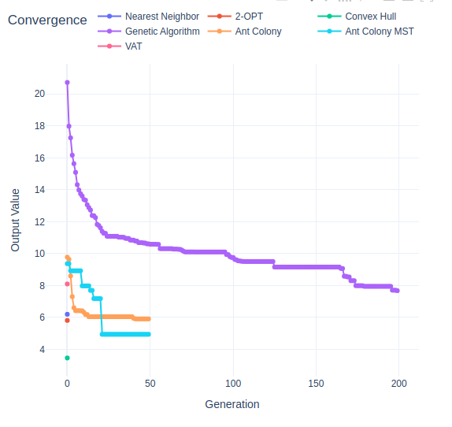
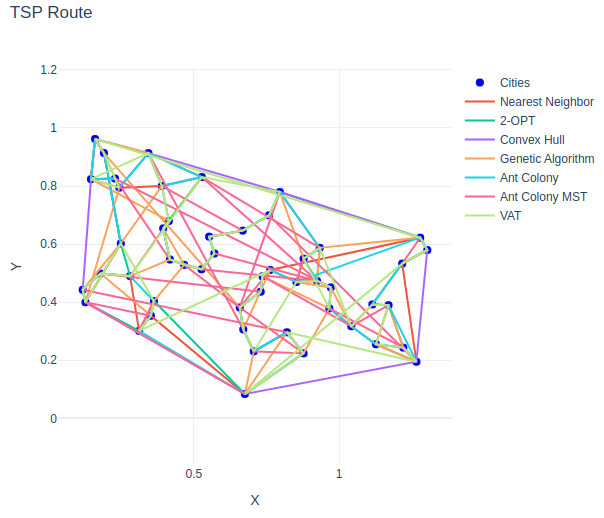
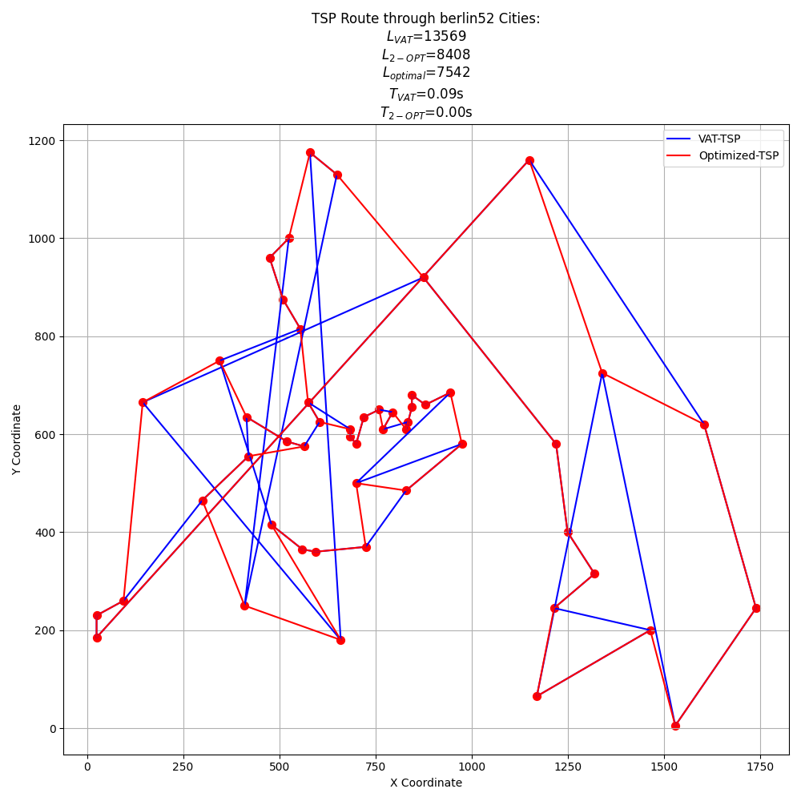
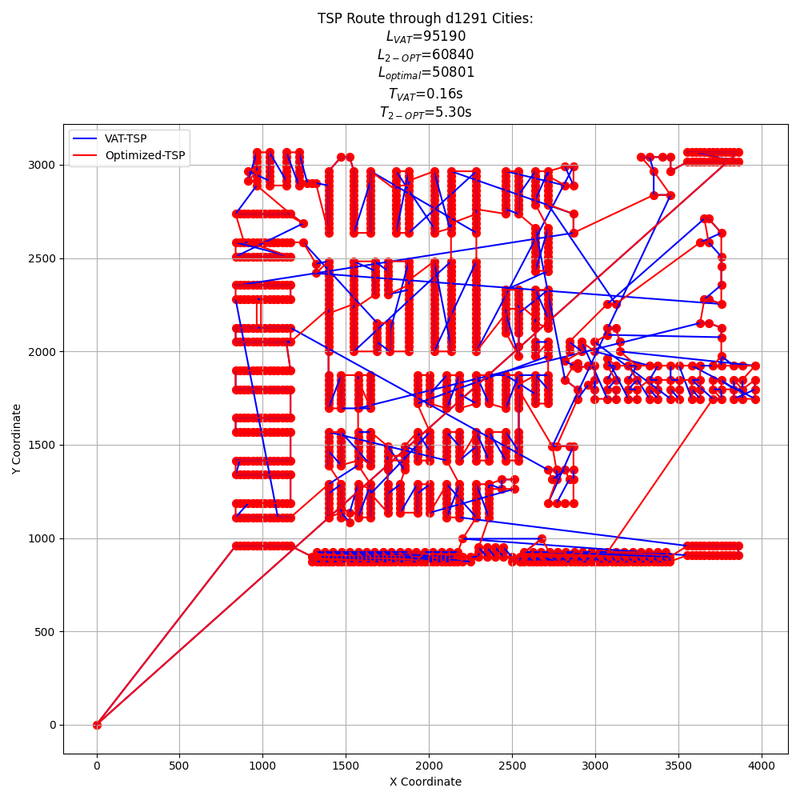
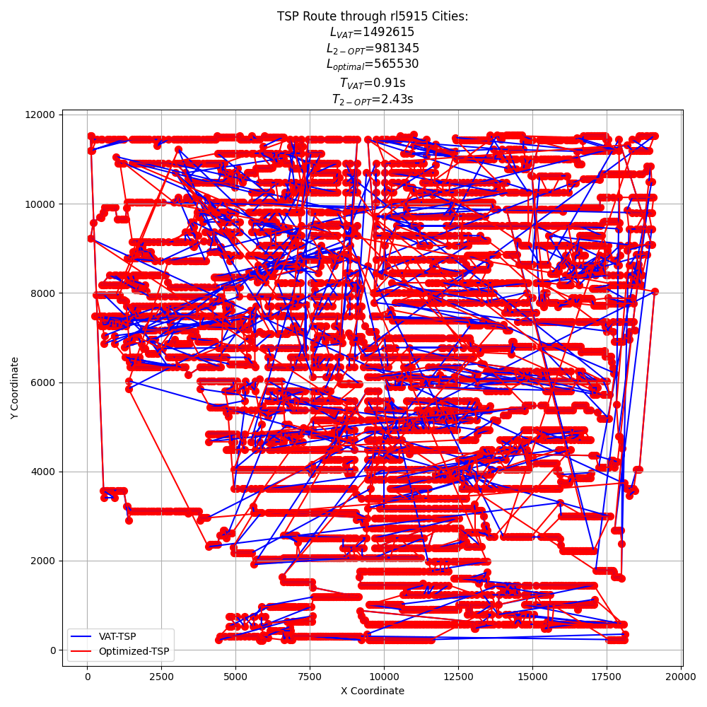
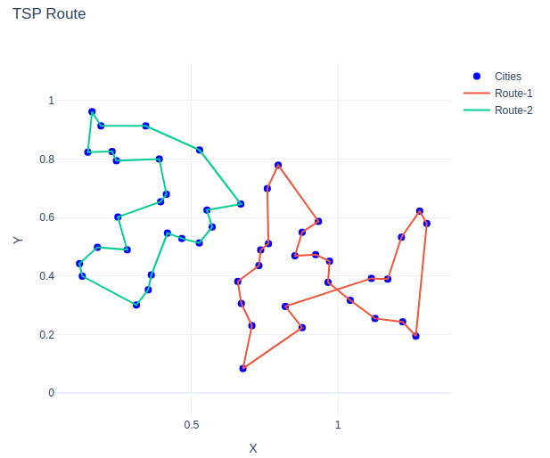
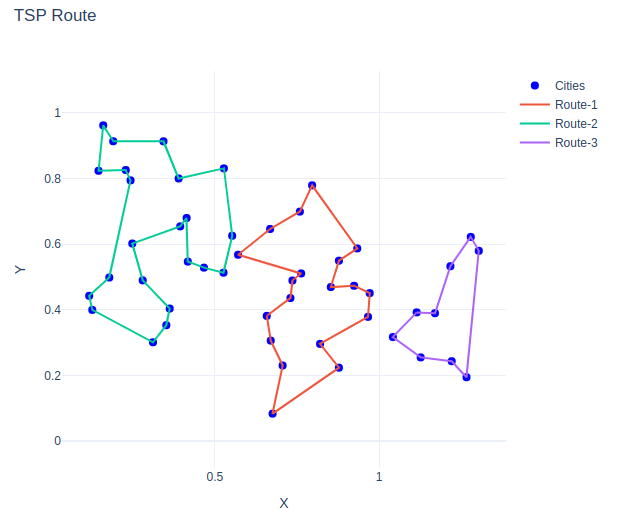
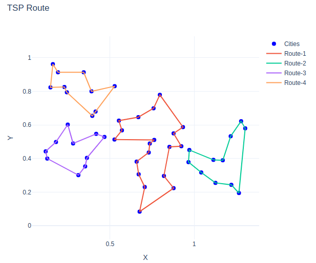

As we have discussed before, I was much more interested in how different methods compare to one another than what is the optimal output I can get for a specific method. As a result, I looked at several additional methods: ACO, GA, 2OPT, and 3OPT. I also configured this as part of the optimization library I have been building. Therefore, my system is capable of supporting multiple processors efficiently. For the purposes of this comparison, I turned off multi-processing.

For this type of problem, a 2D TSP problem, I have found that ACO is probably the best stochastic method. It converges on a mere optimal solution much more quickly versus GA. Because of the relatively uniform city distribution in the USA map provided, applying a post-processing step does not substantially improve the results found with ACO or GA.

For the convex Hall problem, I chose a slightly more realistic approach. Rather than simply finding the convex hull, I use a windmill technique to find the convex hall plus the distance from the starting city to the convex Hall. I am curious, based upon a specific three blue one brown video, to determine if you can use the same windmill technique to find a route through all of the cities.

An even better technique that I have found for cities in the range of 1 to a few tens of thousands is the VAT technique. Normally used for cluster visualization, it technically calculates the minimum spanning tree of the distances among all of the points. For certain larger scale data sets, it can provide a factor of two of the known optimal solution in a fraction of a second. This does require my merge vat technique, but I figured it was worthy of note.

### USA Plots

| Method                             | Solution Value | Time (s) |
|------------------------------------|----------------|----------|
| TSP Upper Bound (Nearest Neighbor) | 6.20           | 0.00     |
| TSP 2-OPT Solution                 | 5.82           | 0.00     |
| TSP Lower Bound (Convex Hull)      | 3.46           | 0.00     |
| TSP GA Solution                    | 7.68           | 0.97     |
| TSP ACO Solution                   | 5.91           | 3.73     |
| MST ACO Solution                   | 4.94           | 4.64     |
| VAT Solution                       | 8.10           | 0.12     |

Here is the convergence plot. Notice that the convergence is not relevant for the non-stochastic methods.

### Scaling

Because of my interest in scalability, I chose not to create other sample cases with 50 or so cities, but rather to utilize some existing data sets with thousands or tens of thousands of cities. The sample datasets were all sourced from here: https://github.com/mastqe/tsplib/blob/master/solutions 

| Dataset  | VAT Time (s) | 2-OPT Time (s) | Total Time (s) |
|----------|--------------|----------------|----------------|
| berlin52 | 0.09         | 0.00           | 0.1            |
| d1291    | 0.16         | 5.30           | 5.46           |
| rl5915   | 0.91         | 2.43           | 3.34           |

Here is a similar scale dataset for comparison purposes. This has 52 entries, vs 50 from the project data. Notice that the VAT based solution is within about 2x of the optimal. The actual distances cannot be compared across these two examples, but the ratio of $(\frac{VAT}{OPT})$ can be compared. 

For example, here is the d1291 dataset where the optimal solution is known. Notice that VAT solution gets within 2x of the optimal solution in 0.16s.
2-OPT does improve the solution somewhat, but it takes 5.3s to do so.

For a final scaled example, here is the rl5915 dataset. For this case, the 2-OPT refinement was reduced to the nearest-50 neighbors to reduce the computation time.

These tests were all performed on a Surface Laptop 4 with an i7-1165G7 CPU and 16GB RAM.

# Part 2 - M-TSP

Rather than using the MATLAB scripts, I chose to reimplement the algorithms in Python. The code is all available in my optimizers library. I also chose to use ACO methods, given their apparently better performance as indicated in part 1.

For each case, I chose 50 ants/generation, 50 generations, and 15 minimum generations to ensure it did not stop prematurely. I have also excluded the convergence diagrams since they are somewhat redundant.

## 2-UAV

As expected, the clusters converge more and more quickly as the number of clusters increases. For some reason, the 2-UAV situation likes to have a crossover that does not seem to be optimized away. If I added post-ACO optimization with 2-OPT, this would definitely disappear. These clusters do not intersect, which is to be expected with a good clustering algorithm.

