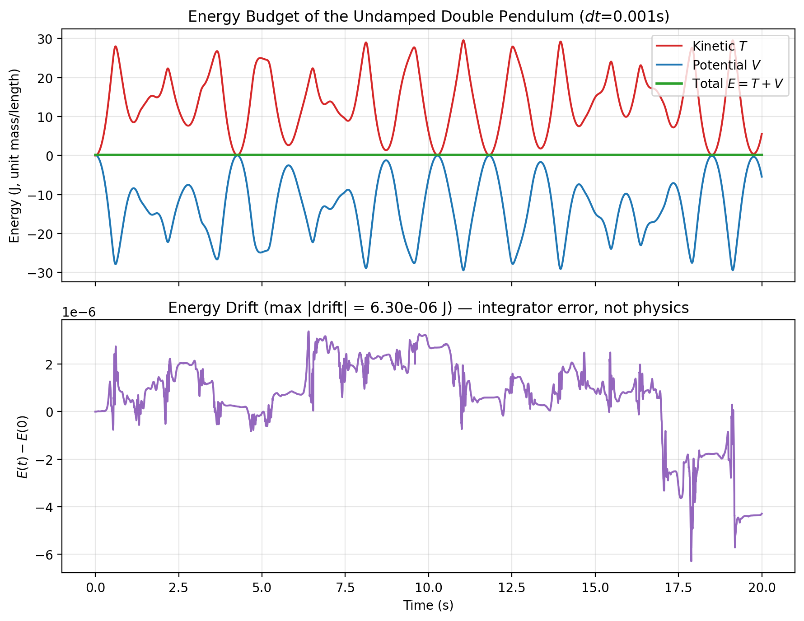
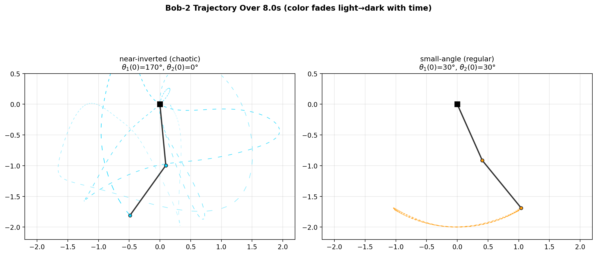
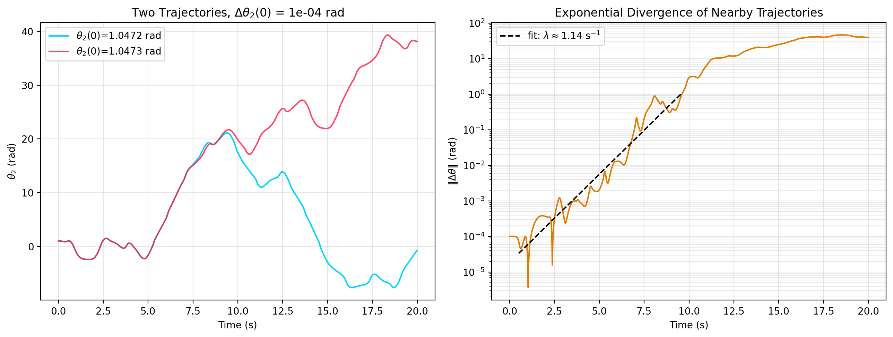
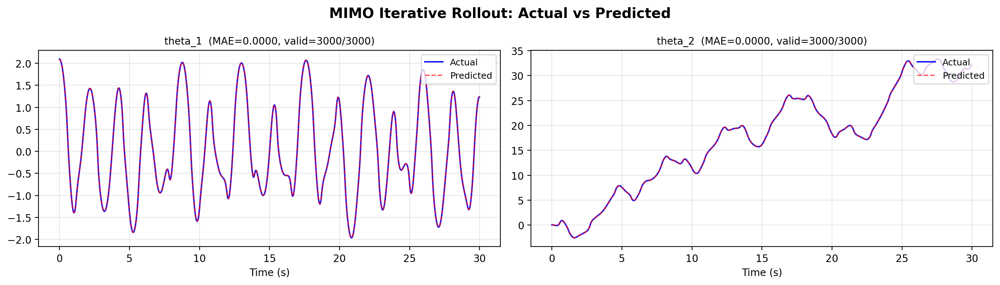
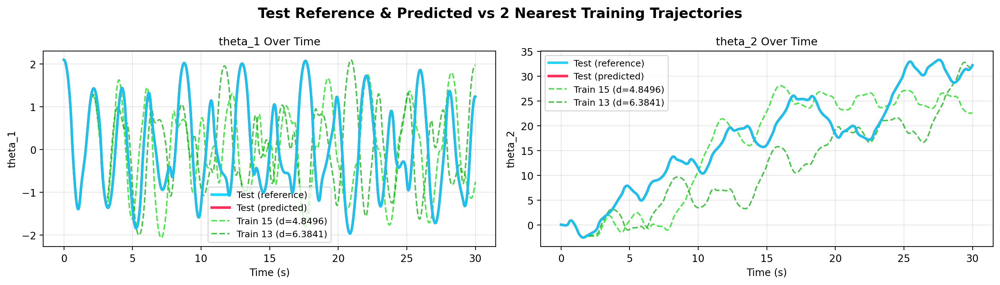

# The Planar Double Pendulum: Lagrangian Derivation, Numerical Verification, and a Fuzzy-Regression Surrogate

**Course:** Analytical Dynamics — final project, double-pendulum component
**Code:** `AnalyticalDynamics/test_fuzzy_ode.py`, `test_double_pendulum.py`, `double_pendulum_classical_dynamics.py`

This note derives the equations of motion for the planar double pendulum from
the Lagrangian, verifies the numerical implementation against energy
conservation, characterizes the system's transition from regular to chaotic
motion, and reports results from an existing fuzzy Takagi–Sugeno–Kang (TSK)
regression pipeline that tries to learn the dynamics from simulated
trajectories. A modeling bug was found and fixed along the way (§3), so the
reported ML results are re-run against the corrected physics.

---

## 1. System Definition

Two point masses $m_1,m_2$ hang from massless rigid rods of length $l_1,l_2$.
$\theta_1$ is measured from the downward vertical to rod 1; $\theta_2$ from the
downward vertical to rod 2 (**not** relative to rod 1). Positions of the two
bobs in the fixed frame:

$$
\begin{aligned}
x_1 &= l_1 \sin\theta_1, & y_1 &= -l_1 \cos\theta_1 \\
x_2 &= x_1 + l_2 \sin\theta_2, & y_2 &= y_1 - l_2 \cos\theta_2
\end{aligned}
$$

Differentiating gives the bob velocities:

$$
\begin{aligned}
\dot x_1 &= l_1\dot\theta_1\cos\theta_1, & \dot y_1 &= l_1\dot\theta_1\sin\theta_1\\
\dot x_2 &= l_1\dot\theta_1\cos\theta_1 + l_2\dot\theta_2\cos\theta_2, &
\dot y_2 &= l_1\dot\theta_1\sin\theta_1 + l_2\dot\theta_2\sin\theta_2
\end{aligned}
$$

## 2. Lagrangian and the Euler–Lagrange Equations

**Kinetic energy.**

$$
T = \tfrac12 m_1\left(\dot x_1^2+\dot y_1^2\right) + \tfrac12 m_2\left(\dot x_2^2+\dot y_2^2\right)
= \tfrac12(m_1+m_2)l_1^2\dot\theta_1^2 + \tfrac12 m_2 l_2^2\dot\theta_2^2
+ m_2 l_1 l_2 \dot\theta_1\dot\theta_2\cos(\theta_1-\theta_2)
$$

**Potential energy** (zero at the pivot):

$$
V = -(m_1+m_2) g\, l_1\cos\theta_1 - m_2 g\, l_2 \cos\theta_2
$$

**Lagrangian** $L=T-V$, generalized coordinates $q=(\theta_1,\theta_2)$. Writing
$\Delta \equiv \theta_1-\theta_2$, the Euler–Lagrange equation
$\frac{d}{dt}\frac{\partial L}{\partial \dot q_i}-\frac{\partial L}{\partial q_i}=0$
for each coordinate gives, after collecting terms:

$$
(m_1+m_2)l_1^2\ddot\theta_1 + m_2 l_1 l_2\cos\Delta\,\ddot\theta_2
= -m_2 l_1 l_2 \sin\Delta\,\dot\theta_2^2 - (m_1+m_2) g l_1\sin\theta_1 \tag{A}
$$

$$
m_2 l_1 l_2\cos\Delta\,\ddot\theta_1 + m_2 l_2^2\ddot\theta_2
= m_2 l_1 l_2 \sin\Delta\,\dot\theta_1^2 - m_2 g l_2 \sin\theta_2 \tag{B}
$$

(A)–(B) is a linear system in $(\ddot\theta_1,\ddot\theta_2)$ with matrix

$$
\mathbf{M} =
\begin{pmatrix}(m_1+m_2)l_1^2 & m_2 l_1 l_2\cos\Delta\\ m_2 l_1 l_2\cos\Delta & m_2 l_2^2\end{pmatrix},
\qquad \det \mathbf M = m_2 l_1^2 l_2^2\left(m_1+m_2\sin^2\Delta\right)
$$

Solving $\mathbf M \ddot\theta = \mathbf b$ and simplifying with the identity
$\cos\Delta\sin\theta_1-\sin\theta_2=\cos\theta_1\sin\Delta$ gives the closed-form
angular accelerations:

$$
\ddot\theta_1 = \frac{-(m_1+m_2)g\sin\theta_1 + m_2 g\sin\theta_2\cos\Delta
- m_2\sin\Delta\left(l_2\dot\theta_2^2 + l_1\cos\Delta\,\dot\theta_1^2\right)}
{l_1\left(m_1+m_2\sin^2\Delta\right)}
$$

$$
\ddot\theta_2 = \frac{\sin\Delta\left[(m_1+m_2)l_1\dot\theta_1^2 + m_2 l_2\cos\Delta\,\dot\theta_2^2
+ (m_1+m_2)g\cos\theta_1\right]}
{l_2\left(m_1+m_2\sin^2\Delta\right)}
$$

Using $2(m_1+m_2\sin^2\Delta) = 2m_1+m_2-m_2\cos2\Delta$ and the product-to-sum
identity $2\sin\theta_2\cos\Delta=\sin\theta_1-\sin(\theta_1-2\theta_2)$ recovers
exactly the form implemented in code (§3), sourced originally from MIT's
[double-pendulum chaos notes](https://web.mit.edu/jorloff/www/chaosTalk/double-pendulum/double-pendulum-en.html):

$$
\ddot\theta_1=\frac{-g(2m_1+m_2)\sin\theta_1 - m_2 g\sin(\theta_1-2\theta_2)
-2\sin\Delta\, m_2\left(\dot\theta_2^2 l_2+\dot\theta_1^2 l_1\cos\Delta\right)}
{l_1(2m_1+m_2-m_2\cos2\Delta)}
$$

$$
\ddot\theta_2=\frac{2\sin\Delta\left[\dot\theta_1^2 l_1(m_1+m_2)+g(m_1+m_2)\cos\theta_1
+\dot\theta_2^2 l_2 m_2\cos\Delta\right]}
{l_2(2m_1+m_2-m_2\cos2\Delta)}
$$

## 3. State-Space Expansion — and a Bug Caught by Energy Conservation

Define the state $\mathbf{x}=(\theta_1,\omega_1,\theta_2,\omega_2)^T$ with
$\omega_i \equiv \dot\theta_i$. The two second-order ODEs above become four
first-order ODEs, exactly matching `OdeSystem.equations_of_motion`:

$$
\dot{\mathbf x} =
\begin{pmatrix}\dot\theta_1\\ \dot\omega_1\\ \dot\theta_2\\ \dot\omega_2\end{pmatrix}
=
\begin{pmatrix}\omega_1\\ \alpha_1(\theta_1,\omega_1,\theta_2,\omega_2)\\ \omega_2\\ \alpha_2(\theta_1,\omega_1,\theta_2,\omega_2)\end{pmatrix}
$$

which `scipy.integrate.odeint` steps forward from $\mathbf x(0)$.

**The bug.** The existing `alpha2` implementation had:

```python
num23 = omega2**2 + self.l2*self.m2 * np.cos(delta_theta)   # WRONG: sum
```

where the derivation above requires the $\dot\theta_2^2\,l_2 m_2\cos\Delta$
term to be a *product* of $\omega_2^2$ with $l_2 m_2\cos\Delta$, not a sum —
the two quantities aren't even dimensionally comparable. Re-deriving both
equations independently (§2) confirmed `alpha1` was already correct and
isolated the error to this one term in `alpha2`. Fixed to:

```python
num23 = omega2**2 * self.l2*self.m2 * np.cos(delta_theta)   # correct: product
```

**Why this matters, and how it was confirmed.** The undamped double pendulum
conserves $E=T+V$ exactly; any drift beyond integrator truncation error means
the coded equations of motion don't correspond to a real Lagrangian system.
Before the fix, a 20 s simulation at $dt=1\,\text{ms}$ drifted by up to
**150 J**, i.e. $10^5\%$ of the (near-zero) initial energy. After the fix, the
drift drops to **$6.3\times10^{-6}$ J (0.004%)** — consistent with
`odeint`'s truncation error rather than a modeling defect:



This one-line bug had been silently degrading the entire downstream pipeline;
§5 shows how much it mattered for the fuzzy-regression surrogate.

## 4. Regular vs. Chaotic Regimes

The double pendulum is integrable only in special limits (e.g. small angles);
generically it is chaotic. Two regimes, both simulated with the corrected
model ($m_1=m_2=l_1=l_2=1$, $g=9.81\,\text{m/s}^2$):



- **Small-angle** ($\theta_1(0)=\theta_2(0)=30°$, released from rest): bob 2
  traces a smooth, repeating near-elliptical arc — energy stays low enough
  that the rods barely couple nonlinearly.
- **Near-inverted** ($\theta_1(0)=170°,\ \theta_2(0)=0°$): bob 2 sweeps a dense,
  self-intersecting tangle over the same 8 s window — the signature of
  chaotic, non-repeating motion.

**Sensitivity to initial conditions.** Two trajectories released from
$\theta_1(0)=120°$, $\theta_2(0)=60°\pm5\times10^{-5}°$ ($\Delta\theta_2(0)=10^{-4}$ rad)
track each other for about 5 s, then diverge completely:



Fitting $\log\|\Delta\theta(t)\|$ over the early-time linear-growth window gives
an estimated largest Lyapunov exponent $\lambda\approx1.14\,\text{s}^{-1}$
(e-folding time $\approx0.88$ s) — in the range reported in the double-pendulum
literature for comparable mass/length ratios, and a positive value is itself
direct numerical evidence of chaos.

## 5. Fuzzy TSK Regression as a Data-Driven Surrogate

`test_double_pendulum.py` asks a different question: given only the simulated
trajectories, can a fuzzy (Gaussian-mixture TSK) regressor learn the map from
state to next state well enough to substitute for the ODE integrator?

**Setup.** 16 training trajectories from $\theta_1(0)=120°$, $\theta_2(0)\in\{1.5°,1.6°,\dots,3.0°\}$,
released from rest, $dt=0.01\,\text s$, duration 30 s (3000 samples each).
One held-out test trajectory at $\theta_2(0)=2.05°$ (between two training grid
points). Only $(\theta_1,\theta_2)$ are used as model inputs — velocities are
*not* included as features.

| Model | Target | R² (θ₁) | R² (θ₂) |
|---|---|---|---|
| Single-step (2nd-order TSK) | absolute next $\theta_1$ | **0.965** | — |
| MIMO, window=1 | one-step **Δstate** | −0.011 | −0.040 |
| MIMO, window=3 | Δstate from 3-step history | **0.857** | **0.754** |
| MIMO, window=5 | Δstate from 5-step history | 0.526 | 0.456 |
| MIMO, window=7 | Δstate from 7-step history | −0.087 | 0.139 |
| MIMO, window=10 | Δstate from 10-step history | −0.712 | −0.222 |




**Three things worth flagging, not glossing over:**

1. **The 0.965 single-step R² is largely autocorrelation, not learned dynamics.**
   That model predicts the *absolute* next angle, and at $dt=0.01\,$s a
   pendulum's angle barely changes step to step — even $\hat\theta_1(t+dt)=\theta_1(t)$
   would score well. The MIMO models predict the *increment* $\Delta\theta$
   directly, which is the actual quantity governed by the dynamics, and that
   is where the real story is.

2. **There is a sweet spot at window=3, not "more history is better."** Before
   the physics fix, every window size scored negative R² (worse than
   predicting the mean). After the fix, window=3 jumps to R²≈0.75–0.86, then
   *degrades* monotonically as the window grows to 5, 7, 10. With only
   $(\theta_1,\theta_2)$ as inputs, a short window lets the regressor infer an
   implicit finite-difference velocity; a longer window adds input dimensions
   faster than it adds useful information, and the fuzzy partition starts
   fragmenting the training data. This is the kind of bias–variance tradeoff
   worth a follow-up sweep with velocity terms included explicitly.

3. **The near-perfect iterative rollout (window=1, R²=1.0000 over the full 30 s)
   looks like it contradicts finding #2 — it doesn't, once you notice what's
   being measured.** The "divergence" check only flags numerical blow-up
   ($>10^4$ rad), not accuracy, and none of the runs ever hit that; the
   stability table in the test output is measuring something closer to
   "did it stay finite" than "was it correct." Separately, the rollout tracks
   so closely because the 16 training initial conditions are packed into a
   $1.5°$ window and the test case sits inside it — the regressor is
   effectively interpolating between near-identical neighboring trajectories
   of the *same* underlying vector field, not extrapolating to a genuinely
   novel chaotic orbit. The right-hand panel above makes this visible: the two
   nearest training trajectories (dashed green) separate visibly from the test
   trajectory (cyan) after about 8 s, exactly as chaos predicts — the surrogate
   is not "beating chaos," it just isn't being asked to on this test case.

Two GIF animations (`double_pendulum_comparison.gif`,
`double_pendulum_with_training.gif`) render the same rollout as the actual
swinging double pendulum, alongside its two nearest training neighbors.

## 6. Summary

- Derived the double-pendulum equations of motion from the Lagrangian
  independently of the existing code, confirmed `alpha1` was correct, and
  found/fixed a product-coded-as-sum bug in `alpha2`.
- Verified the fix via energy conservation (drift: 150 J → 6×10⁻⁶ J) — the
  cleanest test available for an undamped Lagrangian system.
- Quantified the system's chaos directly: positive Lyapunov exponent
  ($\lambda\approx1.14\,\text{s}^{-1}$), plus qualitative regular-vs-chaotic
  trajectory contrast.
- Re-ran the fuzzy TSK surrogate pipeline against the corrected physics —
  window=3 MIMO prediction went from R²<0 to R²≈0.75–0.86 — and identified a
  non-monotonic window-size effect and an autocorrelation confound in the
  single-step baseline that a first read of the numbers would miss.

## 7. Roadmap (next phase, not yet started)

This report covers the double pendulum's *numerical* side. The planned next
phase is a from-scratch **symbolic** Lagrangian derivation (SymPy) of the
same equations of motion, cross-checked against §2 and the fixed code, then
generalized to an $n$-link planar pendulum chain, with worked $n=3$ and $n=5$
cases for later results sections. See chat for the phased plan.
