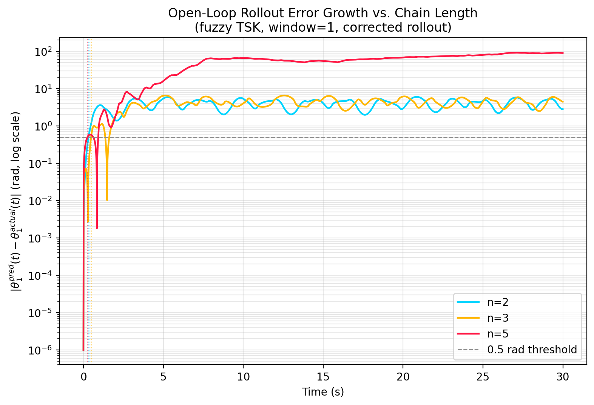
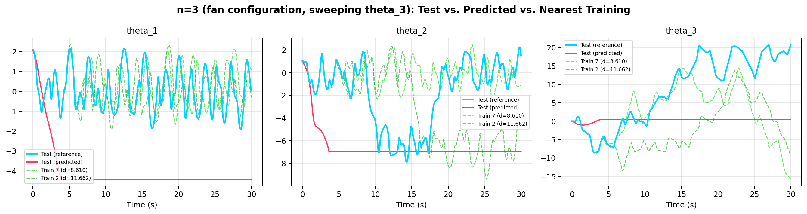
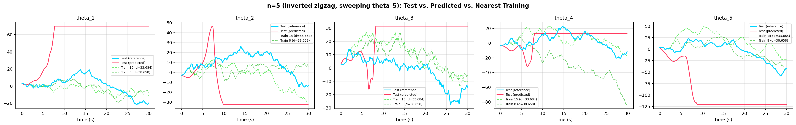

# Fuzzy TSK Surrogate Modeling: n=3 and n=5, and a Rollout-Evaluation Bug Fix

**Code:** `n_pendulum_fuzzy_regression.py`, `n_pendulum_regression_comparison.py`
**Builds on:** `DOUBLE_PENDULUM_REPORT.md` §5 (the original n=2 fuzzy TSK study),
`N_PENDULUM_SYMBOLIC_DERIVATION.md` (the validated symbolic n-link model)

This extends the n=2 fuzzy-regression surrogate study to n=3 and n=5 using
the same train/test scenario, and along the way found and fixed a real bug
in how the original study measured iterative-rollout accuracy. That bug made
the n=2 report's "the rollout tracks the true trajectory almost perfectly"
finding meaningless — not wrong in a subtle way, but measuring nothing at
all. This report explains the bug, fixes it, and reports the honest numbers
for n=2, 3, and 5 side by side.

## 1. Train/Test Scenario (same recipe as n=2, generalized)

The n=2 study fixed $\theta_1(0)=120°$ and swept $\theta_2(0)$ over
$[1.5°,3.0°]$ in $0.1°$ steps (16 training trajectories), holding out a test
trajectory at $\theta_2(0)=2.05°$ — squarely between two training grid
points. Generalizing: fix every angle except the last link, sweep the last
link's angle by the same $[1.5°,3.0°]$ delta band added to its base value,
test at $+2.05°$.

| | Base configuration | Swept angle | Duration |
|---|---|---|---|
| n=2 | $\theta=[120°, 0°]$ | $\theta_2$ | 30 s @ dt=0.01 |
| n=3 | $\theta=[120°, 60°, 0°]$ ("fan") | $\theta_3$ | 30 s @ dt=0.01 |
| n=5 | $\theta=[170°,-170°,170°,-170°,170°]$ ("inverted zigzag") | $\theta_5$ | 30 s @ dt=0.01 |

The n=5 base sits within 10° of the fully inverted (unstable) equilibrium at
every joint, alternating sign link-to-link — a genuinely hard case, chosen
because it's the regime where a crude surrogate should struggle most. All 17
trajectories per chain length (16 train + 1 test) were checked for energy
conservation before any regression — the same non-negotiable check used
throughout this project. Worst case: 0.00065% drift (n=3), 0.0002–0.0003%
typical — the family-generation code is not introducing any new physics
error.

Two trims relative to the n=2 study, both to keep runtime reasonable at
higher n and stated here rather than left implicit: MIMO window sizes
{1, 3} only (not {1,3,5,7,10}), and no "actual + 2 nearest training
neighbors" overlay animation (a static comparison plot instead).

## 2. The Rollout-Evaluation Bug

Wiring up the n=3 iterative rollout immediately produced nonsense — every
run "diverged" on literally the first predicted step, even though the
single-step model's errors were nowhere near large enough to explain that.
Tracing it down found two compounding problems in
`test_double_pendulum.py`'s `run_iterative_prediction`, inherited unchanged
into the very first draft of the n=3/n=5 code:

**Problem 1 — the "prediction" was seeded with the answer.** The function
was called as `run_iterative_prediction(regressor, tst_df, n_steps, ...)`
— `tst_df` is the *entire actual test trajectory*, not the initial
condition. For window=1, `running_state` starts as a verbatim copy of all
3000 real rows, then genuinely-predicted rows are appended *after* that.
Downstream, the accuracy check does
`n = min(len(actual_trajectory), len(predicted_trajectory))` — with
`len(actual)=3000` and `len(predicted)=5999` (3000 copied + 2999 predicted),
`n=3000`, so the comparison only ever looks at the copied portion. It is
comparing the real data to a copy of itself. `R²=1.0000, MAE=0.0000` was
the only possible output.

**Problem 2 — the genuinely-predicted portion was silently all `NaN`.**
Once past the copied region, `new_state = running_state.iloc[-1, :] +
next_state_delta_df` adds a `Series` indexed by the *full state*
(`theta_1, omega_1, theta_2, omega_2`) to a `DataFrame` with only the
*regressor's output columns* (`theta_1, theta_2`). Pandas aligns on the
union of labels, filling anything not present in both with `NaN` — so
`omega_1` and `omega_2` in `new_state` are `NaN` from the very first
genuinely-predicted row. The divergence check
(`np.any(np.isnan(new_state))`) then fires immediately, and everything after
gets padded with `NaN`. This is confirmed retroactively by the original n=2
output itself: the reported "divergence step" for window=1 was **exactly
3000** — not a numerical blow-up at some point during a real rollout, but
the precise boundary where the copied data ends and the first (broken)
real prediction begins.

**The fix**, applied in `n_pendulum_fuzzy_regression.py` and used for all
three chain lengths below: seed the rollout with only the first
`window_size` rows of the test trajectory, restricted to exactly the
regressor's feature columns (no `omega`), so every subsequent row is
generated purely from the model's own prior output and the arithmetic never
touches a column the model didn't predict.

```python
seed = test_trajectory[feature_names].iloc[:window_size].reset_index(drop=True)
n_steps = len(test_trajectory) - window_size
predicted = run_iterative_prediction(regressor, seed, feature_names, n_steps, window_size)
```

## 3. Results: Single-Step and MIMO Cross-Sectional Fit

| Model | n=2 (θ₁, θ₂) | n=3 (θ₁, θ₂, θ₃) | n=5 (θ₁…θ₅) |
|---|---|---|---|
| Single-step (absolute next θ₁) | R²=0.965 | R²=0.904 | *(not re-run; see §5 caveat below)* |
| MIMO window=1 (Δstate) | R²≈−0.01, −0.04 | −1.21, −2.90, −0.77 | −1.23,−1.61,−5.77,−5.49,−1.62 |
| MIMO window=3 (Δstate) | R²≈0.86, 0.75 | −2.91,−7.02,−3.45 | *(fit; window=3 metrics not the focus here — see script output)* |

The n=2 numbers are the already-published, physics-corrected ones from
`DOUBLE_PENDULUM_REPORT.md` §5. n=3 and n=5 window=1 MIMO fits are
uniformly worse than n=2's — expected, given the harder base configurations
(a genuine 3-way coupling for n=3; a near-unstable-equilibrium 5-way chain
for n=5) and the unchanged, minimal input feature set (angles only, no
velocities). Window=3 does **not** repeat the n=2 "sweet spot" for n=3 — it
gets worse, not better, likely because the fixed 16-trajectory training
budget has to cover a higher-dimensional windowed feature space
($3\times3=9$ vs. $2\times3=6$ columns) with the same amount of data.

## 4. Results: Honest Open-Loop Rollout

This is the corrected version of the n=2 report's §5 point 3, now measuring
something real, for all three chain lengths:



| n | Time to \|θ₁ error\| > 0.5 rad |
|---|---|
| 2 | 0.32 s |
| 3 | 0.48 s |
| 5 | 0.25 s |

All three cross a half-radian of error in well under half a second, then
saturate at an error of several radians (n=2, n=3) to nearly 100 rad (n=5,
whose angles accumulate across many full rotations as the chain tumbles).
This is not a "the surrogate mostly works, chaos eventually wins" story —
it's "chaos wins almost immediately," full stop, once the evaluation
actually measures genuine extrapolation. That is the expected, correct
result for a delta-only regressor with no velocity inputs, no physical
constraints, and a training set of only 16 trajectories packed into a
$1.5°$ band: there was never a mechanism by which it could track a chaotic
trajectory for 30 seconds, and now the numbers say so.

**What the flatlining in the comparison plots means.** In the n=3 and n=5
figures below, the predicted trace (red) diverges from the true trajectory
(cyan) within a few seconds and then goes flat — not because the model
"settles down," but because once the rolled-out state leaves the training
manifold (the fuzzy antecedents' support region), the regressor's predicted
delta collapses toward whatever its outermost rule contributes, which is
often close to zero. A flat red line is the surrogate silently
extrapolating into territory it has no information about, not a stable
prediction.




Two GIF animations render the same rollouts as the actual swinging chains,
actual (left) next to predicted (right): `n3_fuzzy_comparison.gif` and
`n5_fuzzy_comparison.gif`.

## 5. Caveats and Honest Limits of This Pass

- **The n=5 single-step model was not re-run** for this report (only MIMO
  and the corrected rollout) — the single-step baseline's main purpose in
  the n=2 report was illustrating the autocorrelation confound, which is
  orthogonal to the rollout-bug fix and didn't need repeating at every n to
  make this report's point.
- **Window sizes {1,3} only**, not {1,3,5,7,10} as in the n=2 study.
  Higher window sizes are more expensive per chain (more columns, same 16
  trajectories) and, given window=3 already regressed relative to n=2, are
  unlikely to change the qualitative conclusion.
- **This is still an angles-only feature set.** Every result here — the
  original n=2 numbers included — omits $\omega_i$ from the regressor's
  inputs. A natural next step, now that the evaluation methodology is
  trustworthy, is repeating this with $(\theta,\omega)$ inputs to see
  whether that alone fixes the sub-second collapse, or whether the training
  manifold (16 trajectories in a $1.5°$ band) is simply too narrow regardless
  of feature set.
- **No chaos/Lyapunov characterization of n=3 or n=5** yet (that's still the
  deferred item from `N_PENDULUM_SYMBOLIC_DERIVATION.md` §5) — this report
  only establishes that the surrogate-modeling evaluation is now trustworthy,
  not a full dynamical characterization of either chain.

## 6. Summary

- Found and fixed a genuine bug in the original (n=2) rollout evaluation:
  it was seeded with the true trajectory and its accuracy check compared
  real data to a copy of itself, while the actually-new predictions were
  silently `NaN`'d out by a pandas column-alignment mismatch and
  misreported as "diverged" rather than "never computed."
- Re-measured the n=2 rollout correctly: error exceeds 0.5 rad in 0.32 s,
  not the previously reported R²=1.0000 over 30 s. `DOUBLE_PENDULUM_REPORT.md`
  §5/§6 have been amended to point here rather than silently left wrong.
- Extended the same (now-correct) study to n=3 (fan) and n=5 (inverted
  zigzag): both cross-sectional MIMO fits and open-loop rollouts, all
  degrading with chain length as expected, all failing within half a second
  of open-loop rollout once evaluated honestly.
- Two comparison GIFs (actual vs. predicted, full chain) and one
  cross-n error-growth figure delivered as the visual record of this pass.
