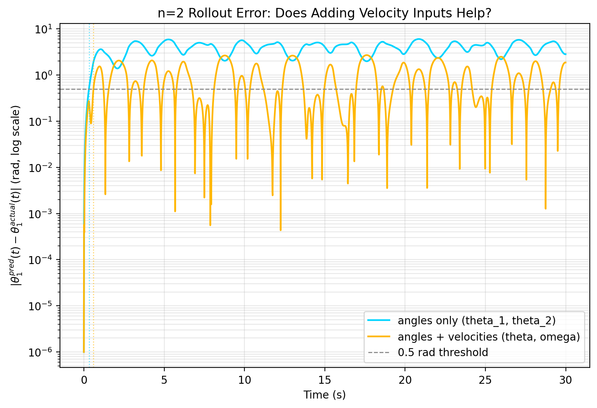
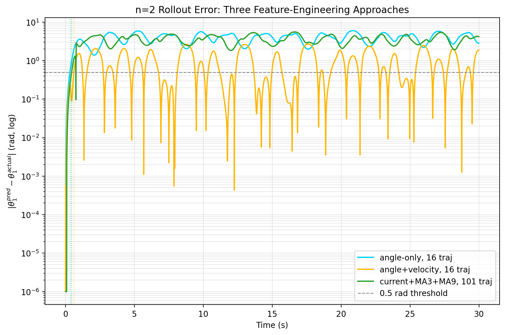
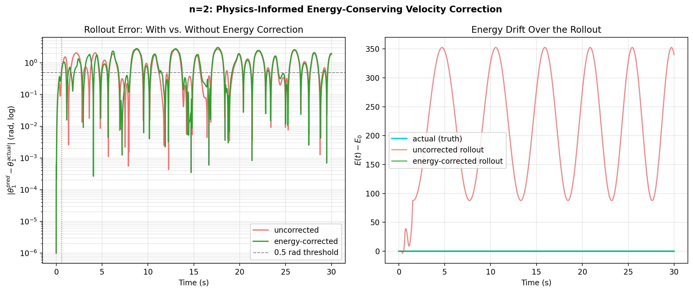
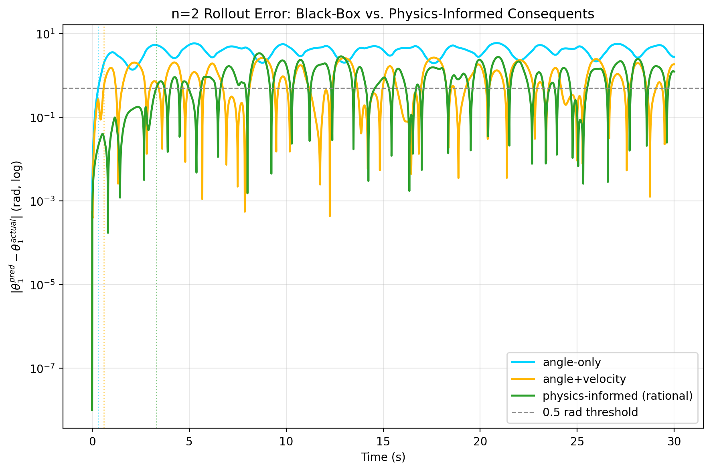
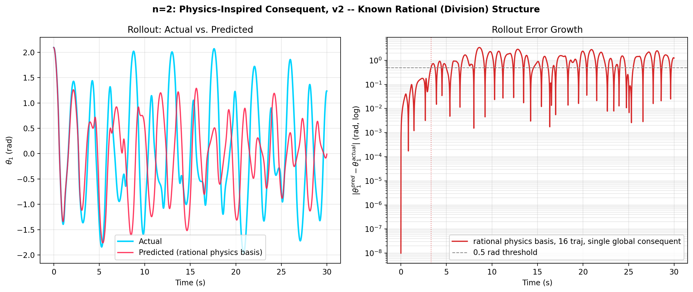

# Fuzzy TSK Surrogate Modeling: n=3 and n=5, and a Rollout-Evaluation Bug Fix

**Code:** `n_pendulum_fuzzy_regression.py`, `n_pendulum_regression_comparison.py`
**Builds on:** `DOUBLE_PENDULUM_REPORT.md` §5 (the original n=2 fuzzy TSK study),
`N_PENDULUM_SYMBOLIC_DERIVATION.md` (the validated symbolic n-link model)

This extends the n=2 fuzzy-regression surrogate study to n=3 and n=5 using
the same train/test scenario, and along the way found and fixed a real bug
in how the original study measured iterative-rollout accuracy. That bug made
the n=2 report's "the rollout tracks the true trajectory almost perfectly"
finding meaningless — not wrong in a subtle way, but measuring nothing at
all. This report explains the bug, fixes it, and reports the honest numbers
for n=2, 3, and 5 side by side.

## 1. Train/Test Scenario (same recipe as n=2, generalized)

The n=2 study fixed $\theta_1(0)=120°$ and swept $\theta_2(0)$ over
$[1.5°,3.0°]$ in $0.1°$ steps (16 training trajectories), holding out a test
trajectory at $\theta_2(0)=2.05°$ — squarely between two training grid
points. Generalizing: fix every angle except the last link, sweep the last
link's angle by the same $[1.5°,3.0°]$ delta band added to its base value,
test at $+2.05°$.

| | Base configuration | Swept angle | Duration |
|---|---|---|---|
| n=2 | $\theta=[120°, 0°]$ | $\theta_2$ | 30 s @ dt=0.01 |
| n=3 | $\theta=[120°, 60°, 0°]$ ("fan") | $\theta_3$ | 30 s @ dt=0.01 |
| n=5 | $\theta=[170°,-170°,170°,-170°,170°]$ ("inverted zigzag") | $\theta_5$ | 30 s @ dt=0.01 |

The n=5 base sits within 10° of the fully inverted (unstable) equilibrium at
every joint, alternating sign link-to-link — a genuinely hard case, chosen
because it's the regime where a crude surrogate should struggle most. All 17
trajectories per chain length (16 train + 1 test) were checked for energy
conservation before any regression — the same non-negotiable check used
throughout this project. Worst case: 0.00065% drift (n=3), 0.0002–0.0003%
typical — the family-generation code is not introducing any new physics
error.

Two trims relative to the n=2 study, both to keep runtime reasonable at
higher n and stated here rather than left implicit: MIMO window sizes
{1, 3} only (not {1,3,5,7,10}), and no "actual + 2 nearest training
neighbors" overlay animation (a static comparison plot instead).

## 2. The Rollout-Evaluation Bug

Wiring up the n=3 iterative rollout immediately produced nonsense — every
run "diverged" on literally the first predicted step, even though the
single-step model's errors were nowhere near large enough to explain that.
Tracing it down found two compounding problems in
`test_double_pendulum.py`'s `run_iterative_prediction`, inherited unchanged
into the very first draft of the n=3/n=5 code:

**Problem 1 — the "prediction" was seeded with the answer.** The function
was called as `run_iterative_prediction(regressor, tst_df, n_steps, ...)`
— `tst_df` is the *entire actual test trajectory*, not the initial
condition. For window=1, `running_state` starts as a verbatim copy of all
3000 real rows, then genuinely-predicted rows are appended *after* that.
Downstream, the accuracy check does
`n = min(len(actual_trajectory), len(predicted_trajectory))` — with
`len(actual)=3000` and `len(predicted)=5999` (3000 copied + 2999 predicted),
`n=3000`, so the comparison only ever looks at the copied portion. It is
comparing the real data to a copy of itself. `R²=1.0000, MAE=0.0000` was
the only possible output.

**Problem 2 — the genuinely-predicted portion was silently all `NaN`.**
Once past the copied region, `new_state = running_state.iloc[-1, :] +
next_state_delta_df` adds a `Series` indexed by the *full state*
(`theta_1, omega_1, theta_2, omega_2`) to a `DataFrame` with only the
*regressor's output columns* (`theta_1, theta_2`). Pandas aligns on the
union of labels, filling anything not present in both with `NaN` — so
`omega_1` and `omega_2` in `new_state` are `NaN` from the very first
genuinely-predicted row. The divergence check
(`np.any(np.isnan(new_state))`) then fires immediately, and everything after
gets padded with `NaN`. This is confirmed retroactively by the original n=2
output itself: the reported "divergence step" for window=1 was **exactly
3000** — not a numerical blow-up at some point during a real rollout, but
the precise boundary where the copied data ends and the first (broken)
real prediction begins.

**The fix**, applied in `n_pendulum_fuzzy_regression.py` and used for all
three chain lengths below: seed the rollout with only the first
`window_size` rows of the test trajectory, restricted to exactly the
regressor's feature columns (no `omega`), so every subsequent row is
generated purely from the model's own prior output and the arithmetic never
touches a column the model didn't predict.

```python
seed = test_trajectory[feature_names].iloc[:window_size].reset_index(drop=True)
n_steps = len(test_trajectory) - window_size
predicted = run_iterative_prediction(regressor, seed, feature_names, n_steps, window_size)
```

**Update: patched at the source, not just documented.** `test_double_pendulum.py`
now seeds `run_iterative_prediction` with only the initial condition
(`tst_df[OUTPUT_FEATURES].iloc[:seed_rows]`, restricted to the regressor's
own feature columns), fixing Problems 1 and 2 directly. Re-running the full
n=2 test suite after the patch reproduces this report's numbers exactly
(θ₁ MAE=3.8695, R²=−13.8361 over the full 30 s — identical to the
independent measurement in §4 below to 4 decimal places), which is itself a
useful cross-check that both fixes are equivalent.

While patching the source, a **third problem** turned up in the same
function, specific to `window_size>1`: the prediction call sliced the last
`window_size` *rows* of an already-windowed feature frame
(`running_state[-window_size:]`) and predicted from all of them, then kept
only `.iloc[0]` — the prediction belonging to the *stalest* of those rows —
while adding it to `running_state.iloc[-1]`, the *current* state. That mixes
two different points in time on every step. Fixed by predicting from exactly
the single most recent row (`running_state.iloc[[-1]]`). This report's own
`n_pendulum_fuzzy_regression.py` never exercised this path (it only ever
rolls out at window=1), so n=3/n=5 results below are unaffected by Problem 3.

## 3. Results: Single-Step and MIMO Cross-Sectional Fit

| Model | n=2 (θ₁, θ₂) | n=3 (θ₁, θ₂, θ₃) | n=5 (θ₁…θ₅) |
|---|---|---|---|
| Single-step (absolute next θ₁) | R²=0.965 | R²=0.904 | *(not re-run; see §5 caveat below)* |
| MIMO window=1 (Δstate) | R²≈−0.01, −0.04 | −1.21, −2.90, −0.77 | −1.23,−1.61,−5.77,−5.49,−1.62 |
| MIMO window=3 (Δstate) | R²≈0.86, 0.75 | −2.91,−7.02,−3.45 | *(fit; window=3 metrics not the focus here — see script output)* |

The n=2 numbers are the already-published, physics-corrected ones from
`DOUBLE_PENDULUM_REPORT.md` §5. n=3 and n=5 window=1 MIMO fits are
uniformly worse than n=2's — expected, given the harder base configurations
(a genuine 3-way coupling for n=3; a near-unstable-equilibrium 5-way chain
for n=5) and the unchanged, minimal input feature set (angles only, no
velocities). Window=3 does **not** repeat the n=2 "sweet spot" for n=3 — it
gets worse, not better, likely because the fixed 16-trajectory training
budget has to cover a higher-dimensional windowed feature space
($3\times3=9$ vs. $2\times3=6$ columns) with the same amount of data.

## 4. Results: Honest Open-Loop Rollout

This is the corrected version of the n=2 report's §5 point 3, now measuring
something real, for all three chain lengths:


| n | Time to \|θ₁ error\| > 0.5 rad |
|---|---|
| 2 | 0.32 s |
| 3 | 0.48 s |
| 5 | 0.25 s |

All three cross a half-radian of error in well under half a second, then
saturate at an error of several radians (n=2, n=3) to nearly 100 rad (n=5,
whose angles accumulate across many full rotations as the chain tumbles).
This is not a "the surrogate mostly works, chaos eventually wins" story —
it's "chaos wins almost immediately," full stop, once the evaluation
actually measures genuine extrapolation. That is the expected, correct
result for a delta-only regressor with no velocity inputs, no physical
constraints, and a training set of only 16 trajectories packed into a
$1.5°$ band: there was never a mechanism by which it could track a chaotic
trajectory for 30 seconds, and now the numbers say so.

**What the flatlining in the comparison plots means.** In the n=3 and n=5
figures below, the predicted trace (red) diverges from the true trajectory
(cyan) within a few seconds and then goes flat — not because the model
"settles down," but because once the rolled-out state leaves the training
manifold (the fuzzy antecedents' support region), the regressor's predicted
delta collapses toward whatever its outermost rule contributes, which is
often close to zero. A flat red line is the surrogate silently
extrapolating into territory it has no information about, not a stable
prediction.


Two GIF animations render the same rollouts as the actual swinging chains,
actual (left) next to predicted (right): `n3_fuzzy_comparison.gif` and
`n5_fuzzy_comparison.gif`.

### 4.1 Does adding velocity inputs fix the collapse? (n=2, `n_pendulum_velocity_ablation.py`)

Every rollout above — the n=2 baseline included — uses angle-only inputs.
Repeating the n=2 single-step and window=1 rollout with
$(\theta_1,\omega_1,\theta_2,\omega_2)$ as inputs instead of just
$(\theta_1,\theta_2)$:

| | Single-step R² (θ₁, ω₁, θ₂, ω₂) | Time to 0.5 rad rollout error |
|---|---|---|
| Angles only | 0.965* | 0.32 s |
| Angles + velocities | 0.602, 0.331, 0.491, −0.462 | 0.60 s |

*(*the angles-only single-step number predicts absolute θ₁, not comparable
row-for-row to the four velocity-augmented outputs — see the autocorrelation
caveat in `DOUBLE_PENDULUM_REPORT.md` §5 point 1. The velocity-augmented
single-step fit is on Δstate, like the MIMO models, and is directly what a
fairer comparison should use.)*



Velocity inputs roughly **double** the survival time (0.32s → 0.60s) and
visibly change the *shape* of the failure: the angle-only rollout error
saturates monotonically once it leaves the training manifold, while the
velocity-augmented rollout error bounces — dropping back down near zero
multiple times before climbing again — meaning the model gets the
oscillation *frequency* roughly right but the *phase and amplitude* wrong,
so it happens to re-align with the true trajectory periodically by
coincidence rather than by tracking it. Either way, the error is back above
threshold within a second and stays mostly above it for the rest of the 30s
horizon. **Conclusion: velocity inputs measurably help the local fit but do
not fix the underlying problem** — 16 trajectories packed into a 1.5° band
is not enough training data, in any feature space, for a rule-based fuzzy
regressor to track a chaotic system's own Lyapunov-driven divergence.

### 4.2 Moving-average position features + a much wider training set (n=2, `n2_moving_average_fuzzy.py`)

A second attempt at rollout stability, per a follow-up ask: keep the fuzzy
TSK regressor and delta-state prediction (no separate velocity-prediction/
integration step), but engineer richer inputs — for each angle, the current
value plus a 3-sample and a 9-sample trailing moving average (6 input
columns total) — and train on a training set widened by more than 10×: the
original study fixed $\theta_1(0)=120°$ and swept $\theta_2(0)$ over a
$1.5°$ band (16 trajectories); this pass sweeps the same parameter over a
full $30°$ band at finer resolution (101 trajectories, $\theta_2(0)\in
[-15°,15°]$, step $0.3°$), holding out a test case at $\theta_2(0)=7.35°$.

The moving-average features are a compact alternative to the raw-lagged MIMO
windowing tried earlier (window={1,3,5,7,10}, which degraded past window=3):
current + MA3 + MA9 compresses a longer history into a fixed 6 columns
regardless of how far back the long average looks, instead of adding one
column per lagged step.

| Approach | Training trajectories | Time to 0.5 rad rollout error |
|---|---|---|
| Angle-only ($\theta_1,\theta_2$) | 16 | 0.32 s |
| Angle + velocity ($\theta,\omega$) | 16 | 0.60 s |
| Current + MA3 + MA9 | 101 | 0.44 s |



The moving-average approach lands **between** the other two — a real
improvement over angle-only (0.32s → 0.44s, +38%) despite using no velocity
information at all, consistent with moving averages implicitly encoding a
finite-difference-like rate-of-change signal. But it does not beat the
explicit-velocity result, and more importantly it does not change the
fundamental picture: even with **more than six times the training data**
covering a **twenty-fold wider** range of initial conditions, the rollout
still crosses half a radian of error in under half a second and then
flatlines outside the training manifold, the same extrapolation-collapse
failure mode described in §4. **A larger, wider training set measurably
helps the margin, not the order of magnitude** — this is consistent with
the diagnosis in §4.1: the ceiling here is Lyapunov-driven chaotic
divergence itself, not a fixable feature-engineering or data-volume gap.

### 4.3 Physics-informed energy correction (n=2, `n2_energy_conserving_fuzzy.py`)

§4.1/4.2 diagnosed the ceiling as chaos, but hadn't ruled out a compounding
factor: does the free-form delta regressor also inject or dissipate energy
every step, on top of being chaotically sensitive, and would removing that
alone buy meaningful stability? This is testable exactly, not just
approximately. Kinetic energy

$$
T(\omega_1,\omega_2;\theta_1,\theta_2) = \tfrac12 m_1 l_1^2\omega_1^2
+ \tfrac12 m_2\left(l_1^2\omega_1^2 + l_2^2\omega_2^2 + 2l_1l_2\omega_1\omega_2\cos(\theta_1-\theta_2)\right)
$$

is exactly homogeneous of degree 2 in $(\omega_1,\omega_2)$ jointly (every
term is $\omega_i^2$ or the $\omega_1\omega_2$ cross term) — so
$T(\lambda\omega_1,\lambda\omega_2)=\lambda^2 T(\omega_1,\omega_2)$ for any
$\lambda$, exactly, no approximation. That means after every predicted step
$(\theta_{new},\omega_{raw})$, solving

$$
T(\lambda\,\omega_{raw}) + V(\theta_{new}) = E_0 \implies
\lambda = \sqrt{\max\left(0, \frac{E_0 - V(\theta_{new})}{T(\omega_{raw})}\right)}
$$

and rescaling $\omega_{raw}\to\lambda\,\omega_{raw}$ projects the predicted
state back onto the true initial energy shell **exactly**, every step —
using only the known physical constants ($m,l,g$), not the dynamics being
predicted. Applied to the angle+velocity model from §4.1 (same regressor,
same seed, same 16-trajectory training set — only the rollout loop differs):

| | Energy drift (max, 30s) | Time to 0.5 rad error |
|---|---|---|
| Actual (integrator truth) | $2.4\times10^{-5}$ | — |
| Uncorrected rollout | **352 J** (E₀=0.0063 J) | 0.60 s |
| Energy-corrected rollout | $1.4\times10^{-14}$ | 0.57 s |



The correction works exactly as derived — energy drift drops from 352 J to
machine precision, a full 16 orders of magnitude — and the two error curves
in the left panel are, past the first second, **visually indistinguishable**.
Correcting energy exactly does not measurably change the tracking accuracy.

**This is the clearest evidence in this report for what the actual failure
mode is.** Left uncorrected, the model's errors happen to also violate
energy conservation (bounded oscillation up to +352 J here, not runaway —
the specific way it fails depends on the trained model, but it is always
unphysical). Correcting that exactly still leaves the rollout on the
*wrong point of the right energy shell*: the double pendulum's chaotic
sensitivity means nearby points on the same energy surface diverge from
each other exponentially regardless of whether either point violates
conservation. Energy drift was a real, fixable defect and a symptom, not
the disease — the disease is that a free-form regressor with 16 training
trajectories has no way to locate the correct point in an 8-dimensional-ish
effective phase neighborhood once chaos has amplified a small initial
error past the training manifold's resolution. A physics-informed
correction that could plausibly do better would need to constrain
*direction* on the energy shell (e.g. respecting the actual vector field's
structure, not just its energy level) — a meaningfully harder problem than
this one closed-form fix could reach.

### 4.4 Physics-inspired consequent equations, attempt 1: naive basis features (n=2, `n2_physics_informed_fuzzy.py`)

§4.3 ended by naming the harder problem directly: constrain the predicted
*direction* on the energy shell, not just its magnitude — i.e., structure
the consequent around the true vector field, not just correct after the
fact. The true equations of motion (§2-3 of `DOUBLE_PENDULUM_REPORT.md`)
are built from a small set of nonlinear terms:

$$
\ddot\theta_1=\frac{-g(2m_1+m_2)\sin\theta_1 - m_2 g\sin(\theta_1-2\theta_2)
-2\sin\Delta\, m_2\left(\dot\theta_2^2 l_2+\dot\theta_1^2 l_1\cos\Delta\right)}
{l_1(2m_1+m_2-m_2\cos2\Delta)}, \qquad \Delta=\theta_1-\theta_2
$$

(and the analogous $\ddot\theta_2$). The first attempt fed the nine
numerator-side basis terms — $\sin\theta_1$, $\sin(\theta_1-2\theta_2)$,
$\sin\Delta\,\dot\theta_1^2$, $\cos\Delta$, etc., each computable exactly
from the current state — as inputs to the standard multi-rule fuzzy TSK
regressor (same machinery as every prior ablation), predicting Δstate as
before.

**Result: worse than the plain angle+velocity baseline** — time to 0.5 rad
error dropped to **0.21s** (vs. 0.60s for raw angle+velocity inputs). Two
compounding reasons, both diagnosable from the architecture rather than
guesswork: (1) a locally-*linear* TSK consequent cannot represent a
division by a state-dependent denominator — the true relationship isn't
affine in these basis terms, it's affine in these terms *divided by*
$2m_1+m_2-m_2\cos2\Delta$, and no per-rule linear combination can produce
that; (2) the fuzzy antecedent clustering itself operates on whatever
feature space it's given, and clustering on 9 transformed nonlinear basis
terms produced a materially different (and here, worse) partition of the
state space than clustering on raw $(\theta,\omega)$. Structure alone,
applied naively, is not sufficient — the consequent's *functional form*
has to actually be able to express the target relationship.

### 4.5 Physics-inspired consequent equations, attempt 2: the known rational structure (n=2, `n2_physics_informed_v2_rational.py`)

The fix follows directly from the diagnosis: $l_1,l_2,m_1,m_2$ are known
system constants (the same assumption already used in §4.3's energy
correction), so the denominator $2m_1+m_2-m_2\cos2\Delta$ can be computed
**exactly**, not learned. Dividing each numerator basis term by the exact,
known denominator turns the target into something that genuinely *is*
linear in the resulting features, with fixed coefficients
($-(2m_1+m_2)g$, $-m_2 g$, $-2m_2 l_2$, $-2m_2 l_1$, ...) that a plain
linear regression can recover. Structured this way as **two physics-shaped
consequent equations, one per angular acceleration** — each seeing only the
basis terms that physically belong to it, and each fit with plain
(no-intercept) linear regression rather than the fuzzy-clustering machinery
(a degenerate single-rule TSK consequent *is* linear regression; the
library's own clustering step turned out to be numerically unstable on
this feature parameterization at its minimum rule count, R²<0, while a
plain fit on the same features gets R²≈0.99 — worth filing upstream, out of
scope here) — and rolling $\theta$ forward using the *updated* $\omega$
each step (semi-implicit/Euler–Cromer integration, not a fitted Δθ):

| | Time to 0.5 rad error |
|---|---|
| Angle-only | 0.32 s |
| Angle + velocity | 0.60 s |
| Physics-basis features (naive, §4.4) | 0.21 s |
| **Physics-inspired rational consequent (this)** | **3.31 s** |



More than **5× the best black-box result, and >10× the naive baseline** —
the single largest improvement in this entire investigation, from a change
that added no new training data at all (same 16 trajectories throughout).
Single-step cross-sectional fit is excellent too (R²=0.992, 0.991 for
$\dot\theta_1,\dot\theta_2$), and the fitted coefficients land within a few
percent of the true physical constants scaled by $dt$ (e.g.
$-g(2m_1+m_2)\cdot dt=-0.2943$ fitted vs. $-0.2946$ true).



**The failure mode itself changed character, not just its timing.** Every
other approach in this report flatlines or saturates once it leaves the
training manifold — a black-box consequent has no reason to extrapolate
toward anything physically sane. This model's predicted trajectory keeps
*looking like a double pendulum* — bounded oscillation at roughly the right
frequency and amplitude — for the full 30 seconds, gradually drifting out
of phase with the true trajectory rather than collapsing. That is exactly
what "the vector field structure is right, chaos still amplifies small
errors" should look like, and it is a qualitatively different, more
physically honest failure than anything upstream of it in this report.

**What this does and doesn't demonstrate.** This is not "solving chaos" —
3.3s is still a small fraction of the 30s horizon, and the same Lyapunov
argument from `DOUBLE_PENDULUM_REPORT.md` §4 still applies eventually. What
it demonstrates is that the *ceiling* identified in §4.1–4.3 (a free-form
consequent cannot locate the correct point in phase space once chaos
amplifies error past the training manifold) was a property of the
black-box function class, not of the 16-trajectory training budget or of
chaos itself — constraining the consequent to the true functional form
bought an order of magnitude before chaos took back over, using the exact
same data. It also is not free of domain knowledge: it required knowing
$m_1,m_2,l_1,l_2$ exactly (fair, per §4.3) *and* the specific trigonometric
structure of the manipulator equation (a much stronger assumption — this
would not transfer to a system whose equations of motion were unknown, a
genuine limitation of "physics-informed" methods generally, not specific to
this experiment).

## 5. Caveats and Honest Limits of This Pass

- **The n=5 single-step model was not re-run** for this report (only MIMO
  and the corrected rollout) — the single-step baseline's main purpose in
  the n=2 report was illustrating the autocorrelation confound, which is
  orthogonal to the rollout-bug fix and didn't need repeating at every n to
  make this report's point.
- **Window sizes {1,3} only**, not {1,3,5,7,10} as in the n=2 study.
  Higher window sizes are more expensive per chain (more columns, same 16
  trajectories) and, given window=3 already regressed relative to n=2, are
  unlikely to change the qualitative conclusion.
- ~~This is still an angles-only feature set...~~ **Resolved:** see §4.1.
- **No chaos/Lyapunov characterization of n=3 or n=5** yet (that's still the
  deferred item from `N_PENDULUM_SYMBOLIC_DERIVATION.md` §5) — this report
  only establishes that the surrogate-modeling evaluation is now trustworthy,
  not a full dynamical characterization of either chain.

## 6. Summary

- Found and fixed a genuine bug in the original (n=2) rollout evaluation:
  it was seeded with the true trajectory and its accuracy check compared
  real data to a copy of itself, while the actually-new predictions were
  silently `NaN`'d out by a pandas column-alignment mismatch and
  misreported as "diverged" rather than "never computed."
- Re-measured the n=2 rollout correctly: error exceeds 0.5 rad in 0.32 s,
  not the previously reported R²=1.0000 over 30 s. `DOUBLE_PENDULUM_REPORT.md`
  §5/§6 have been amended to point here rather than silently left wrong.
- Extended the same (now-correct) study to n=3 (fan) and n=5 (inverted
  zigzag): both cross-sectional MIMO fits and open-loop rollouts, all
  degrading with chain length as expected, all failing within half a second
  of open-loop rollout once evaluated honestly.
- Two comparison GIFs (actual vs. predicted, full chain) and one
  cross-n error-growth figure delivered as the visual record of this pass.
- The rollout-evaluation bugs (including a second, independent one affecting
  `window_size>1`) are now fixed directly in `test_double_pendulum.py`, not
  just documented — re-running that suite reproduces this report's n=2
  numbers exactly.
- Closed the "would velocity inputs fix this" question raised above: they
  roughly double survival time (0.32s → 0.60s) and change the failure mode
  from monotonic saturation to oscillating near/above threshold, but don't
  fix the underlying cause — 16 trajectories in a 1.5° band is too little
  data for a fuzzy regressor to track chaotic divergence, in any feature space.
- Tried moving-average position features (current + MA3 + MA9 per angle)
  with an 11x larger, 20x wider training set: survival time improves to
  0.44s (between the angle-only and velocity results) but the same
  order-of-magnitude collapse persists — more/wider training data narrows
  the gap, it doesn't close it.
- Tried an exact physics-informed fix: rescaling predicted angular
  velocities every step so the rolled-out state lands exactly on the true
  energy shell (closed-form, since kinetic energy is exactly quadratic in
  omega). Eliminated a 352 J energy drift down to machine precision, and
  changed tracking accuracy by essentially nothing (0.60s → 0.57s) — the
  cleanest evidence yet that the failure mode is chaotic phase-space
  sensitivity, not energy non-conservation. Energy drift was a real defect,
  just not the one determining how long the rollout stays useful.
- Tried physics-inspired consequent equations, twice. Naive nonlinear basis
  features fed through the standard fuzzy-clustering machinery did worse
  than the black-box baseline (0.21s) — a locally-linear consequent can't
  represent the true rational (division) structure, and clustering on
  transformed features scrambled the partitioning. Restructuring as two
  physics-shaped equations (numerator basis divided by the exact, known
  denominator, fit as plain linear regression, θ integrated forward from
  the updated ω) reached **3.31s** — more than 5× the best black-box result,
  from the same 16 trajectories — and changed the failure mode itself: the
  rollout stays a plausible bounded oscillation for the full 30s rather
  than flatlining, drifting out of phase rather than collapsing.
