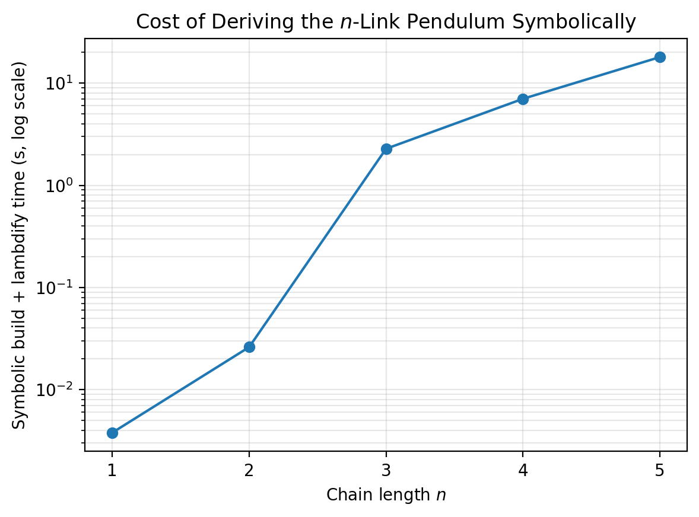
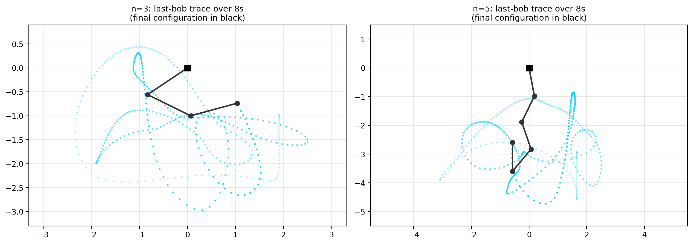

# Symbolic Lagrangian Derivation of the Planar n-Link Pendulum (SymPy)

**Code:** `n_pendulum_symbolic.py`, `n_pendulum_validation.py`
**Builds on:** `DOUBLE_PENDULUM_REPORT.md` (by-hand double-pendulum derivation,
the α₂ bug fix, and the energy-conservation check this reuses)

`DOUBLE_PENDULUM_REPORT.md` derived the double pendulum's equations of motion
by hand and used energy conservation to catch a coding bug. This note redoes
that derivation symbolically with SymPy — so the algebra is generated and
checked by the computer rather than by hand — and then generalizes it to an
arbitrary chain of $n$ pendulum links, which is the harder thing hand algebra
doesn't scale to.

## 1. Why symbolic, and why this is a real check (not busywork)

Hand-deriving the equations for $n=2$ took the better part of §2 of the
double-pendulum report. Doing that again for $n=3$ by hand is tedious;
for $n=5$ it is impractical. The point of SymPy here isn't convenience — it's
that the *same* symbolic construction that produces the $n=2$ case
automatically produces $n=3,4,5,\ldots$ with no new by-hand algebra, and each
instance can be checked the same two ways used for $n=2$: does it match an
independent derivation, and does it conserve energy.

## 2. General Construction

For $n$ links with generalized coordinates $q=(\theta_1,\ldots,\theta_n)$,
masses $m_i$, and lengths $l_i$, bob $i$'s position is the cumulative sum
along the chain (link $i$ hangs off the end of link $i-1$):

$$
x_i = \sum_{k=1}^{i} l_k\sin\theta_k, \qquad y_i = -\sum_{k=1}^i l_k\cos\theta_k
$$

$T=\sum_i \tfrac12 m_i(\dot x_i^2+\dot y_i^2)$ and $V=\sum_i m_i g\, y_i$ follow
directly, and $L=T-V$. In code this is a loop over `range(n)`, with SymPy's
`dynamicsymbols` standing in for the time-dependent $\theta_i(t)$ and its
`.diff(t)` giving $\dot\theta_i$ automatically:

```python
theta = list(dynamicsymbols(f'theta1:{n+1}'))
x = [sum(l[k]*sin(theta[k]) for k in range(i+1)) for i in range(n)]
y = [-sum(l[k]*cos(theta[k]) for k in range(i+1)) for i in range(n)]
```

Rather than hand-applying the Euler–Lagrange operator as in the $n=2$ case,
`sympy.physics.mechanics.LagrangesMethod` applies
$\frac{d}{dt}\frac{\partial L}{\partial\dot q_i}-\frac{\partial L}{\partial q_i}=0$
for every $q_i$ and returns the result in **manipulator-equation form**,
the standard form for multi-body dynamics:

$$
\mathbf{M}(\mathbf q)\,\ddot{\mathbf q} = \mathbf f(\mathbf q, \dot{\mathbf q})
$$

where $\mathbf M$ (the mass/inertia matrix) collects every $\ddot\theta_j$
coefficient and $\mathbf f$ collects everything else (Coriolis/centrifugal
coupling and gravity). For $n=2$, SymPy reproduces the by-hand result from
§2 of the double-pendulum report exactly:

$$
\mathbf M = \begin{pmatrix}(m_1+m_2)l_1^2 & m_2 l_1 l_2\cos\Delta\\ m_2 l_1 l_2\cos\Delta & m_2 l_2^2\end{pmatrix},
\qquad
\mathbf f = \begin{pmatrix}-l_1\left[(m_1+m_2)g\sin\theta_1 + m_2 l_2\sin\Delta\,\dot\theta_2^2\right]\\
m_2 l_2\left(-g\sin\theta_2 + l_1\sin\Delta\,\dot\theta_1^2\right)\end{pmatrix}
$$

with $\Delta=\theta_1-\theta_2$, matching (A)/(B) in the double-pendulum
report term for term.

## 3. From Symbolic Equations to a Numeric Integrator

The tempting next step — symbolically inverting $\mathbf M$ to get
$\ddot{\mathbf q}=\mathbf M^{-1}\mathbf f$ in closed form, as was done by hand
for $n=2$ — does not scale: symbolic matrix inversion cost grows combinatorially
with $n$ (this is exactly why the $n=2$ closed form in the earlier report
already needed trig identities to stay readable). Instead, `M` and `f` are
each `lambdify`'d into plain NumPy functions once, and the ODE right-hand side
solves the *numeric* linear system $\mathbf M\ddot{\mathbf q}=\mathbf f$ at
every integration step with `numpy.linalg.solve` — an $O(n^3)$ operation
regardless of how large $n$ gets, versus symbolic inversion which can blow up
in expression size well before that:

```python
def rhs(state, t):
    theta, omega = state[0::2], state[1::2]
    Mm = M_func(*theta, *omega)          # lambdified numeric matrix
    ff = f_func(*theta, *omega)
    alpha = np.linalg.solve(Mm, ff)      # numeric solve, not symbolic inverse
    ...
```

The one-time symbolic derivation is memoized per $n$ (`@lru_cache`) since it
doesn't depend on the numeric mass/length values — only the *shape* of the
Lagrangian does.

## 4. Validation

Three independent checks, run in `n_pendulum_validation.py`:

**(1) $n=1$ reduces to the textbook simple pendulum.** Solving
$M\ddot\theta_1=f$ for the one-link case gives
$\ddot\theta_1=-\frac{g}{l_1}\sin\theta_1$ — SymPy confirms this symbolically
(`sp.simplify(thetaddot - expected) == 0`), a basic but non-trivial sanity
check that the general construction hasn't mangled the $n=1$ limit.

**(2) $n=2$ matches the independently hand-derived, bug-fixed
`DoublePendulum.equations_of_motion`** — not just at one initial condition,
but over 200 random states with randomized (non-unit) masses and lengths:

```
n=2 vs hand-derived DoublePendulum: max abs error over 200 random states = 8.9e-15
```

That's machine precision, not "close." This is a strong result: the by-hand
derivation, the bug fix from §3 of the double-pendulum report, and this
from-scratch symbolic derivation were all done independently, and they agree
exactly.

**(3) $n=3,4,5$ conserve energy** under free (undamped) evolution — the same
diagnostic that caught the original α₂ bug, now applied automatically to
chain lengths where no hand-derived reference formula exists to compare
against:

| $n$ | Symbolic build + lambdify time | Energy drift over 8s @ dt=1ms |
|---|---|---|
| 1 | 0.00 s | 0.00004% of \|E₀\| |
| 2 | 0.03 s | 0.00031% of \|E₀\| |
| 3 | 2.28 s | 0.00025% of \|E₀\| |
| 4 | 7.02 s | 0.00002% of \|E₀\| |
| 5 | 17.97 s | 0.00001% of \|E₀\| |

All five are consistent with integrator truncation error rather than a
modeling defect — the same standard used for the $n=2$ case.



Build time grows steeply (roughly ×3 per additional link before $n=3$,
settling to roughly ×2.5 after) because $\mathbf M$ and $\mathbf f$ are fully
symbolic expressions whose term count grows with the chain; it is a one-time
cost per $n$ (cached), and integration itself stays fast (all five cases
integrate 8000 steps in well under a second) since the per-step cost is a
numeric linear solve, not symbolic evaluation.



These snapshots are a "does this look like a real pendulum chain and not
garbage" check — final linkage configuration in black, faint trace of the
last bob's path — not a chaos characterization. That's the deferred next
step.

## 5. What This Doesn't Cover Yet

This note validates that the $n$-link derivation is *correct* and
*numerically usable* up to $n=5$. It deliberately stops short of:

- A chaos/Lyapunov characterization of the triple or quintuple pendulum
  (§4-5 style, from the double-pendulum report) — worth doing once these are
  wanted as standalone results sections.
- Re-running the fuzzy TSK surrogate-modeling study (§5 of the double-pendulum
  report) against $n=3$/$n=5$ trajectory data.
- Performance work if $n>5$ is ever wanted — the symbolic build time trend
  above suggests $n=6$–$7$ would still be minutes, not hours, but a fully
  numeric (Newton–Euler recursive) formulation would be the next step past
  that if needed.

Both are natural follow-ons once the $n=3$/$n=5$ results phase is wanted.
