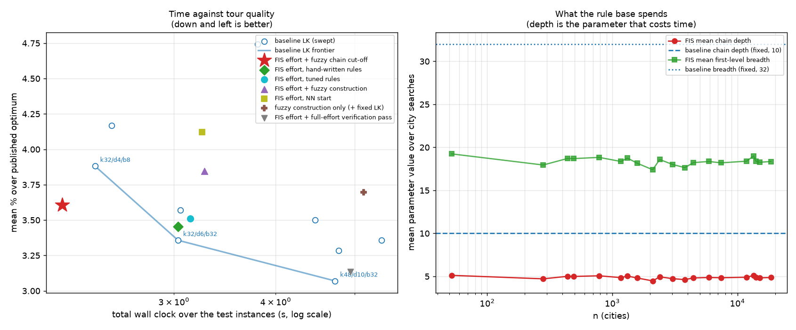

# A fuzzy inference system as a TSP strategy engine — findings

**Question.** Can a fuzzy inference system, reading the same cheap features a
Lin-Kernighan solver already has to hand, beat that solver on both wall clock and
tour quality by spending its search effort unevenly?

**Answer, in one line.** Partly. Fuzzy effort control produces a point that no
configuration of the baseline dominates, and that strictly dominates three of the
nine baseline configurations swept — cleanly and consistently for n ≥ 4000. It does
not beat the baseline's *best-quality* configuration, which still reaches a shorter
tour (2.95% vs 3.12% over optimum) for about twice the time. Below n ≈ 4000 the
fuzzy arm is dominated outright: the per-city inference does not pay for itself when
there is little search to allocate.

Two of the three rule bases earned their place. The third — the fuzzy next-city
ranker for construction — did not, and §5 says so with numbers.

---

## 1. What is being compared, and why it is a frontier

The baseline is a real LK: variable-depth sequential gain chains implemented as
chained 2-opt moves on an array tour, first-level backtracking over the candidate
list, LKH's "break long, add short" ordering rule at depth, Or-opt(1..3) as a
companion move, don't-look bits over a work queue, and shorter-side segment
reversal. From a greedy-edge start it reaches ~2.8–3.1% over the published optima.

Beating one configuration of a tunable solver proves nothing, so the baseline is
swept over the three parameters that trade its time against its quality
(candidate-list size *k*, chain depth *d*, deep breadth *b*) and reported as a
frontier. The claim under test is whether the fuzzy arm lands **outside** it.

Both arms run the same `lk.py`. The baseline *is* that module with `use_chain` off
and constant parameters, so the two cannot differ in move repertoire or in the speed
of their arithmetic — only in strategy. Every reported tour is checked to be a
permutation of the cities and re-scored from coordinates under TSPLIB rounding,
independently of the solver's bookkeeping. Times are the minimum of 3 runs after a
warm-up that pays all JIT compilation. Test instances (20 TSPLIB instances,
n = 52…18 512) are disjoint from the sets the rule bases were fitted and selected on.



---

## 2. The result

Every arm measured, over all 20 test instances, sorted by quality. Baseline
configurations are labelled `k / depth / deep-breadth`.

| arm | mean % over optimum | total s |
|---|---|---|
| LK `k48/d10/b32` | **3.070** | 4.729 |
| FIS effort + verification pass (§4) | 3.135 | 4.942 |
| LK `k32/d10/b32` | 3.284 | 4.779 |
| LK `k64/d10/b32` | 3.357 | 5.393 |
| LK `k32/d6/b32` | 3.357 | 3.035 |
| FIS effort, hand-written rules | 3.455 | 3.035 |
| LK `k32/d10/b12` | 3.502 | 4.472 |
| FIS effort, fitted rules | 3.512 | 3.142 |
| LK `k32/d6/b8` | 3.571 | 3.057 |
| **FIS effort + fuzzy chain cut-off** | **3.606** | **2.188** |
| fuzzy construction + unmodified LK (§5) | 3.695 | 5.131 |
| FIS effort + fuzzy construction (§5) | 3.847 | 3.269 |
| LK `k32/d4/b8` | 3.881 | 2.400 |
| FIS effort, NN start | 4.120 | 3.250 |
| LK `k24/d4/b8` | 4.168 | 2.515 |
| LK `k16/d4/b8` | 4.743 | 3.799 |

The baseline's own Pareto frontier is `k32/d4/b8` (2.400 s, 3.881%) →
`k32/d6/b32` (3.035 s, 3.357%) → `k48/d10/b32` (4.729 s, 3.070%).

The fuzzy arm at **2.188 s / 3.606%** is dominated by nothing in the sweep, and
strictly dominates `k32/d4/b8`, `k24/d4/b8` and `k16/d4/b8` — faster *and* shorter
tours than all three. It is a genuine new point at the fast end of the frontier, not
a re-parameterisation.

It is not a clean win overall: `k48/d10/b32` still buys 0.54 points of quality for
2.2x the time, and the fuzzy arm cannot reach it at any setting tested.

### The result is strongly size-dependent

This is the most informative cut in the study, and it is not visible in the totals.

| | n < 4000 (12 inst.) | | n ≥ 4000 (8 inst.) | |
|---|---|---|---|---|
| arm | mean gap | total s | mean gap | total s |
| LK `k32/d4/b8` | 4.420% | 0.187 | 3.073% | 2.213 |
| LK `k32/d6/b32` | 3.505% | 0.231 | 3.136% | 2.804 |
| LK `k48/d10/b32` | **3.148%** | 0.357 | **2.954%** | 4.372 |
| FIS effort + chain | 3.928% | 0.235 | 3.124% | **1.953** |
| FIS effort (hand-written rules) | 3.741% | 0.232 | 3.024% | 2.803 |

- **n < 4000: every fuzzy arm is dominated** by `k32/d6/b32`. Consulting a rule base
  per city — and per chain level — costs a fixed amount per decision, and on a small
  instance there is not enough search for better allocation to repay it.
- **n ≥ 4000: the fuzzy arms are not dominated by anything, and dominate
  `k32/d6/b32`.** With the chain rules, 3.124% in 1.953 s against 3.136% in 2.804 s:
  a shorter tour, 1.44x faster. With the hand-written effort rules at matched time
  (2.803 s vs 2.804 s), 3.024% against 3.136% — 0.11 points of quality for free.

So the honest scope of the claim is: **the strategy engine beats LK on both axes at
scale, against LK at matched or lighter settings, and loses to LK's most expensive
setting on quality.**

---

## 3. The mechanism: depth is the budget, and it was not the obvious one

The first design assumed candidate *breadth* was the thing to allocate. Measured, it
is nearly free. Sweeping the first-level breadth from 2 to 32 with everything else
fixed moves the clock by under 10%, because the sequential positive-gain criterion
(`G_{i-1} - |y_i| > 0`) truncates most candidate scans long before the cap applies.

Chain **depth** is where the time is. On 8 instances, `k=32`, deep breadth 32:

| chain depth | mean gap | total s | chain levels entered |
|---|---|---|---|
| 4 | 3.121% | 0.0955 | 117 180 |
| 6 | 2.929% | 0.1290 | 177 684 |
| 10 | 2.833% | 0.2398 | 296 750 |

2.6x the time for 0.29 points. That is the inefficiency the rule base exploits: most
cities do not need a deep chain, a few need a very deep one, and a fixed cut-off
cannot tell them apart. On the test set the fuzzy arm runs a **mean chain depth of
4.88 against the baseline's fixed 10**, and a mean first-level breadth of 18.4
against 32 — and lands nearer the depth-10 tour than the depth-4 one.

The clearest single win is the CHAIN rule base, which takes the deepen-or-cut
decision from the chain's own gain trajectory (gain credit carried forward, depth so
far, gain already banked, and whether the next step still trades a long edge for a
short one) instead of at a fixed depth. Adding it moved the arm from 3.512% / 3.142 s
to 3.606% / 2.188 s — **30% of the runtime for 0.09 points of quality**, the best
exchange rate anywhere in the study.

---

## 4. Where the fuzzy allocation does lose moves

Cutting effort at a city is not free even when it looks it. A city searched at
reduced depth that finds nothing has its don't-look bit set, and a move a deeper
chain would have found there is lost for good.

`defer=True` measures exactly this: a city that fails cheaply is re-queued and
re-searched at full breadth and full depth, so the run cannot stop until every city
has failed at full effort — the baseline's own stopping condition.

| arm | mean gap | total s |
|---|---|---|
| FIS effort, tuned | 3.512% | 3.142 |
| FIS effort + full-effort verification | 3.135% | 4.942 |

The verification pass recovers **0.38 points**, so the cheap schedule *is* discarding
real improvements. It costs 57% more time to recover them, which leaves the deferred
arm dominated by `k48/d10/b32` (3.070% / 4.729 s) — the pass is a good instrument and
a bad algorithm.

One caution about how this was nearly mis-read: on `d493` alone the verification pass
makes 493 full-effort attempts and finds *zero* additional moves, which looks like
proof that the reduced effort lost nothing. It does not generalise, and a
single-instance check would have shipped the wrong claim.

---

## 5. The fuzzy next-city ranker: a negative result

The construction ranker asks the question in its most direct form — score each
candidate next city with a rule base over four cues (how much worse than the nearest
available option, whether the candidate is about to be stranded, what coming back for
it later would cost, and whether it continues the heading) and take the best.

It works, in the sense that it beats the heuristic it generalises:

| construction | mean % over optimum | total s |
|---|---|---|
| greedy edge | **17.043** | 0.537 |
| fuzzy ranker | 21.851 | 0.269 |
| nearest neighbour | 22.299 | 0.027 |

It beats nearest-neighbour (21.85% vs 22.30%) at 10x the cost, and loses to
greedy-edge by 4.8 points. Because a start tour is only worth what the local search
makes of it, that gap carries through: **fuzzy construction + fuzzy effort reaches
3.847% / 3.269 s and is dominated** by two baseline configurations, while the same
effort controller from a greedy-edge start reaches 3.512% / 3.142 s. Feeding the
fuzzy start to an unmodified LK is worse still (3.695% / 5.131 s, dominated by five).

The reason is structural, not a tuning failure. A sequential ranker commits to a city
knowing only the local neighbourhood; greedy-edge sorts all candidate edges globally
before committing to any. No amount of fuzzy reasoning over local cues recovers
global edge information the ranker never sees. **The shipped configuration therefore
starts from greedy-edge**, and the ranker is reported rather than used.

Two things did improve it substantially and are worth recording:

- **Feature scaling mattered more than the rules.** Normalising nearness by the
  city's neighbourhood scale made the nearest and second-nearest candidate both score
  "very near", firing identical rules, so the other three cues decided every step and
  the construction wandered — 30.7% over optimum, far *worse* than nearest-neighbour.
  Re-expressing it as excess over the best option currently available (the greedy
  choice sits at exactly 0.0, a candidate 30% further at 0.3) fixed it with no change
  to the rule base: on a 10-instance probe it went from 30.7% to 21.2%, against 21.9%
  for nearest-neighbour on the same ten.
- **It has to be fitted against its own tour length.** Fitted end-to-end, on quality
  after the local search, construction quality rotted to 24.0% — worse than
  nearest-neighbour — while the effort consequents silently absorbed the loss. The
  local search washes out most of what the construction does, so the end-to-end
  gradient is mostly noise. Fitting it on the tour it builds is both the honest
  objective and thousands of times cheaper, since no local search has to run.

---

## 6. Fitting the rules, and how it overfits

The antecedents, membership functions and rule structure are fixed by hand and stay
readable. Only the consequent singletons are fitted: 20 desirabilities for the
ranker, 19x4 parameter settings for the effort controller, 18 continuation scores for
the chain rules. A (1+1) evolution strategy with the 1/5th success rule searches them.

**Fitting is the least trustworthy part of this study.** The first attempt fitted 8
small instances and reached 2.44% on them and **4.67% on unseen instances** — worse
than the baseline it was supposed to beat. Widening the training set and adding a
validation split that the search cannot see, and keeping the vector that transfers
rather than the vector that fits, took validation to 3.742% against a 4.704% baseline
at 0.90x its time.

Even so, on the test set the **hand-written effort rules beat the fitted ones**:

| effort rules | mean gap | total s |
|---|---|---|
| hand-written | **3.455%** | 3.035 |
| fitted | 3.512% | 3.142 |

The residual overfitting is real, and the hand-written rules are the more honest
artefact — they encode the mechanism §3 identifies and were never shown the test set
at all. The fitted vector is kept because it is what makes the chain rules usable
(untuned, the chain rules cut too aggressively: 3.013% / 0.106 s against 2.847% /
0.121 s for no chain rules on the 8-instance probe — worse quality for the time
saved).

---

## 7. Absolute standing: LKH

On the 9 test instances where LKH (via `elkai`, one run) finishes inside 90 s:

| | mean % over optimum | total s |
|---|---|---|
| LKH | **0.003** | 153.9 |
| FIS effort + chain | 3.220 | 0.130 |
| LK `k48/d10/b32` | 2.353 | 0.185 |

LKH is essentially exact and about **1180x slower**. Nothing here competes with it,
and nothing here claims to: it uses alpha-nearness candidates from a held 1-tree
rather than plain k-nearest neighbours, and 5-opt basic moves. Both arms of this study
live in a different time regime — tens of milliseconds against tens of seconds. On
`fl1577` LKH returned no tour within 90 s at all.

---

## 8. Two bugs worth recording

**Tied neighbours made every measurement noisy.** TSPLIB instances are full of exact
distance ties — in `pr1002`, cities 326 and 328 are both at distance 150 from 327 —
and `cKDTree` returns tied neighbours in an order that shifts with *k*. The k=8
candidate list therefore stopped being a prefix of the k=20 one, and nearest-neighbour
tour length changed with k (21.8% to 29.5% across k = 6…20) for a construction that
cannot depend on k at all. Breaking ties by city index, and breaking the
exact-scan fallback's ties the same way, made it invariant. Any parameter sweep run
before that fix was measuring tie-break luck as much as parameters.

**Or-opt surgery needed an exact reversal.** Relocating a segment is a swap of two
adjacent blocks, done as three reversals via `(A B)^R = B^R A^R`. The 2-opt reversal
used elsewhere is free to reverse a segment's *complement* instead — same tour edges,
different array layout — which silently breaks that algebra. Block swaps use a
reversal that is never allowed to substitute the complement, and choose the shorter of
the forward and backward spans so a move stays sub-linear. Verified by checking every
move's predicted gain against the recomputed tour length: zero mismatches over
several hundred moves across three instances, with `pos` and permutation validity
re-checked after each.

---

## 9. Reproducing

```bash
python tune.py --construct-seconds 150 --seconds 900   # -> tuned.npz
python benchmark.py --reps 3                           # -> results.json
python lkh_reference.py --max-n 2500 --timeout 90      # -> lkh.json
python figures.py                                      # -> figures/
```

Numbers above are from a single machine, 3 timed repetitions per measurement, minimum
taken. Absolute times will move between machines; the domination relations are what
should be reproducible, and the size split in §2 is the claim most worth re-checking
on different hardware, since it turns on a fixed per-decision overhead.
