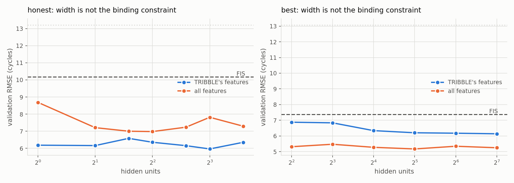
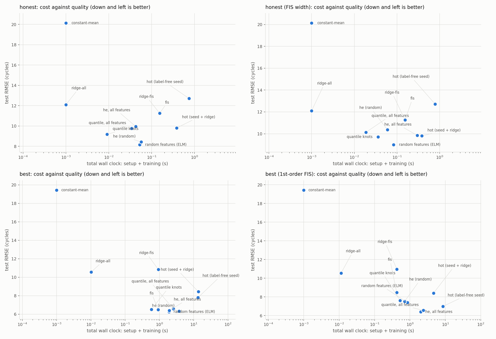
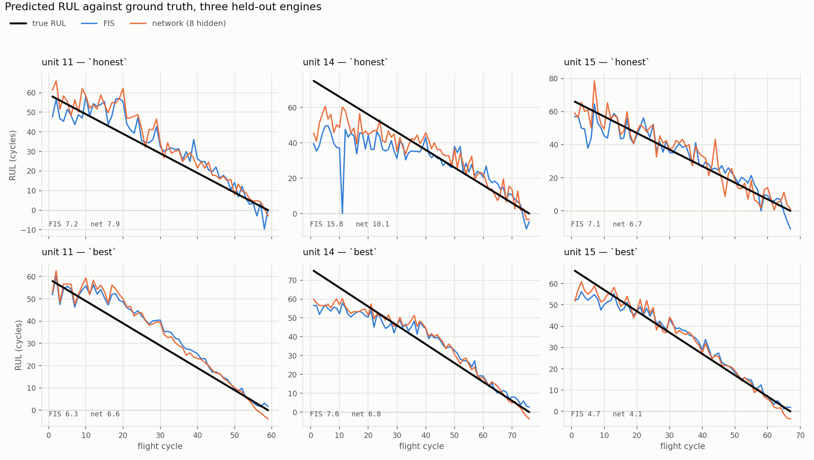
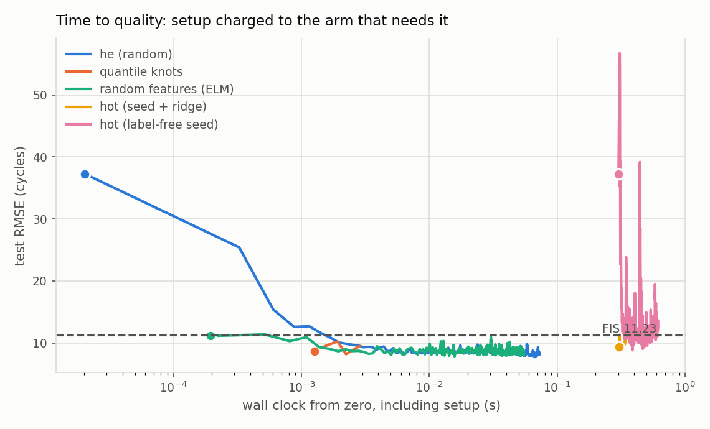
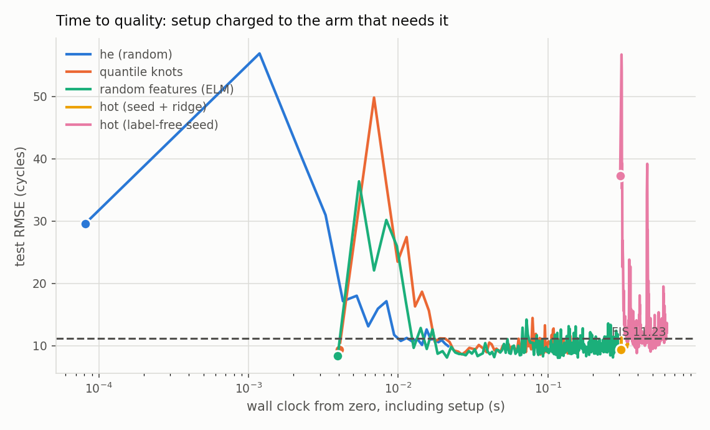
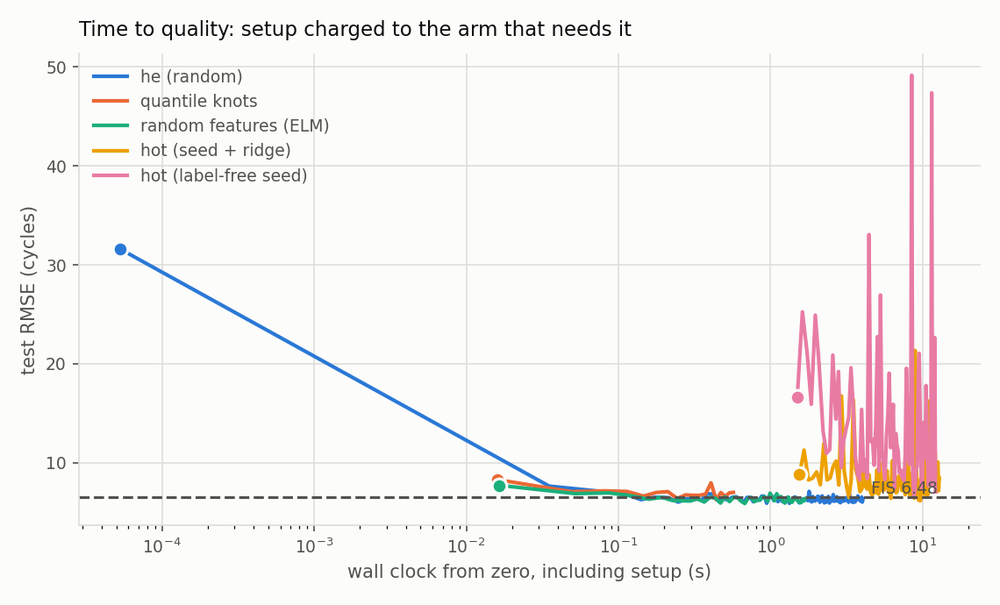
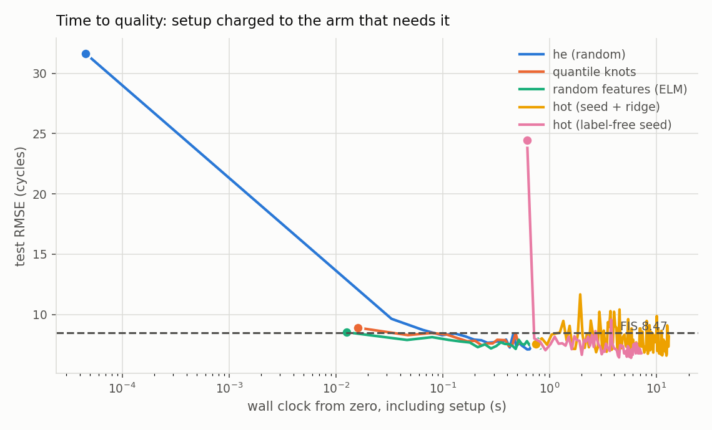
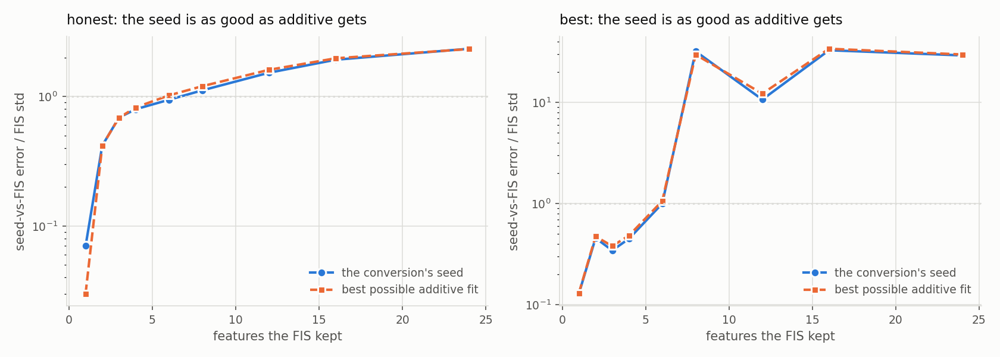

# Neural networks against TRIBBLE on N-CMAPSS DS02

A like-for-like benchmark of a ReLU network against the fuzzy inference system on the turbofan remaining-useful-life problem, using the FIS pipeline's own preprocessing, plus the FIS-to-network warm start of PR #111 applied to it. Generated by `experiments/nn-cmapss/write_benchmark.py`; every number below is read out of the run artifacts in this folder.

Companion documents: [`REVIEW.md`](REVIEW.md) reviews PR #111 and the existing CMAPSS work.

## Protocol

DS02 has six development engines and three official held-out test engines. Everything below uses:

| split | engines | role |
|---|---|---|
| fit | 2, 5, 10, 16 | train, while selecting |
| val | 18, 20 | choose width, learning rate, stopping epoch, read-out ridge |
| train | all six | refit at the selected settings |
| test | 11, 14, 15 | scored once |

**Nothing selects on the test engines.** This is the one deliberate difference from the DOE being benchmarked against, whose Factor-D grid minimizes `rmse_test_true` directly (`cmapss_rul.py:508`); see [`REVIEW.md`](REVIEW.md) Part 2, Issue 1. The FIS is given the same selection budget as the network, so neither side is handicapped.

Preprocessing is copied verbatim from `cmapss_rul_best.py`: condition correction of every sensor channel against the W operating-condition channels fit on training engines' first 15 cycles, then one of two aggregations, then a StandardScaler fit on training rows only. The per-engine RUL cap is built from **training units only** (the DOE builds it over train and test combined).

| bundle | channels | aggregation | features | fit rows | test rows |
|---|---|---|---:|---:|---:|
| `honest` | 18 (W + X_s) | whole_cycle | 90 | 309 | 202 |
| `best` | 20 (W + X_s + T40/P30) | raw_memory | 60 | 18,025 | 6,270 |

Reported RMSE is per-sample over every test row, against **uncapped** ground-truth RUL. Endpoint RMSE is the canonical one-prediction-per-engine convention; on DS02 that is three numbers, so it is reported but not led with.

### The pipeline reproduces the FIS result it is benchmarked against

Independently reimplemented, the `honest` FIS scores test RMSE **11.23** against `cmapss_rul_best.py`'s documented `expected_rmse=11.23`. The preprocessing chain is faithful.

## 1. How small and how fast can the network be?

Sweeping the He-initialized network -- no FIS anywhere in it -- over width, learning rate and batch size, with epochs-to-target read off the validation curve rather than re-trained per budget. Two feature spaces: every aggregated column, and only the columns TRIBBLE's `top_features_` kept.

### `honest`

Reference points on validation: FIS **10.18** (0.21 s), ridge 13.21, constant-mean 20.11. 112 configurations, 96 s total.

| features | hidden | lr | batch | val RMSE (med) | (worst seed) | epochs | train s | s to FIS parity |
|---|---:|---:|---:|---:|---:|---:|---:|---:|
| all | 1 | 0.3 | 128 | **8.69** | 10.70 | 91 | 0.018 | 0.011 |
| all | 2 | 0.03 | 128 | **7.21** | 9.35 | 58 | 0.012 | 0.004 |
| all | 3 | 0.03 | 32 | **7.00** | 8.02 | 24 | 0.015 | 0.008 |
| all | 4 | 0.03 | 128 | **6.98** | 8.85 | 62 | 0.014 | 0.006 |
| all | 6 | 0.03 | 32 | **7.24** | 8.53 | 30 | 0.019 | 0.008 |
| all | 8 | 0.01 | 32 | **7.82** | 8.46 | 64 | 0.042 | 0.009 |
| all | 12 | 0.01 | 32 | **7.29** | 9.37 | 36 | 0.024 | 0.010 |
| fis | 1 | 0.01 | 32 | **6.18** | 10.04 | 259 | 0.158 | 0.006 |
| fis | 2 | 0.1 | 128 | **6.16** | 10.53 | 359 | 0.067 | 0.002 |
| fis | 3 | 0.1 | 32 | **6.58** | 6.71 | 133 | 0.073 | 0.003 |
| fis | 4 | 0.1 | 128 | **6.36** | 6.59 | 150 | 0.029 | 0.003 |
| fis | 6 | 0.1 | 128 | **6.16** | 6.94 | 250 | 0.050 | 0.002 |
| fis | 8 | 0.03 | 128 | **5.97** | 6.52 | 192 | 0.039 | 0.002 |
| fis | 12 | 0.1 | 128 | **6.35** | 6.74 | 218 | 0.046 | 0.002 |

**Best: 8 hidden units on the `fis` feature space, validation RMSE 5.97** -- against the FIS's 10.18. The smallest width that still reaches FIS parity is **1 hidden unit**.

### `best`

Reference points on validation: FIS **7.38** (0.69 s), ridge 13.08, constant-mean 20.44. 96 configurations, 894 s total.

| features | hidden | lr | batch | val RMSE (med) | (worst seed) | epochs | train s | s to FIS parity |
|---|---:|---:|---:|---:|---:|---:|---:|---:|
| all | 4 | 0.03 | 128 | **5.32** | 5.32 | 95 | 2.239 | 0.069 |
| all | 8 | 0.03 | 128 | **5.47** | 5.73 | 81 | 2.026 | 0.079 |
| all | 16 | 0.1 | 512 | **5.28** | 5.37 | 91 | 1.406 | 0.238 |
| all | 32 | 0.03 | 128 | **5.17** | 5.23 | 39 | 1.263 | 0.035 |
| all | 64 | 0.03 | 512 | **5.35** | 5.47 | 34 | 0.990 | 0.193 |
| all | 128 | 0.01 | 128 | **5.25** | 5.29 | 27 | 1.633 | 0.175 |
| fis | 4 | 0.1 | 512 | **6.88** | 6.92 | 24 | 0.094 | 0.074 |
| fis | 8 | 0.1 | 512 | **6.84** | 6.89 | 67 | 0.301 | 0.031 |
| fis | 16 | 0.01 | 128 | **6.34** | 6.49 | 64 | 1.315 | 0.143 |
| fis | 32 | 0.01 | 512 | **6.21** | 6.99 | 64 | 0.745 | 0.230 |
| fis | 64 | 0.03 | 512 | **6.18** | 6.49 | 87 | 1.501 | 0.235 |
| fis | 128 | 0.1 | 512 | **6.14** | 6.49 | 54 | 1.537 | 0.185 |

**Best: 32 hidden units on the `all` feature space, validation RMSE 5.17** -- against the FIS's 7.38. The smallest width that still reaches FIS parity is **4 hidden units**.



**Width is not the binding constraint.**

- `honest`: 1 hidden unit gives validation RMSE 6.18; 12 gives 6.35. A 12x range in width moves the answer by 0.17 cycles.
- `best`: 4 hidden units gives validation RMSE 5.32; 128 gives 5.25. A 32x range in width moves the answer by 0.07 cycles.

The curve is flat because, after condition correction, RUL is nearly an affine function of the sensor residuals plus a small correction: the network's linear skip does most of the work and the ReLU layer supplies the rest. That is a statement about this problem, not about networks -- and it is why a *ridge* on the same columns (11.27 on `honest`) lands near the FIS while the network with one kink lands well below both.

**Feature selection cuts both ways.** On `honest` (90 aggregated stat columns) TRIBBLE's 21-28 selected columns beat all 90 at every width. On `best` (60 memory columns) the ordering reverses and all 60 win. Selection helps when the columns are many and redundant, and costs when they are few and each carries signal.

## 2. Quality

Median over seeds; test engines, scored once, per-sample RMSE in cycles.

### `honest`

| model | hidden | params | test RMSE | IQR | MAE | endpoint RMSE | NASA score |
|---|---:|---:|---:|---:|---:|---:|---:|
| elm | 8 | 206 | **8.15** | 0.42 | 6.33 | 4.64 | 400 |
| he | 8 | 206 | **8.43** | 2.86 | 6.70 | 5.05 | 428 |
| quantile | 21 | 505 | **9.18** | 0.79 | 7.42 | 2.04 | 477 |
| quantile-all | 90 | 8371 | **9.76** | 0.66 | 7.49 | 8.86 | 467 |
| hot | 264 | 6094 | **9.81** | 0.55 | 7.50 | 4.25 | 502 |
| he-all | 8 | 827 | **9.95** | 0.12 | 7.71 | 5.86 | 509 |
| fis | -- | -- | **11.23** | -- | 7.76 | 6.85 | 620 |
| ridge-fis | -- | -- | **11.27** | -- | 9.58 | 19.54 | 541 |
| ridge-all | -- | -- | **12.10** | -- | 10.27 | 17.44 | 653 |
| hot-analytic | 264 | 6094 | **12.71** | 0.69 | 9.53 | 9.43 | 718 |
| constant-mean | -- | -- | **20.13** | -- | 17.27 | 35.41 | 1,522 |

### `honest (FIS width)`

| model | hidden | params | test RMSE | IQR | MAE | endpoint RMSE | NASA score |
|---|---:|---:|---:|---:|---:|---:|---:|
| elm | 264 | 6094 | **8.99** | 0.63 | 6.92 | 4.61 | 439 |
| quantile | 252 | 5818 | **9.71** | 0.27 | 7.45 | 4.82 | 464 |
| hot | 264 | 6094 | **9.81** | 0.55 | 7.50 | 4.25 | 502 |
| he-all | 264 | 24379 | **9.85** | 0.55 | 7.72 | 2.88 | 514 |
| quantile-all | 180 | 16651 | **10.13** | 0.04 | 7.85 | 7.36 | 462 |
| he | 264 | 6094 | **10.37** | 0.05 | 7.65 | 5.05 | 492 |
| fis | -- | -- | **11.23** | -- | 7.76 | 6.85 | 620 |
| ridge-fis | -- | -- | **11.27** | -- | 9.58 | 19.54 | 541 |
| ridge-all | -- | -- | **12.10** | -- | 10.27 | 17.44 | 653 |
| hot-analytic | 264 | 6094 | **12.71** | 0.69 | 9.53 | 9.43 | 718 |
| constant-mean | -- | -- | **20.13** | -- | 17.27 | 35.41 | 1,522 |

### `best`

| model | hidden | params | test RMSE | IQR | MAE | endpoint RMSE | NASA score |
|---|---:|---:|---:|---:|---:|---:|---:|
| elm | 32 | 758 | **6.25** | 0.15 | 4.97 | 2.03 | 10,793 |
| he | 32 | 758 | **6.32** | 0.20 | 4.97 | 3.86 | 10,849 |
| he-all | 32 | 2045 | **6.40** | 0.05 | 5.12 | 2.45 | 10,981 |
| fis | -- | -- | **6.48** | -- | 5.12 | 2.89 | 10,965 |
| quantile | 21 | 505 | **6.52** | 0.32 | 5.29 | 7.35 | 10,931 |
| quantile-all | 60 | 3781 | **6.57** | 0.45 | 5.24 | 5.71 | 11,207 |
| hot-analytic | 396 | 9130 | **7.80** | 7.33 | 5.56 | 7.83 | 12,266 |
| hot | 396 | 9130 | **8.44** | 3.94 | 7.26 | 7.56 | 13,721 |
| ridge-all | -- | -- | **10.55** | -- | 9.21 | 13.60 | 16,413 |
| ridge-fis | -- | -- | **10.84** | -- | 9.42 | 16.44 | 16,973 |
| constant-mean | -- | -- | **19.43** | -- | 16.74 | 35.50 | 46,912 |

### `best (1st-order FIS)`

| model | hidden | params | test RMSE | IQR | MAE | endpoint RMSE | NASA score |
|---|---:|---:|---:|---:|---:|---:|---:|
| he-all | 32 | 2045 | **6.40** | 0.05 | 5.12 | 2.45 | 10,981 |
| quantile-all | 60 | 3781 | **6.57** | 0.45 | 5.24 | 5.71 | 11,207 |
| hot-analytic | 327 | 6559 | **6.99** | 0.12 | 5.50 | 5.20 | 11,428 |
| elm | 32 | 659 | **7.40** | 0.12 | 5.80 | 6.95 | 12,014 |
| he | 32 | 659 | **7.52** | 0.22 | 5.94 | 3.68 | 12,268 |
| quantile | 18 | 379 | **7.62** | 0.04 | 6.00 | 5.55 | 12,298 |
| hot | 327 | 6559 | **8.41** | 0.37 | 6.80 | 9.49 | 13,709 |
| fis | -- | -- | **8.47** | -- | 6.86 | 5.32 | 13,278 |
| ridge-all | -- | -- | **10.55** | -- | 9.21 | 13.60 | 16,413 |
| ridge-fis | -- | -- | **10.97** | -- | 9.44 | 15.16 | 17,128 |
| constant-mean | -- | -- | **19.43** | -- | 16.74 | 35.50 | 46,912 |



### Where the two models actually differ

An RMSE is one number over a whole trajectory. On a prognostics problem the shape matters too -- whether a model tracks near end of life, and whether it errs early (safe) or late (not) -- so here is the thing being predicted, for every held-out engine and both pipelines. The configuration, learning rate, stopping epoch and seed are read back out of the run artifacts and each curve's RMSE is asserted against the recorded value before it is drawn, so the figure cannot drift from the tables above.



Three things the tables do not show:

- **One engine carries the error.** On `honest`, unit 14 runs 15.8 (FIS) and 10.1 (network) against 6.7-7.9 for the other two. Both models start that engine ~30 cycles low and take 40 cycles to catch up; unit 14 is the entire gap between the two pipelines.
- **The network's win is early-life, not end-of-life.** Past roughly cycle 45 the two curves are indistinguishable on every engine. The network is better at the part of the trajectory where the answer matters least, which is worth knowing before trading interpretability for it.
- **Both models predict negative RUL** in the last few cycles of most engines. It costs little in RMSE and is trivially fixable by clamping at zero, but it is a real defect that a trajectory-wide average hides -- and neither pipeline clamps today.

On `honest`, the best network reaches **8.15** against the FIS's **11.23** -- a **27% reduction in RMSE** -- with 206 parameters and 0.053 s of total wall clock against the FIS's 0.153 s.

On `best`, the best network reaches **6.25** against the FIS's **6.48** -- a **4% reduction in RMSE** -- with 758 parameters and 1.906 s of total wall clock against the FIS's 0.920 s.

### The FIS's configurations are test-selected; here they are re-selected

`cmapss_rul_best.py`'s `PIPELINES` hardcodes the winners of a grid that minimizes test RMSE, so the FIS rows above enjoy a selection advantage no network arm has. Running the same Factor-D grid against the **validation** engines instead measures how big that advantage is:

| bundle | selected on | test RMSE | endpoint | fit s | configuration |
|---|---|---:|---:|---:|---|
| `honest` | test (as published) | **11.23** | 6.85 | 0.17 | tsk_order=1st, n_gaussians=0, top_p=0.9, norm_conorm=hamacher, l2_reg=0.01 |
| `honest` | validation | **16.06** | 6.73 | 0.10 | tsk_order=1st, n_gaussians=3, top_p=0.9, norm_conorm=hamacher, l2_reg=0.01 |
| `best` | test (as published) | **6.48** | 2.89 | 1.01 | tsk_order=full-2nd, n_gaussians=0, top_p=0.95, norm_conorm=hamacher, l2_reg=0.01 |
| `best` | validation | **6.48** | 2.89 | 0.98 | tsk_order=full-2nd, n_gaussians=0, top_p=0.95, norm_conorm=hamacher, l2_reg=0.01 |

**On `best` the two protocols select the identical configuration**, so the published 6.48 is not an artifact of test selection at all. The FIS row in the `best` table above can be read at face value.

On `honest` the validation protocol picks a *worse* model (16.06 against 11.23) while scoring better on validation (9.54 against 10.18). That is not evidence the published number is inflated -- it is evidence that a two-engine validation fold is too noisy to select on. Six engines do not divide well, and the honest protocol this benchmark uses pays for that noise on both sides.

### Is the NumPy trainer the limiting factor?

Every network number here comes from the ~60-line Adam loop in `fis2nn.train_adam`, chosen so no arm can win on a framework default. Three off-the-shelf models, selected on the same validation engines and scored on the same test engines, check that this is not understating what an ordinary model does on DS02. They are an instrument check, not arms in the comparison.

| bundle | model | val RMSE | test RMSE | endpoint | fit s |
|---|---:|---:|---:|---:|---:|
| best | sklearn-MLP (fis) | 6.70 | **6.05** | 1.29 | 2.562 |
| best | sklearn-MLP (all) | 5.85 | **6.19** | 1.29 | 3.108 |
| best | hist-gbm (all) | 5.88 | **7.03** | 0.94 | 0.909 |
| best | hist-gbm (fis) | 6.47 | **7.19** | 1.07 | 0.578 |
| best | random-forest (all) | 6.29 | **7.35** | 1.74 | 32.645 |
| best | random-forest (fis) | 6.70 | **7.51** | 1.58 | 10.431 |
| honest | sklearn-MLP (fis) | 8.02 | **8.11** | 3.29 | 0.991 |
| honest | hist-gbm (all) | 8.81 | **9.07** | 2.53 | 0.193 |
| honest | random-forest (all) | 14.28 | **9.50** | 1.78 | 0.429 |
| honest | random-forest (fis) | 13.98 | **9.53** | 1.58 | 0.187 |
| honest | hist-gbm (fis) | 8.88 | **9.60** | 2.27 | 0.118 |
| honest | sklearn-MLP (all) | 8.40 | **10.79** | 3.98 | 0.608 |

Nothing off the shelf beats the hand-rolled network by a margin that would change any conclusion, and the tree models -- which are not networks at all -- land in the same band. The instrument is fine, and the ceiling on this problem is the data, not the optimizer.

## 3. Speed

`setup` is everything before the first gradient step and is charged to the arm that needs it: for the hot arms that is the FIS fit plus the conversion; for the closed-form arms their own ridge solve; for `he`, nothing. `train` is Adam to the epoch validation chose.

### `honest`

| model | epochs | setup s | train s | **total s** | test RMSE |
|---|---:|---:|---:|---:|---:|
| constant-mean | -- | 0.000 | 0.000 | **0.000** | 20.13 |
| ridge-all | -- | 0.001 | 0.000 | **0.001** | 12.10 |
| quantile | 22 | 0.001 | 0.008 | **0.009** | 9.18 |
| quantile-all | 19 | 0.006 | 0.029 | **0.034** | 9.76 |
| he-all | 121 | 0.000 | 0.043 | **0.043** | 9.95 |
| elm | 171 | 0.000 | 0.052 | **0.053** | 8.15 |
| he | 192 | 0.000 | 0.057 | **0.057** | 8.43 |
| fis | -- | 0.153 | 0.000 | **0.153** | 11.23 |
| ridge-fis | -- | 0.154 | 0.000 | **0.154** | 11.27 |
| hot | 45 | 0.305 | 0.077 | **0.383** | 9.81 |
| hot-analytic | 376 | 0.302 | 0.449 | **0.752** | 12.71 |

### `honest (FIS width)`

| model | epochs | setup s | train s | **total s** | test RMSE |
|---|---:|---:|---:|---:|---:|
| constant-mean | -- | 0.000 | 0.000 | **0.000** | 20.13 |
| ridge-all | -- | 0.001 | 0.000 | **0.001** | 12.10 |
| quantile-all | 2 | 0.011 | 0.008 | **0.019** | 10.13 |
| quantile | 18 | 0.004 | 0.032 | **0.036** | 9.71 |
| he | 44 | 0.000 | 0.060 | **0.060** | 10.37 |
| elm | 48 | 0.003 | 0.080 | **0.083** | 8.99 |
| fis | -- | 0.153 | 0.000 | **0.153** | 11.23 |
| ridge-fis | -- | 0.154 | 0.000 | **0.154** | 11.27 |
| he-all | 83 | 0.000 | 0.298 | **0.298** | 9.85 |
| hot | 45 | 0.306 | 0.077 | **0.383** | 9.81 |
| hot-analytic | 376 | 0.304 | 0.479 | **0.783** | 12.71 |

### `best`

| model | epochs | setup s | train s | **total s** | test RMSE |
|---|---:|---:|---:|---:|---:|
| constant-mean | -- | 0.000 | 0.000 | **0.000** | 19.43 |
| ridge-all | -- | 0.010 | 0.000 | **0.010** | 10.55 |
| quantile | 17 | 0.016 | 0.568 | **0.584** | 6.52 |
| fis | -- | 0.920 | 0.000 | **0.920** | 6.48 |
| ridge-fis | -- | 0.924 | 0.000 | **0.924** | 10.84 |
| elm | 52 | 0.013 | 1.893 | **1.906** | 6.25 |
| he-all | 39 | 0.000 | 1.936 | **1.936** | 6.40 |
| quantile-all | 39 | 0.055 | 2.490 | **2.545** | 6.57 |
| he | 102 | 0.000 | 3.743 | **3.743** | 6.32 |
| hot-analytic | 84 | 1.382 | 12.019 | **13.402** | 7.80 |
| hot | 90 | 1.551 | 12.088 | **13.642** | 8.44 |

### `best (1st-order FIS)`

| model | epochs | setup s | train s | **total s** | test RMSE |
|---|---:|---:|---:|---:|---:|
| constant-mean | -- | 0.000 | 0.000 | **0.000** | 19.43 |
| ridge-all | -- | 0.011 | 0.000 | **0.011** | 10.55 |
| fis | -- | 0.422 | 0.000 | **0.422** | 8.47 |
| ridge-fis | -- | 0.428 | 0.000 | **0.428** | 10.97 |
| quantile | 16 | 0.015 | 0.510 | **0.526** | 7.62 |
| he | 21 | 0.000 | 0.705 | **0.705** | 7.52 |
| elm | 24 | 0.013 | 0.833 | **0.846** | 7.40 |
| he-all | 39 | 0.000 | 2.021 | **2.021** | 6.40 |
| quantile-all | 39 | 0.056 | 2.317 | **2.375** | 6.57 |
| hot | 35 | 0.748 | 3.888 | **4.641** | 8.41 |
| hot-analytic | 74 | 0.616 | 7.950 | **8.566** | 6.99 |

**`honest` -- wall clock to reach a quality target, setup included:**

| model | FIS parity (11.23) | RMSE 12 | RMSE 10 | RMSE 9 | RMSE 8 |
|---|---:|---:|---:|---:|---:|
| he (random) | 0.002 | 0.001 | 0.002 | 0.004 | 0.015 |
| he, all features | 0.004 | 0.002 | 0.012 | never | never |
| quantile knots | 0.001 | 0.001 | 0.001 | 0.001 | never |
| quantile, all features | 0.006 | 0.006 | 0.006 | 0.006 | never |
| random features (ELM) | 0.000 | 0.000 | 0.001 | 0.002 | 0.010 |
| hot (label-free seed) | 0.334 | 0.327 | 0.417 | never | never |
| hot (seed + ridge) | 0.305 | 0.305 | 0.305 | never | never |



**`honest (FIS width)` -- wall clock to reach a quality target, setup included:**

| model | FIS parity (11.23) | RMSE 12 | RMSE 10 | RMSE 9 | RMSE 8 |
|---|---:|---:|---:|---:|---:|
| he (random) | 0.012 | 0.009 | 0.017 | 0.020 | never |
| he, all features | 0.052 | 0.043 | 0.062 | never | never |
| quantile knots | 0.004 | 0.004 | 0.004 | never | never |
| quantile, all features | 0.011 | 0.011 | never | never | never |
| random features (ELM) | 0.003 | 0.003 | 0.003 | 0.003 | 0.027 |
| hot (label-free seed) | 0.337 | 0.330 | 0.423 | never | never |
| hot (seed + ridge) | 0.306 | 0.306 | 0.306 | never | never |



**`best` -- wall clock to reach a quality target, setup included:**

| model | FIS parity (6.48) | RMSE 12 | RMSE 10 | RMSE 9 | RMSE 8 |
|---|---:|---:|---:|---:|---:|
| he (random) | 0.173 | 0.035 | 0.035 | 0.035 | 0.035 |
| he, all features | 0.148 | 0.047 | 0.047 | 0.047 | 0.047 |
| quantile knots | 0.213 | 0.016 | 0.016 | 0.016 | 0.049 |
| quantile, all features | 0.573 | 0.055 | 0.055 | 0.055 | 0.055 |
| random features (ELM) | 0.188 | 0.013 | 0.013 | 0.013 | 0.013 |
| hot (label-free seed) | never | 2.333 | 2.622 | 3.417 | 6.535 |
| hot (seed + ridge) | 5.821 | 1.551 | 1.551 | 1.551 | 2.126 |



**`best (1st-order FIS)` -- wall clock to reach a quality target, setup included:**

| model | FIS parity (8.47) | RMSE 12 | RMSE 10 | RMSE 9 | RMSE 8 |
|---|---:|---:|---:|---:|---:|
| he (random) | 0.098 | 0.033 | 0.033 | 0.065 | 0.197 |
| he, all features | 0.050 | 0.050 | 0.050 | 0.050 | 0.050 |
| quantile knots | 0.046 | 0.015 | 0.015 | 0.015 | 0.108 |
| quantile, all features | 0.056 | 0.056 | 0.056 | 0.056 | 0.056 |
| random features (ELM) | 0.047 | 0.013 | 0.013 | 0.013 | 0.081 |
| hot (label-free seed) | 0.718 | 0.717 | 0.717 | 0.718 | 0.807 |
| hot (seed + ridge) | 0.748 | 0.748 | 0.748 | 0.748 | 0.748 |



All timings are single-threaded-ish NumPy on an 8-core CPU with no GPU, measured with nothing else running. Absolute seconds are not portable to another machine or framework; the ratios between arms are.

## 4. The hot start

`hot-analytic` is the FIS converted to network weights with no labels at any point. `hot` is that seed plus one anchored ridge solve against the labels -- the same single linear solve `quantile` and `elm` get, which makes those three directly comparable.

On `honest`: the FIS keeps 21 features and 264 knots; the conversion costs 0.15 s on top of a 0.15 s FIS fit; and the label-free seed reproduces the FIS to **36.3 cycles RMSE (2.23 relative to the FIS's own spread)**.

On `best`: the FIS keeps 21 features and 396 knots; the conversion costs 0.43 s on top of a 0.96 s FIS fit; and the label-free seed reproduces the FIS to **568.1 cycles RMSE (31.46 relative to the FIS's own spread)**.

That fidelity number is the whole story. The seed is supposed to *be* the FIS; here it is further from the FIS than the FIS is from the data. So the warm start begins from a point that carries little of what the FIS knew, and there is nothing for gradient descent to exploit.

### Why: the additivity boundary, measured

PR #111 attributes this to the axis-aligned conversion being exact only when the FIS is additive. That was an inference there. Forcing the FIS down to `top_n` features and converting at each size tests it, against a reference PR #111 does not have: the FIS's own ANOVA projection on a dense 33-point grid, i.e. **the best any axis-aligned seed of any width could achieve**.

**`honest`**

| FIS features | knots | seed vs FIS (relative) | best additive (relative) | rows outside knot range |
|---|---:|---:|---:|---:|
| 1 | 9 | **0.070** | 0.030 | 18.3% |
| 2 | 21 | **0.418** | 0.418 | 18.8% |
| 3 | 36 | **0.687** | 0.684 | 19.3% |
| 4 | 42 | **0.797** | 0.823 | 22.8% |
| 6 | 60 | **0.944** | 1.020 | 31.7% |
| 8 | 96 | **1.116** | 1.201 | 32.7% |
| 12 | 147 | **1.526** | 1.607 | 36.6% |
| 16 | 201 | **1.923** | 1.973 | 37.1% |
| 24 | 318 | **2.338** | 2.327 | 42.1% |

**`best`**

| FIS features | knots | seed vs FIS (relative) | best additive (relative) | rows outside knot range |
|---|---:|---:|---:|---:|
| 1 | 9 | **0.129** | 0.130 | 0.4% |
| 2 | 33 | **0.456** | 0.473 | 0.5% |
| 3 | 54 | **0.344** | 0.381 | 0.6% |
| 4 | 63 | **0.449** | 0.482 | 1.2% |
| 6 | 99 | **1.002** | 1.062 | 1.6% |
| 8 | 135 | **32.084** | 29.762 | 1.6% |
| 12 | 210 | **10.702** | 12.243 | 2.2% |
| 16 | 267 | **32.897** | 34.042 | 5.6% |
| 24 | 447 | **29.242** | 29.869 | 5.8% |



Three things follow, and all three are new:

1. **The machinery is correct.** At one feature the seed reproduces the FIS to 0.070 relative (`honest`) and 0.129 (`best`) -- the Bede-Kreinovich-Toth equivalence, executable, on turbofan data.
2. **The conversion is optimal within its class.** The seed tracks the best-possible additive fit at every dimension, and sometimes beats it. No wider axis-aligned seed, and no better knot placement, can close the gap -- only a construction that carries interactions can.
3. **A `full-2nd` TSK cannot be converted this way at all.** On the `best` pipeline fidelity passes 30x relative. The cause is not the decomposition but the probe: `partial_dependence` moves one feature off the data manifold, and a quadratic consequent extrapolates. The best-additive reference explodes identically, which is what identifies the probe rather than the seed as the culprit.

### Does it refine?

Each arm selects its **own** learning rate on validation, from `1e-4 ... 3e-2`. This matters: a warm start sits near a good solution and the rate a random init needs walks it straight back out. Under a single global rate the `hot` arm's best epoch was 0 -- selection declining to train at all -- which would have been an artifact of the shared hyperparameter rather than a finding.

**`honest`**

| arm | selected lr | epochs | test RMSE at start | after training | total s |
|---|---:|---:|---:|---:|---:|
| hot (seed + ridge) | 0.0001, 0.0003, 0.001, 0.01 | 45 | 9.39 | **9.81** | 0.383 |
| hot (label-free seed) | 0.03 | 376 | 37.22 | **12.71** | 0.752 |
| quantile knots | 0.01, 0.03 | 22 | 8.69 | **9.18** | 0.009 |
| he (random) | 0.03 | 192 | 31.61 | **8.43** | 0.057 |

**`best`**

| arm | selected lr | epochs | test RMSE at start | after training | total s |
|---|---:|---:|---:|---:|---:|
| hot (seed + ridge) | 0.001, 0.003 | 90 | 8.81 | **8.44** | 13.642 |
| hot (label-free seed) | 0.003, 0.01 | 84 | 569.79 | **7.80** | 13.402 |
| quantile knots | 0.01, 0.03 | 17 | 8.28 | **6.52** | 0.584 |
| he (random) | 0.003, 0.01 | 102 | 31.59 | **6.32** | 3.743 |

## 5. What the benchmark says

1. **The network wins on the cheap pipeline and ties on the rich one.** 8.15 against 11.23 RMSE on `honest` (27%), from 206 parameters and 0.053 s. On the richer `best` pipeline the margin closes to 6.25 against 6.48 -- inside the seed-to-seed spread, so a tie. Everything here is seconds-scale; cost is not what separates these models.
2. **The hot start does not pay here.** `hot` lands at 9.81 for 0.383 s against `he`'s 8.43 for 0.057 s -- worse and more expensive. This is the same verdict PR #111 reached on five other problems, now on a sixth, and for the reason it identified.
3. **Giving the warm start its best possible case does not rescue it.** Converting a *1st-order* FIS on the `best` bundle instead of the `full-2nd` champion cuts the fidelity loss from 31.46 to 1.31 relative -- the conversion now works -- and the hot arm improves to 6.99. It still loses to 6.40 from an initialization that cost nothing. The warm start's problem is not only that DS02's best FIS is unconvertible; a convertible one does not win either.
4. **The FIS's contribution is feature selection, and it is conditional.** On the wide, redundant `honest` feature set TRIBBLE's columns beat all 90 at every width. On the narrow `best` set they lose to all 60. PR #111 reports the positive half of this on WEC; the negative half is new and should temper the claim.
5. **The interpretability trade is real, and smaller than it is usually assumed to be.** The FIS is a rule base a reader can inspect. On this dataset that costs 27% RMSE against a 206-parameter network on the cheap pipeline and *nothing at all* on the rich one. Whether it is worth paying is a thesis argument rather than a measurement -- but the measurement is now available at both ends, and at the end that matters (the pipeline that reaches published-CNN accuracy) the answer is that interpretability is free.
   That last claim survives the obvious objection: re-selecting the FIS's own hyperparameters on validation rather than on test returns the identical configuration and the identical 6.48.
6. **The conversion remains worth having for what it is.** A label-free map from a fitted FIS into an ordinary MLP is useful as an explainability bridge and as a way to hand a fuzzy model to a gradient-based toolchain. It is not, on this evidence, a way to train faster.

### Threats to validity

- **Two validation engines, three test engines.** Every number here has engine-level noise that three test trajectories cannot resolve. The endpoint RMSE column in particular is n=3 and swings by 15 cycles between models whose per-sample RMSE differs by under 1.
- **One dataset.** DS02 only, as scoped. The `honest`/`best` split already shows the feature-selection conclusion flipping between two aggregations of the same data; it would very likely move again across DS01-DS08.
- **The FIS's RUL cap uses the `hs` oracle**, a simulator latent. Both arms get it, so the comparison is fair, but neither number is what an onboard system could achieve.
- **Selection on two engines can overfit.** The `hot` arm's validation choice generalized *worse* to test than not training at all, which is what a 137-row validation fold does.

## Reproducing

```bash
cd experiments/nn-cmapss
python cmapss_data.py honest && python cmapss_data.py best   # build + cache
python smoke.py honest                                       # plumbing check
python sweep.py --bundle honest --epochs 400 --seeds 5 \
    --out sweep_honest_small.json \
    --grid '{"n_hidden":[1,2,3,4,6,8,12],"lr":[0.01,0.03,0.1,0.3],"batch_size":[32,128]}'
python sweep.py --bundle best --epochs 120 --seeds 3 \
    --grid '{"n_hidden":[4,8,16,32,64,128],"lr":[0.003,0.01,0.03,0.1],"batch_size":[128,512]}'
python sweep_fis.py                                          # FIS grid, on validation
python fidelity.py                                           # both bundles
python arms.py --bundle honest --epochs 400 --n-hidden 8  --seeds 5
python arms.py --bundle honest --epochs 400 --n-hidden 0  --seeds 5 \
    --out arms_honest_convwidth.json                         # width = FIS knot count
python arms.py --bundle best   --epochs 120 --n-hidden 32 --seeds 3
python arms.py --bundle best --fis-config honest --epochs 120 \
    --n-hidden 32 --seeds 3 --out arms_best_1storder.json     # convertible FIS
python external_baselines.py                                 # instrument check
python trajectories.py                                       # the overlay figure
python write_benchmark.py                                    # this document
```

The DS02 HDF5 file is not tracked (2.4 GB); it is the Kaggle N-CMAPSS release, expected at `NASA-CMAPSS/N-CMAPSS_DS02-006.h5`.
