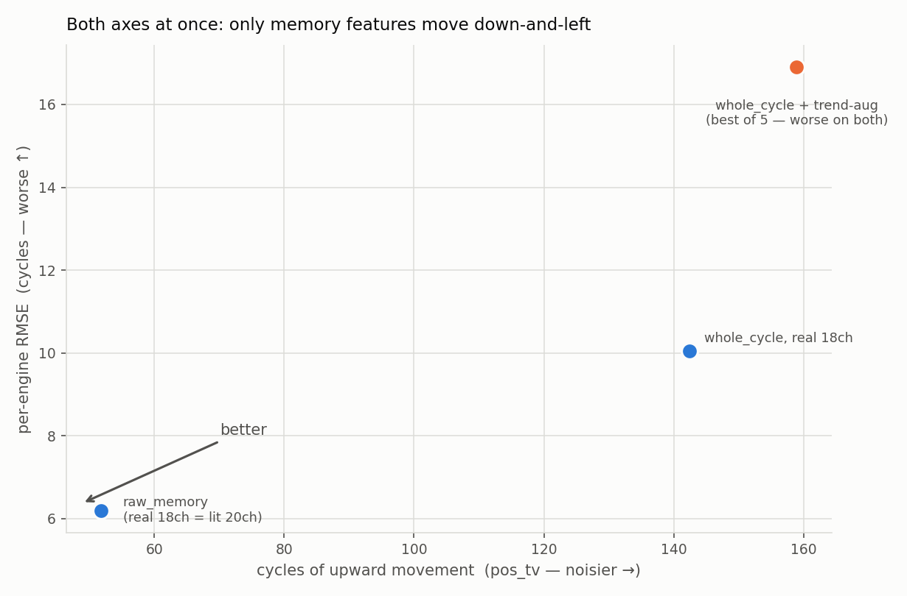

# Improving the FIS's RUL quality — accuracy and smoothness together

Everything here stays inside `TribbleRegressor`: no neural net, no separate
damage model, no post-hoc clamp. The goal is a FIS whose per-cycle RUL is both
more accurate and less jittery — the two axes measured together, per test
engine (each trajectory weighted equally, which differs from the benchmark's
pooled per-sample RMSE; both are reported).

Generated by `experiments/nn-cmapss/fis_quality.py` (levers) and
`fis_memory_sweep.py` (window sweep). Figure: `figures/fis_quality.png`.

## The one lever that moves both axes: memory features

The benchmark already contained the clue. The `best` pipeline is *both* more
accurate and smoother than `honest`, and the only structural difference is that
it feeds the FIS `tribblefis`'s `MemoryWindowFeatureExtractor` — short- and
long-term rolling averages of the sensor stream — instead of one independent
snapshot per cycle. Swapping the aggregation is the whole move:

| pipeline (FIS config) | per-engine RMSE | pooled RMSE | up-cycles % | pos_tv |
|---|---:|---:|---:|---:|
| `whole_cycle`, real 18 sensors | 10.05 | 11.23 | 40% | 142 |
| **`raw_memory`, real 18 sensors** | **6.19** | **6.48** | **36%** | **52** |
| `raw_memory`, literature 20 ch (`best`) | 6.19 | 6.48 | 36% | 51 |

Two things worth stating plainly:

- **Memory features cut per-engine RMSE 38% and upward-noise 63% at once** —
  the only change that moves *down and left* on both axes (see the figure).
- **The strict 18-real-sensor set matches the 20-channel `best` exactly**
  (6.19 either way). The two extra "virtual" channels TRIBBLE's `best` pipeline
  leans on buy nothing once memory is present — so the interpretable
  real-sensors-only pipeline reaches full quality without them. That is a free
  strengthening of the honesty claim in the dissertation write-up.



## What does *not* help (measured, so it need not be retried)

- **Trend-feature augmentation.** Appending causal EWMA / rolling-mean /
  cumulative-mean companions of the per-cycle features — keeping the sharp ones,
  adding smooth ones — *doubles to triples* RMSE (10.05 → 17–30). Adding many
  correlated slow features destabilises the TSK consequent solve; feature
  selection does not rescue it. (Note this is *augmenting*; the earlier
  `monotone.py` result that *replacing* features with their rolling mean also
  fails is a different, equally negative, finding.)

- **Enlarging the memory window.** `window_size`/`memory_size` are the natural
  smoothing dial, but they operate on the sub-cycle sample stream, so a larger
  window averages *across* cycle boundaries and corrupts the per-cycle signal —
  both axes get worse, monotonically:

  | window / memory / stride | RMSE | pos_tv |
  |---|---:|---:|
  | 5 / 2 / 200 (shipped) | **6.19** | **52** |
  | 10 / 5 / 200 | 6.32 | 57 |
  | 20 / 10 / 200 | 6.74 | 64 |
  | 40 / 20 / 200 | 8.69 | 66 |
  | 80 / 40 / 100 | 9.15 | 79 |

  The shipped `w=5, m=2` is already the sweet spot; there is no free smoothing
  to buy by widening it.

- **Consequent regularisation and Gaussian count.** Sweeping `l2_reg`
  (0.01→10) moves RMSE by <0.4 and never lowers `pos_tv`; `n_gaussians > 0`
  makes both axes sharply worse (confirming the DOE's automatic default). Model
  hyperparameters are not a smoothness lever.

- **Richer condition correction.** A quadratic-in-W basis leaves RMSE flat and
  raises `pos_tv` (142 → 189); shortening the healthy baseline to 10 cycles
  gives a small accuracy gain (10.05 → 9.39) with no smoothness change. Not a
  meaningful lever for either axis on this data.

## Reading

The FIS's cycle-to-cycle jitter comes from predicting each cycle independently
from that cycle's operating-condition-contaminated features. **Memory features
are the one FIS-native fix**, because they change *what the FIS sees* — a
temporally-coherent signal — rather than trying to average the answer after the
fact (which trades accuracy for smoothness) or to smooth the inputs by blurring
(which destroys the trend). Once memory is in place at its tuned window, the
FIS is as smooth as it gets on this data without paying accuracy; the residual
jitter (`pos_tv ≈ 52`, ~36% up-cycles) is intrinsic to per-cycle-independent
prediction.

## Recommendation

1. **Use the `raw_memory` aggregation** for RUL, on the strict 18-sensor real
   set — 6.19 per-engine RMSE and less than half the upward-noise of
   `whole_cycle`, with no loss of interpretability and no dependence on the
   virtual channels. This is the single highest-value FIS-quality change.
2. Keep the memory window at `w=5, m=2`; do not widen it.
3. Do not pursue trend augmentation, consequent shrinkage, Gaussian counts, or a
   richer condition correction for smoothness — measured here, none help.
4. If *hard* monotonicity is required on top of this, that is genuinely outside
   the FIS: the causal `mean5 → cummin` clamp or the damage-accumulation model
   in [`MONOTONE.md`](MONOTONE.md) is the tool, applied as a wrapper. Within the
   FIS, `raw_memory` is the answer.

## Reproducing

```bash
cd experiments/nn-cmapss
python fis_quality.py         # lever comparison + figures/fis_quality.png
python fis_memory_sweep.py    # memory-window sweep (loads the 2.4 GB HDF5 once)
```
