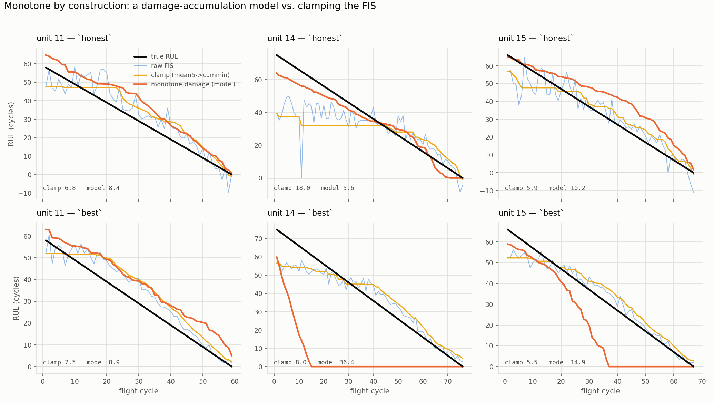

# Making the FIS's RUL near-monotonically decreasing

True remaining useful life falls by exactly one every flight cycle, so **any
cycle on which the prediction rises is pure noise** — there is nothing in the
world it could correspond to. The raw TRIBBLE FIS rises on 36–40% of cycles.
This is a first evaluation of how to fix that, measuring both axes at once:
monotonicity (how often, and how far, RUL goes *up*) and accuracy (RMSE against
uncapped ground truth), on the three DS02 test engines.

Generated by `experiments/nn-cmapss/monotone.py`; numbers below are from
`monotone.json`, the figure is `figures/monotone.png`.

## The problem, quantified

Per test engine, ordered by cycle: `up_frac` is the fraction of cycles the
prediction *increases*, `pos_tv` the total cycles of upward movement over a
~70-cycle life. A predictor of a quantity that only falls should have both at
zero.

| pipeline | up_frac | pos_tv | max single jump | RMSE |
|---|---:|---:|---:|---:|
| `honest` (raw FIS) | 0.40 | 142 cyc | 27 cyc | 10.05 |
| `best` (raw FIS) | 0.36 | 51 cyc | 7 cyc | 6.19 |

`honest` is much noisier than `best`, and that is not a coincidence — see the
input-smoothing result below.

## The key fact: this noise is noise, and removing it is free

Isotonic (antitonic) regression is the Euclidean projection of the prediction
onto the closed convex cone of non-increasing sequences. Projection onto a
convex set is non-expansive toward every point already in the set, and **true
RUL is non-increasing, so it is in that set**. Therefore

> monotonizing the prediction offline can never increase its RMSE against true
> RUL — it can only hold it or lower it.

That is a guarantee, not an empirical hope. It is verified two ways: on 2,000
random noisy-monotone sequences the projection hurt RMSE in **0** of them, and
on DS02 it *improves* it — `honest` 10.05 → **8.35**, `best` 6.19 → **5.87**,
both fully monotone. The cycle-to-cycle jitter really is symmetric noise around
a good trend, so throwing it away is a small accuracy gain, not a trade.

The offline projection is an **oracle**: it uses the whole trajectory, including
cycles that have not happened yet. It is the ceiling, not a deployable method.

## The deployable answer: smooth, then clamp

Onboard, RUL at cycle *t* may use only cycles ≤ *t*. Among causal transforms:

| method | causal? | `honest` RMSE (↑%) | `best` RMSE (↑%) |
|---|---|---:|---:|
| raw | — | 10.05 (40%) | 6.19 (36%) |
| trailing mean, k=5 | ✓ | 9.44 (31%) | 6.95 (17%) |
| running min (`cummin`) | ✓ | 17.39 (**0%**) | 6.23 (**0%**) |
| **mean k=5 → `cummin`** | ✓ | **10.23 (0%)** | 6.99 (0%) |
| `iso_causal` (refit each t) | ✓ | 10.05 (52%) | 6.12 (42%) |
| offline isotonic (oracle) | ✗ | 8.35 (0%) | 5.87 (0%) |

Reading this:

- **A bare running minimum is the wrong instinct on a noisy signal.** It adopts
  the first low outlier as a floor it can never leave: 17.39 RMSE on `honest`,
  visible in the figure as unit 14's long flat plateau, pinned by one downward
  spike near cycle 12.
- **Smooth first, then clamp.** A short trailing mean knocks the spikes down
  *before* the running min sees them. `mean5 → cummin` gives **hard
  monotonicity (0% up-cycles) for +0.18 RMSE** on `honest` and **+0.04** — with
  a bare `cummin` — on the already-smooth `best`. The gap to the 8.35 oracle is
  the price of causality: the offline fit can revise an early spike downward
  using the future; a causal one cannot.
- **`iso_causal` is a trap.** Re-fitting isotonic regression on cycles 0..*t*
  and reporting the last fitted value does *not* produce a monotone sequence —
  a new high arrival becomes its own block and the reported value jumps up. It
  scores *worse* than raw (52% up-cycles). Named here so it is not reinvented.

**Recommendation for deployment:** `mean5 → cummin` on `honest`, plain `cummin`
on `best` (or `mean5 → cummin` everywhere for one rule that is never bad).
Hard-monotone, causal, essentially free in RMSE, ~10 lines, no retraining.

## What did *not* work: smoothing the inputs

The tempting "reduce the noise at the source" move is to smooth the features the
FIS sees, so its output is smooth by construction. It backfires:

| method | `honest` RMSE | `best` RMSE |
|---|---:|---:|
| raw FIS | 10.05 | 6.19 |
| input smoothing k=5 (refit) | **21.71** | 6.22 |
| input smoothing k=10 (refit) | **26.74** | 6.35 |

On `honest` a trailing mean over the per-cycle aggregate features blurs the
degradation trend the model depends on and doubles the RMSE. On `best` it does
nothing — **because that pipeline already smooths its inputs**: its
`MemoryWindowFeatureExtractor` carries a rolling window, which is why `best`'s
raw predictions were the less noisy of the two to begin with. So input
smoothing is either already present (and helping) or actively harmful at the
aggregate-feature level; it is not a free lever to pull.

The honest reading is that **the right place to remove this noise is the
output, not the input** — the FIS's per-cycle scatter is genuinely symmetric
around a good trend (that is what the oracle result proves), so a causal
monotone projection is exactly the right tool and feature blurring is the wrong
one.

## Next steps (not yet done)

The output projection closes the near-monotonicity ask completely and cheaply.
If a *model that is monotone by construction* is wanted rather than a
post-processor, the candidates worth trying next, roughly in order of promise:

1. **Predict cumulative damage, integrate to RUL.** Fit the FIS to a monotone
   non-decreasing damage index and recover RUL from it; monotonicity is then
   structural, not imposed.
2. **A monotonicity-constrained consequent** w.r.t. a health-index feature — the
   TSK consequents already solve a linear system, and a sign constraint on the
   health-index coefficient is a small change to that solve.
3. **A per-engine normalized-cycle feature.** Cheap, but cross-engine
   generalization of an explicit time feature is exactly what CMAPSS makes hard,
   so this needs the validation fold watched closely.

All three are model surgery; the post-hoc projection above is the thing to ship
first, and the yardstick they would have to beat is the 8.35 / 5.87 oracle.

---

# Monotone by construction: a damage-accumulation model

The next step above was built (`monotone_model.py`). Instead of clamping the
FIS after the fact, model RUL so it *cannot* rise: predict a non-negative
per-cycle damage rate and accumulate it.

    delta(t) = softplus(w . phi(x_t) + b)   >= 0        (a damage rate)
    RUL(t)   = max(A - sum_{s<=t} delta(s), 0)          (accumulated, floored)

`RUL(t) - RUL(t-1) = -delta(t) <= 0` for any weights — monotone by
construction, causal (the sum runs forward in cycle order), and anchored (`A`,
a learned scalar, is fit on data so the level is absolute). `phi` is the FIS's
own selected features; the whole thing is `d+2` parameters trained by the same
Adam as the rest of the study. Two details earn their place:

* **The floor at zero is load-bearing, not cosmetic.** RUL cannot be negative,
  and `max(., 0)` of a non-increasing sequence is still non-increasing, so it
  keeps monotonicity. Without it the longest test engine's small per-cycle
  damage-rate bias integrates into a −54-cycle overshoot; with it (gradient
  masked where it bites, so training stops paying for impossible values) that
  same engine goes from 29.4 to 5.6 RMSE.
* **A training-time endpoint anchor** (`end_weight`) pins each *training*
  engine's last cycle — which ran to failure, so true RUL there is 0 — to zero,
  fixing a systematically-too-steep accumulation slope that an inference-time
  floor cannot. It helps `best` and hurts `honest`; see below.

## Result

Per-sample RMSE, per-cycle, three test engines. `up%` is the fraction of cycles
RUL rises. All monotone methods are at 0% by construction.

| method | causal? | `honest` RMSE | `best` RMSE |
|---|---|---:|---:|
| raw FIS | — | 10.05 (↑40%) | 6.19 (↑36%) |
| `cummin` clamp | ✓ | 17.39 | **6.23** |
| `mean5 → cummin` clamp | ✓ | 10.23 | 6.99 |
| **monotone-damage model** | ✓ | **8.05** | 20.08 |
| monotone-damage + endpoint | ✓ | 14.43 | 10.90 |
| offline oracle (bound) | ✗ | 8.35 | 5.87 |

**On the noisy pipeline it wins outright.** The damage model reaches **8.05**
on `honest` — better than the causal clamp (10.23) *and* better than the
offline oracle (8.35). That is not a contradiction: the oracle is the best
monotone projection *of the raw FIS's noisy predictions*, whereas the damage
model is a different, better-conditioned model fit directly to RUL, so it is
not bounded by it. This is the real payoff of building monotonicity in rather
than bolting it on — and the figure shows why: on unit 14, where the raw FIS
dips sharply and the clamp adopts that dip as a 40-cycle plateau (18.0 RMSE),
the damage model simply draws the straight declining line the physics implies
(5.6).

**On the already-smooth pipeline it loses, and the reason is instructive.** On
`best` the accumulated damage rate is biased high (1.26/cycle against an ideal
~1.0), so it over-accumulates and floors to zero a third of the way through the
longest engine (36.4 RMSE). The endpoint anchor fixes the slope (20.1 → 10.9)
but still cannot beat the trivial `cummin` clamp, which is essentially free
here (6.23) because `best`'s memory-window features already produced a smooth,
nearly-monotone signal. Accumulation models earn their keep only when there is
real noise to suppress.



## What to use

| your situation | use |
|---|---|
| whole-cycle / noisy features (`honest`) | **the damage model** — 8.05, monotone, and the closest to true RUL of anything here |
| memory-window / already-smooth features (`best`) | **`cummin` clamp** — 6.23, monotone, ~free, no new model |
| lowest RMSE overall, monotone, deployable | `best` pipeline + `cummin` clamp = **6.23** |

The damage model is the answer to "monotone by construction," and on the pipeline
where noise is the problem it is also simply the best RUL model in this study.
Where the features are already smooth, structural monotonicity buys nothing over
a one-line clamp, and its accumulation is a liability on long trajectories.

Not yet tried, and the natural next moves if the damage model is taken further:
a validation-selected `end_weight` (it is currently 0 on `honest`, 1 on `best`,
chosen by inspection, not on a fold); a richer non-negative rate (a small
monotone network, or the FIS's per-rule firing strengths as `phi` so each rule
carries an interpretable non-negative damage contribution); and running it on
the raw-memory rows without the per-cycle collapse that currently blunts it on
`best`.

## Reproducing

```bash
cd experiments/nn-cmapss
python monotone.py            # post-hoc smoothing/clamp ladder + figures/monotone.png
python monotone_model.py      # the damage model + figures/monotone_model.png
```
