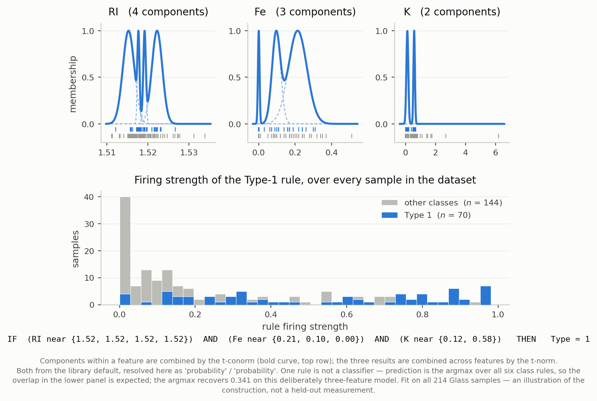
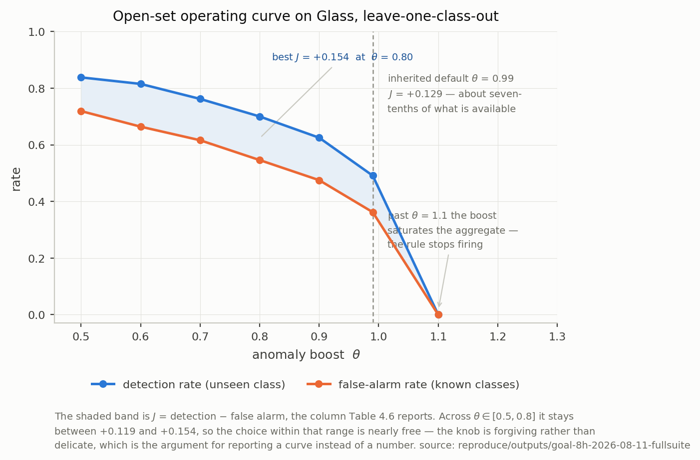

# The Tribble Approach

**Scott Phillips**

Advisor: Dr Kelly Cohen

---

## Result 1 — Fast, interpretable FIS synthesis

* Answer-first construction: $K$ rules for $K$ classes — no grid, no search

| Dataset | Rules | Accuracy / $R^2$ | Train time |
|---|---:|---:|---:|
| PhiUSIIL (235K × 54) | 2 | 0.997 ± 0.001 | 0.28 s |
| RT-IOT2022 (123K × 82, 12-class) | 12 | 0.927 ± 0.002 | 37.4 s |
| Concrete (regression) | 3 buckets | $R^2=$ 0.852 ± 0.030 | 0.24 ± 0.01 s |

* Free: the rule-base complement is automatically an open-set / anomaly
  detector, at no extra training cost

---

## Result 2 — open-set detection, for free, at scale

* One scalar knob ($\theta$) — no second model to train
* **BETH host telemetry, 1.14M rows, trained on benign traffic only:**
  **99.3% detection at 15% false alarms** ($J=+0.843$)

| Method | Detection | False alarm | $J$ |
|---|---:|---:|---:|
| **Complement rule (this work)** | 0.993 | 0.150 | +0.843 |
| One-class SVM | 0.993 | 0.152 | +0.841 |

* Parity with a one-class SVM — no separate model required
* Mechanism visualized on Glass (right): $\theta$ trades detection against
  false alarms smoothly

