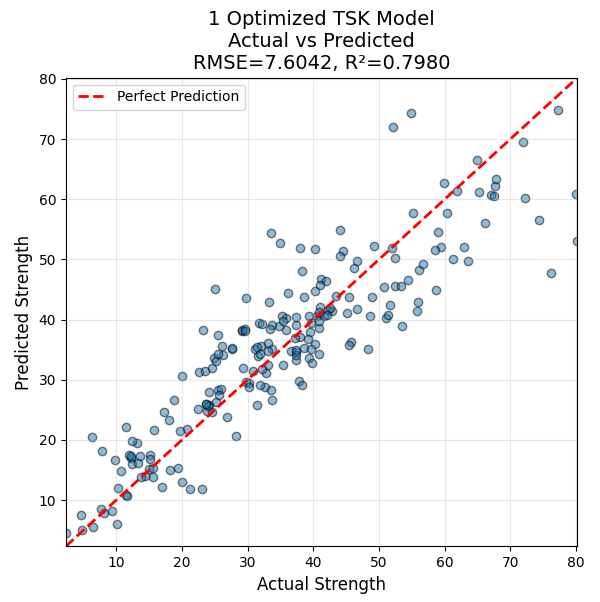

# (Future) Paper 3: Fuzzy C Means and Cluster Detail Extraction

---

## Mixture of Gaussians: Why it matters
1. Genetic Algorithms (GAs) are slow to converge (same issue for other gradient-free stochastic methods)
2. Gradient Descent is much faster than GAs, but requires a - very! - good initial guess.
3. Rule-base explosion is a major issue for Fuzzy models, as the number of rules can grow exponentially with the number of input features.
4. Mixture of Gaussians is a fast, accurate, and easy-to-use method for training Fuzzy Models, making it a valuable tool for practitioners.
5. The simplicity of the model makes it easy to interpret and understand, which is crucial for many applications.
6. The model can be easily extended to handle more complex problems by adding more features or output classes.
7. The model can be trained in a semi-supervised manner, making it easy to incorporate future data into the model.

---

## Mixture of Gaussians Classification Model Training

1. For classification tasks ($N$ samples, $M$ features, $K$ output classes):
2. Segment the data by output class and compute statistical differences among the inputs to identify discriminant features ($O(M)=M^2$)
4. Train a GMM model with the selected feature $m$ for the given output class $k$ (up to $p$ gaussians)
5. These memberships for feature $m$ are _OR_ d together. Repeat for all selected features and all output classes
7. Evaluate confusion matrix and identify second-pass correction rules.

> There will be $K$ final rules, each of which is a linear combination of the $M \times p$ Gaussians.

---

## Mixture of Gaussians Regression Model Training

1. Make your output centroids uniformly - unless you know otherwise - distributed across the output range.
2. Put one output centroid at each extrema of the output range.
3. Use the same approach for the rules, and then apply linear regression to produce the order-1 TSK output rules.
4. This is the UC Irvine Concrete dataset, it's noisy and has a lot of outliers.

> Higher than order-1 TSK doesn't seem to help. Local optimization also barely improves the accuracy.

---

## Mixture of Gaussians: Model Inference

1. Evaluation is done like any other Fuzzy model, $\arg \max(K)$ for selecting the output class.
2. This is the UC Irvine ML phishing dataset, running about 97-99% accuracy in 6 seconds.
3. This methodology prevents rule-base explosion by only the minimum possible number of rules.

---

## Mixture of Gaussians: RT-IOT2022

> 123K instances, 83 features, 12 output classes, trains in <60 seconds.

---

## Background: Fuzzy C Means

$m$ is the _fuzzification parameter_, $m \in [2,4]$

* Centroid equation:
$$\vec c_k = {{\sum_x w_k(\vec x)^m \vec x}\over{\sum_x w_k(\vec x)^m}}$$
* Objective function:
$$J(W,C) = \sum_{i=1}^{n} \sum_{j=1}^{c} w_{j}(\vec x_i)^m \||\vec x_i - \vec c_j\||^{2}$$

* Weights:
$$w_{k}(\vec x) = \frac{1}{\sum_{j=1}^{c} \left ( {\|\vec x - \vec c_k \|}\over{\|\vec x - \vec c_j \|} \right )^{{2}\over{m-1}}}$$

> This method handles points with partial membership in multiple clusters, but it is susceptible to initialization issues.

---
## Speedup: Gradient-Descent
* Fuzzy C Means is continuous and differentiable _almost_ everywhere.
* Key singularities are when cluster centroids exactly match a point.
* Utilize gradient-descent optimization to find the optimal centroid points, vs iterative methods.
* This does require a good initial guess for the centroids, or GD will converge on a - poor! - local minima.

---

## Get the Cluster Details - IVAT Style

1. Use the difference of the IVAT superdiagonal to identify the boundaries of each cluster.
2. Sort this, and find the point of the maximum change.
3. This is the initial guess for the count of cluster centroids.
4. Look back to the row/col permutation sequence of VAT/IVAT to identify the initial, "hard" cluster memberships
5. Take the mean of the points in each cluster -> cluster centroids.

> IVAT provides an excellent initial guess for the cluster centroids, whether FCM or K-Means.

---