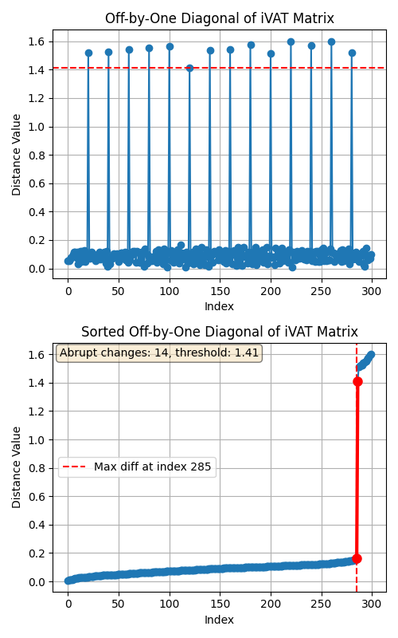
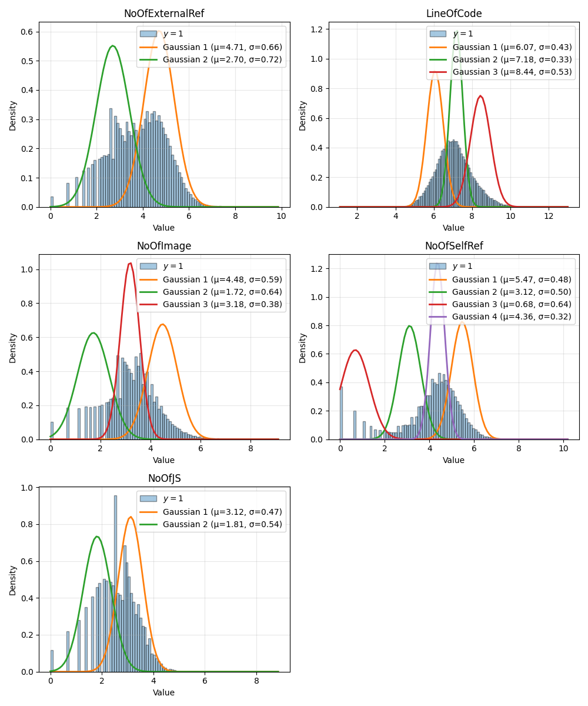
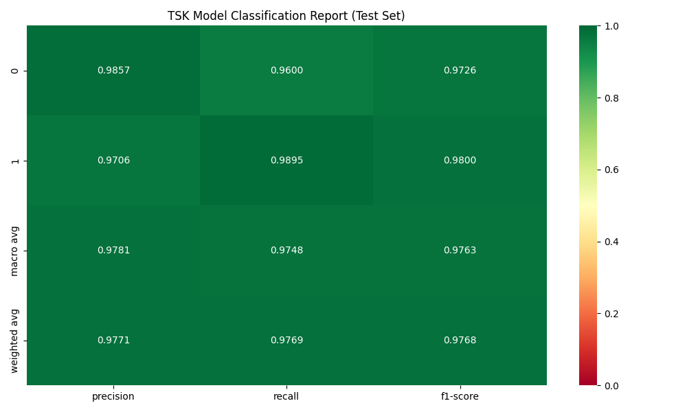
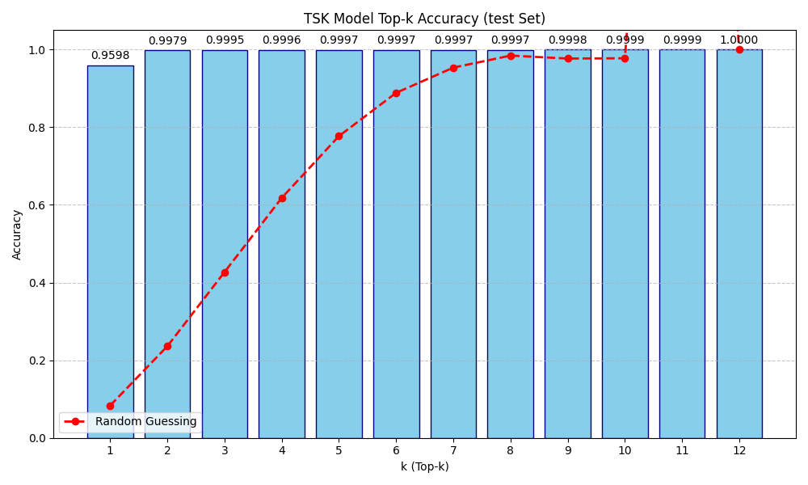
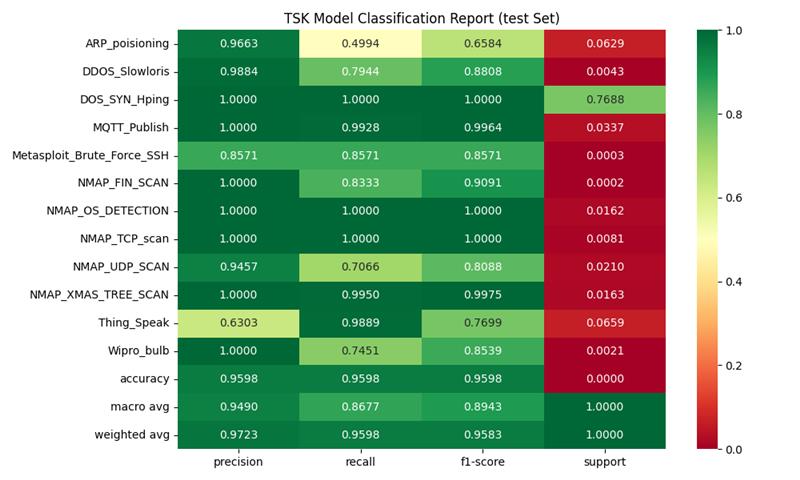

# (Future) Paper 3: Fuzzy C Means and Cluster Detail Extraction

---

## Background: Fuzzy C Means

$m$ is the _fuzzification parameter_, $m \in [2,4]$

* Centroid equation:
$$\vec c_k = {{\sum_x w_k(\vec x)^m \vec x}\over{\sum_x w_k(\vec x)^m}}$$
* Objective function:
$$J(W,C) = \sum_{i=1}^{n} \sum_{j=1}^{c} w_{j}(\vec x_i)^m \||\vec x_i - \vec c_j\||^{2}$$

* Weights:
$$w_{k}(\vec x) = \frac{1}{\sum_{j=1}^{c} \left ( {\|\vec x - \vec c_k \|}\over{\|\vec x - \vec c_j \|} \right )^{{2}\over{m-1}}}$$

> This method handles points with partial membership in multiple clusters, but it is susceptible to initialization issues.

---
## Speedup: Gradient-Descent
* Fuzzy C Means is continuous and differentiable _almost_ everywhere.
* Key singularities are when cluster centroids exactly match a point.
* Utilize gradient-descent optimization to find the optimal centroid points, vs iterative methods.
* This does require a good initial guess for the centroids, or GD will converge on a - poor! - local minima.

---

## Get the Cluster Details - IVAT Style

1. Use the difference of the IVAT superdiagonal to identify the boundaries of each cluster.
2. Sort this, and find the point of the maximum change.
3. This is the initial guess for the count of cluster centroids.
4. Look back to the row/col permutation sequence of VAT/IVAT to identify the initial, "hard" cluster memberships
5. Take the mean of the points in each cluster -> cluster centroids.

> IVAT provides an excellent initial guess for the cluster centroids, whether FCM or K-Means.

---

## Now: Current Research Direction

1. Accelerating Fuzzy C Means methods with gradient-descent optimization
    1. Still subject to initial point selection
2. Utilizing VAT/IVAT for automatic cluster (and cluster centroid) identification
    1. This guarantees we don't initialize FCM with points which have primary membership in the same cluster.
    2. This also provides the initial steps towards 2-OPT check points identification
    3. Automatic cluster counting
3. Mixture of Gaussians (MoG) FIS membership function and rule identification
    1. This is showing promise for orders-of-magnitude speed up in model training
    2. It trains on a phishing dataset with 235K entries to 97% accuracy in 6 seconds
    3. No post-training GD or GA required
    4. It does this with 2 rules and a handful of clauses
    5. It extends to TSK order-1 and order-2 with linear regression parameter estimation.
4. 2D-rotation AND-rule selection
    1. Uniformly distributes rules across possible space
    2. Provides a good initial solution deck for GA/ACO methods

---

## Mixture of Gaussians Model Training

1. For classification tasks ($N$ samples, $M$ features, $K$ output classes):
2. Segment the data by output class
3. Compute statistical differences among the inputs to identify discriminant features ($O(M)=M^2$)
4. Train a GMM model with the selected feature $m$ for the given output class $k$ (up to $p$ gaussians)
5. These memberships for feature $m$ are _OR_ d together.
6. Repeat for all selected features and all output classes
7. Evaluate confusion matrix and identify second-pass correction rules.

> There will be $K$ final rules, each of which is a linear combination of the $M \times p$ Gaussians.

---

## Mixture of Gaussians Model Inference

1. Evaluation is done like any other Fuzzy model, $\arg \max(K)$ for selecting the output class.
2. This is the UC Irvine ML phishing dataset, running about 97-99% accuracy in 6 seconds.
3. This methodology prevents rule-base explosion by only the minimum possible number of rules.

---

## MoG: RT-IOT2022

> 123K instances, 83 features, 12 output classes, trains in <60 seconds.

---