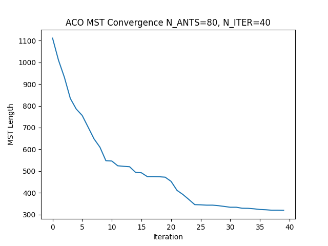
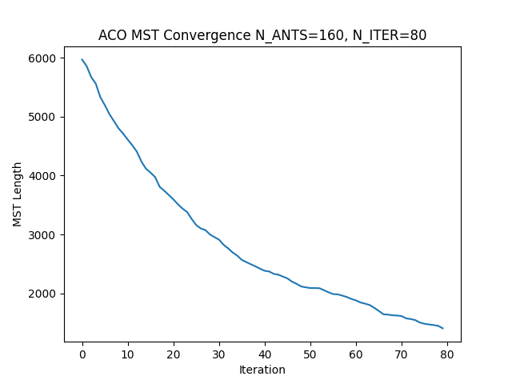
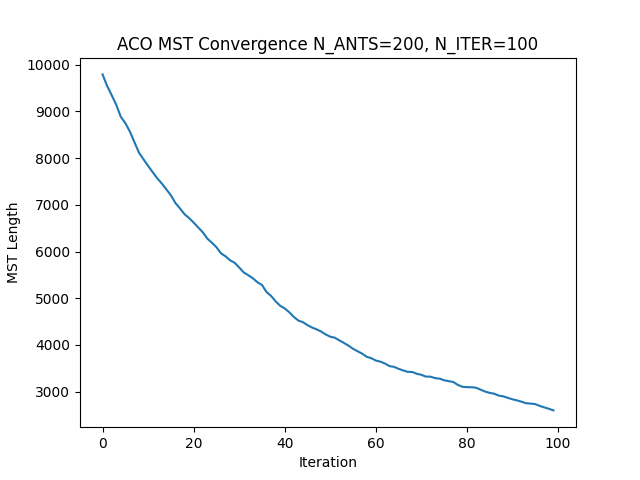
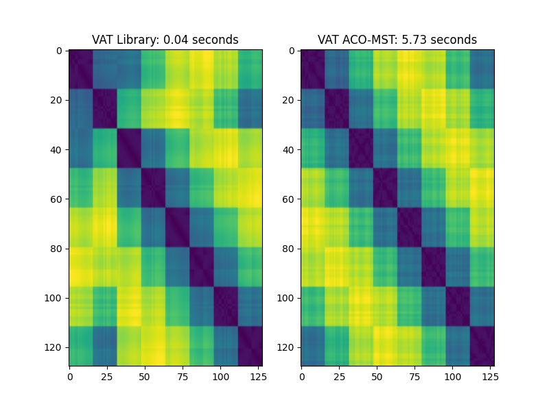
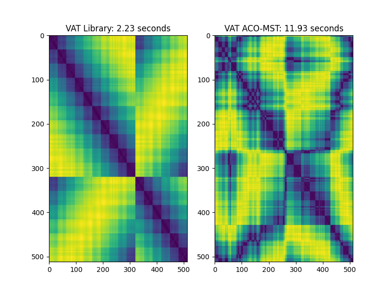
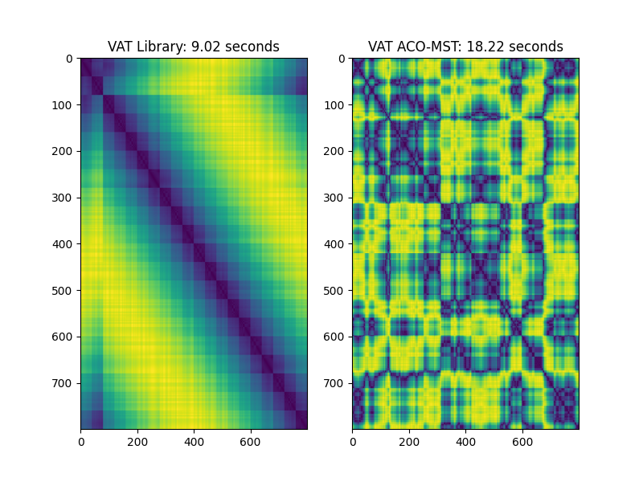

# NAFIPS Paper 1: Utilization of VAT for Hot-start of TSP

---

## VAT Background & Limitations

* Visual Assessment for Tendency (VAT) is a method for cluster identification pioneered by Bezdek
* It converts, usually via the _L2-norm_, an $N \times M$ matrix of samples into an $N \times N$ dissimilarity
  matrix $D$
* It permutes the matrix to minimize the distances off the principal diagonal – Minimum Spanning Tree (MST)
* The core algorithm is greedy, similar to Prim's Algorithm for MSTs
* It was computationally expensive, $O(N)=N^3$ - I have brought down to $O(N)=N^2 \log N$

---

## ACO Background & Limitations

* Ant Colony Optimization is a stochastic optimization technique used for combinatorics, commonly with the Traveling
  Salesperson Problem (TSP)
* It doesn’t guarantee finding the “best” solution, but often finds a “good enough” solution
* It is trivially parallelizable – important on multicore processors and GPUs

* It does not require the cost function to continuous, or differentiable, only comparable
* It is susceptible to initialization issues, since it is not guaranteed to find the local optima on a given attempt (
  unlike gradient descent)
* Having a good initial guess, a “hot-start” can greatly reduce the convergence time.

---

## The Connection

* The dissimilarity matrix $D$, and the optimized VAT matrix $D'$ are symmetric permutations of rows and columns.
* It has been proven that the MST provides an upper bound on the length of the optimal tour:

$T_{best} \le 2T_{MST}$
> An intuitive tour is to visit the permuted cities in $D'$ sequentially, then wrap back from city $N$ to $1$.

---

## Example - Circular Cities

* A constructed dataset with obvious structure, clusters, and an analytic nearly optimal tour length
* A large circle with smaller circular clusters distributed evenly around the perimeter
* Optimal tour length approximation:

$T_{optimal} = P_{polygon} + N_{cities}P_{city} - N_{cities}D_{city}$

$D_{polygon} > D_{city}$

---

## Initial Performance Observation - 256

> Unfortunately, IVAT mutates the matrix, making it unsuitable for hot-starting

| Method  | Time [s] | Distance | Change |
|---------|----------|----------|--------|
| Optimal | 0.00     | 289      | 100%   |
| Random  | 0.00     | 10,074   | 3500%  |
| VAT     | 0.35     | 408      | 140%   |
| HS-ACO  | 4.95     | 408      | 140%   |
| ACO     | 4.10     | 1592     | 550%   |

---

## Larger Scale - 2048

| Method  | Time [s] | Distance | Change  |
|---------|----------|----------|---------|
| Optimal | 0        | 394      | 100%    |
| Random  | 0        | 78,104   | 19,829% |
| VAT     | 196      | 582      | 150%    |
| HS-ACO  | 543      | 582      | 150%    |
| ACO     | 258      | 24,723   | 6300%   |

---

# Refinement

* VAT does not always pick the optimal route, so using ACO to refine is helpful.
* VAT will struggle if there are equally valid solutions, that is identical distances.
* In later work, I add radial "noise" to cities to reduce the chance of identical solutions.

---

## Can ACO approximate VAT? - Somewhat

* VAT - based on Prim's (greedy) algorithm

* ACO MST - often Broder's algorithm

> A naive permutation method which minimizes the primary diagonals tends to produce perpendicular lines

---

## Conclusions and Future Work

* VAT provides a great initial guess to solving TSP problems with ACO
* Permutation methods with ACO are not effective
* ACO MST methods show promise, but need further development

---

## ACO MST - Scaling

| Column 1                          | Column 3                         | Column 4                         |
|-----------------------------------|----------------------------------|----------------------------------|
|  |  |  |
| 50x 2x                            | 230x 3x                          |                                  |
|  |  |  |
| 128 4x       512                  | 6.25x                            | 800                              |

