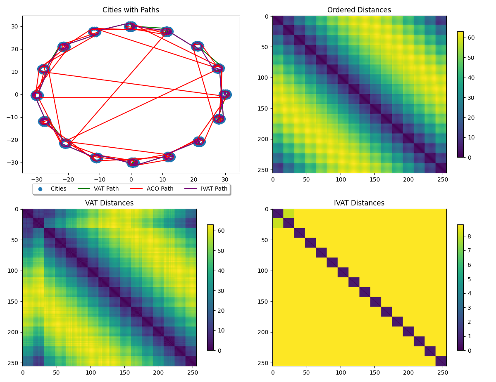
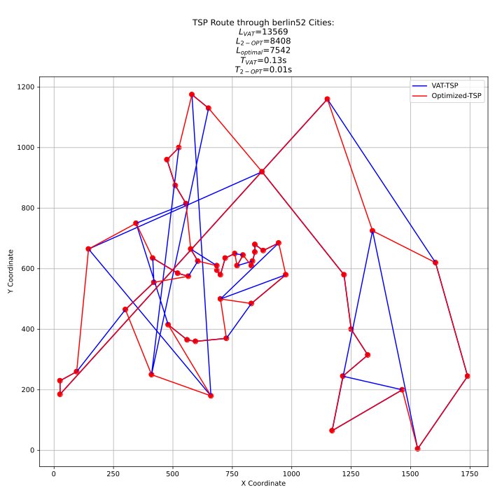
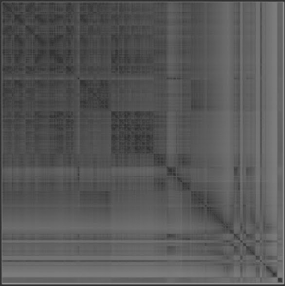
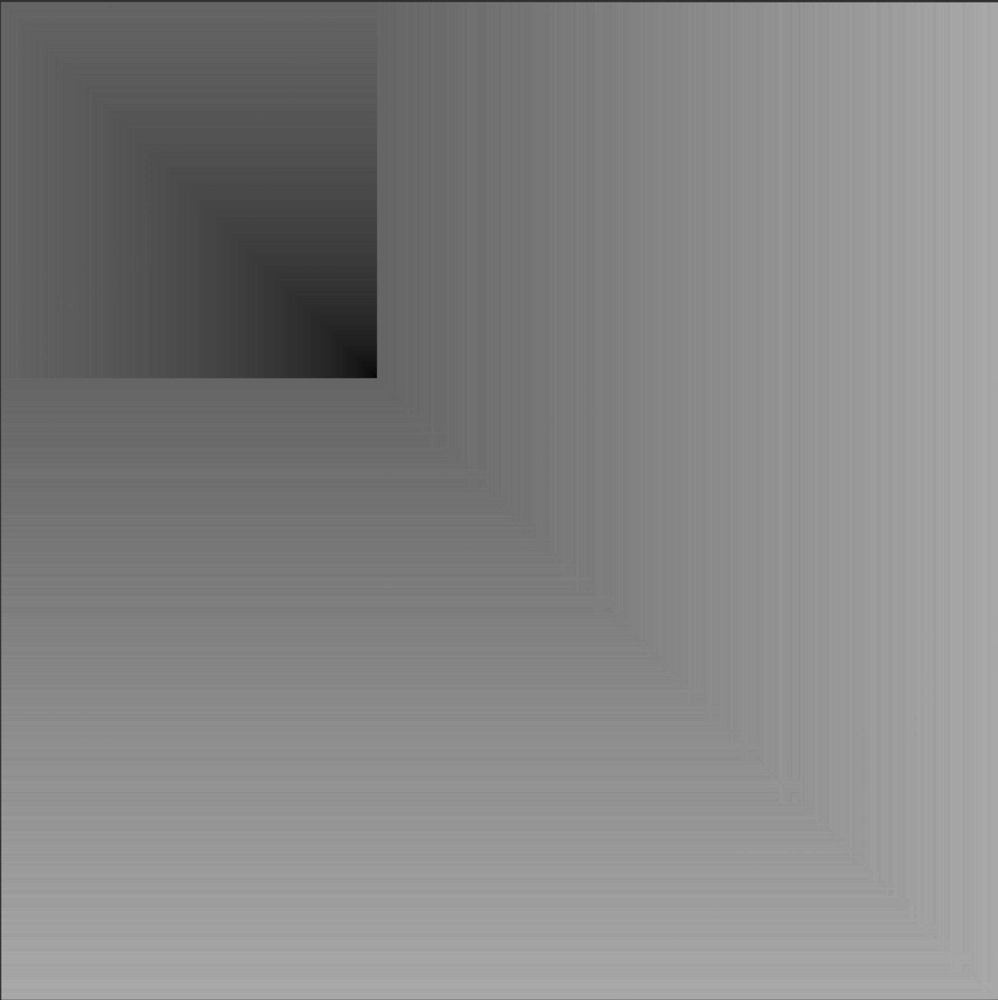
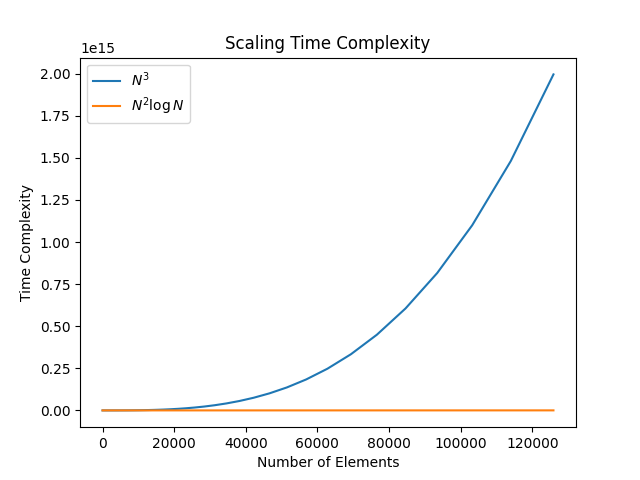
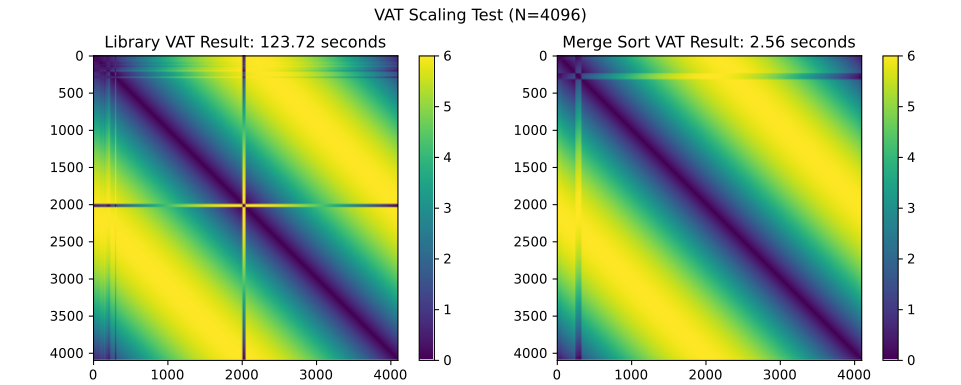
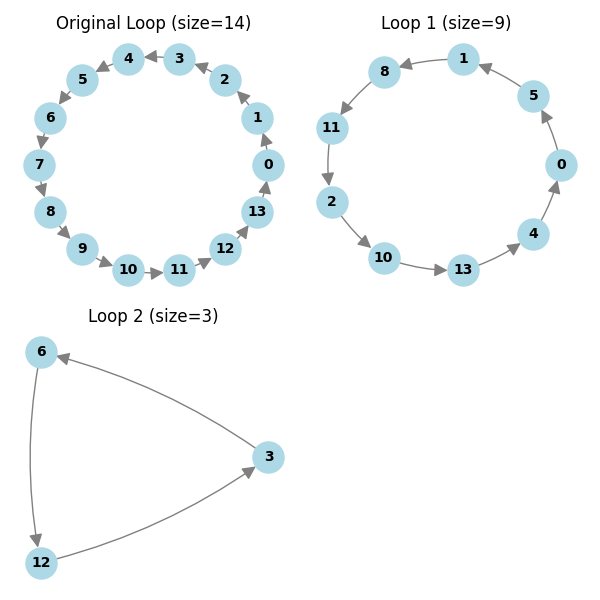

# NAFIPS Papers 1/2: MergeVAT: $58K \times 58K$ in 60 seconds

---

## Motivation

* Improve the starting point for GA/ACO/etc TSP solutions - "hot-starting"
* Automatic segmentation for MTSP problems
* Provide additional information to guide local post-optimization

---

## VAT Background & Limitations

* Visual Assessment for Tendency (VAT) is a method for cluster identification pioneered by Bezdek
* It converts, usually via the _L2-norm_, an $N \times M$ matrix of samples into an $N \times N$ dissimilarity
  matrix $D$
* It permutes the matrix to minimize the distances off the principal diagonal – Minimum Spanning Tree (MST)
* The core algorithm is greedy, similar to Prim's Algorithm for MSTs
* It was computationally expensive, $O(N)=N^3$ - I have brought down to $O(N)=N^2 \log N$

---

## The Connection

* The dissimilarity matrix $D$, and the optimized VAT matrix $D'$ are symmetric permutations of rows and columns.
* It has been proven that the MST provides an upper bound on the length of the optimal tour:

$T_{best} \le 2T_{MST}$
> An intuitive tour is to visit the permuted cities in $D'$ sequentially, then wrap back from city $N$ to $1$.

---

## Example - Circular Cities

* A constructed dataset with obvious structure, clusters, and an analytic nearly optimal tour length
* A large circle with smaller circular clusters distributed evenly around the perimeter
* Optimal tour length approximation:

$T_{optimal} = P_{polygon} + N_{cities}P_{city} - N_{cities}D_{city}$

$D_{polygon} > D_{city}$

* VAT does not always pick the optimal route, so using ACO to refine is helpful.
* VAT will struggle if there are equally close neighbors, that is, identical distances.
* In later work, I add radial "noise" to cities to reduce the chance of identical solutions.

---

## Larger Scale - 2048

| Method  | Time [s] | Distance | Change  |
|---------|----------|----------|---------|
| Optimal | 0        | 394      | 100%    |
| Random  | 0        | 78,104   | 19,829% |
| VAT     | 196      | 582      | 150%    |
| HS-ACO  | 543      | 582      | 150%    |
| ACO     | 258      | 24,723   | 6300%   |

---

## TSP Optimization

> Unfortunately, the commonly used 2-OPT local optimization method breaks the cluster organization

---

## Motivation: Go, Fuzzy! - faster!

* UC Irvine NASA Dataset
    * Space Shuttle reentry (statlog)
    * 80% of data in condition-1
    * 58,000 rows, 7 features
* Can we visualize and confirm that?
    * This image is 1% linear scale, 1/10,000 in area
    * 8-bit grey-scale PNG is >400 MB

---

## Psych Eval Patient Data

* 135K rows, 165 features - 30% clustered, 70% sparse - mostly binary values, data was obfuscated for patient privacy reasons
  * 2 columns were floating point values: `LengthOfStayMinutes`, `PatientAgeInYears`
  * These dominated the dataset, and were excluded from the clustering
* Can we visualize and confirm that?
    * 8 minutes for VAT, 15 minutes for distance matrix calculation
    * At 32-bit floating point, this is 73GB

---

## Scaling Time Complexity

* VAT gets the arg-min of the remainder of the current column
* This sorting operation is typically BubbleSort, $O(N)=N^2$
* This is applied on every column, so overall $O(N)=N^3$
> At 135K rows, my improved method is ~8000 times faster

---

## The First Insight - Sort Algorithm

* MergeSort is the asymptotically fastest algorithm which can exist: $O(N)=N \log N$
* Over $N$ columns, we have $O(N)=N^2 \log N$
* N-scaling=24 is a 16K element dataset
* Utilize a priority queue (fibbonacci heap) to extract the remainder index as $O(N)=1$ operation

> Professor Kreinovich pointed out this method is more akin to HeapSort, which is also $O(N)=N \log N$. The original
> name came from a failed experiment to implement what amounts to a 2D MergeSort.

 

---

## Scaling Comparison

 

> For a 4096 element dataset, 124 seconds vs 2.56 seconds

---

## Sorting Algorithm details

---

## The Second Insight -- Memory

* VAT often caches the entire dissimilarity matrix $D$
* This doubles the memory consumption to save on compute costs, but since mergeVAT scales so much better, we need to
  reduce memory consumption
    * Why not compute only the requested distance $D_{i,j}$ as needed?
    * This reduces memory to one copy of $D$ plus working space, approximately $O(N) = {{N^2+N}\over{16}}$
      vs $O(N)=2N^2$

---

## The Third Insight - Loop-Walking

* VAT sequence, paired with the original sequence, creates a collection of loops: _directed, cyclic graphs_
* We can start at any point on any loop, and follow the loop until we reach our starting point again.
* If we mask which loop entries have been visited, we can simply increment until we find another loop

---

## Conclusions and Future Work

* VAT provides a great initial guess to solving TSP problems with ACO
* mergeVAT:
    * Expands the usable size from 5K to 130K+ elements
    * Provides a good initial guess for TSP applications
    * Loop-walking cuts the memory requirement in half
* **Active** Work: Identify VAT-clusters to change 2-Opt check points
* Future Work: Distributed mergeVAT for 500K elements
* Future Work: InsertionSort for building up to 500K elements

---

## ACO Background & Limitations

* Ant Colony Optimization (ACO) is a stochastic optimization technique used for combinatorics, commonly with the Traveling
  Salesman Problem (TSP)
* It doesn’t guarantee to find the “best” solution, but often finds a “good enough” solution
* It is trivially parallelizable – important on multicore processors and GPUs

* It does not require the cost function to be continuous, or differentiable, only comparable
* It is susceptible to initialization issues, since it is not guaranteed to find the local optima on a given attempt (unlike gradient descent)
* Having a good initial guess, a “hot-start” can greatly reduce the convergence time.

---