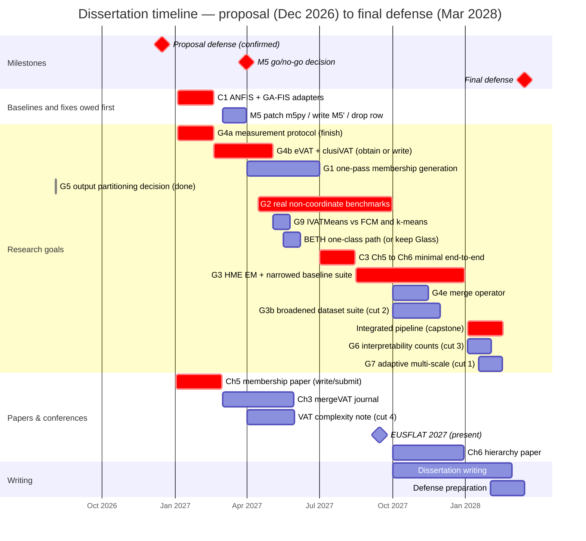

# Chapter 10 — Timeline

The plan runs from the proposal defense at the end of 2026 to the final defense in **March 2028**: fifteen months of research runway. It is deliberately aggressive, and the risk is managed in Chapter 7, where the completed Chapters 3 and 4 are the floor and §7.4 collects the risks. Quarters are calendar quarters; goal labels match Table 7.1 and `CHECKLIST.md`.

Three things changed here, all of them cases of the schedule having assumed the hard parts were done.

- **The baseline adapters come first.** C1 (ANFIS and GA-tuned-FIS) fill the initial baseline gap; see §7.4 for the impact on Tables 4.5 and 6.2.
- **Every blocker the evidence names now has a bar or a stated fallback.** The M5 dependency fault gets a decision date; BETH's one-class path gets a slot and a stated fallback; eVAT and clusiVAT get their own bar. Fumanal-Idocin et al. [@fumanal2025fast] and the deep TSK fuzzy classifier, itemized in Chapter 6's baseline list and nowhere here, are left out of the baseline suite in §7.2 rather than silently carried.
- **Goal G8 is absent deliberately.** §7.2 retargets the construction post-defense, since the 2028 Q1 quarter it would need already carries the capstone, G6, G7, the write-up and the defense, and keeps only the disjunct count over G2's datasets, which rides inside G2.

## 10.1 Gantt



The Chapter 5 membership paper targets **EUSFLAT 2027**: written in January and February 2027 against a **February submission deadline**,\* presented in September. NAFIPS 2025 (Banff, July 2025) and NAFIPS 2026 (El Paso, March 2026) are already published and predate this timeline.

Two bars deliberately have no dates. **G4c**, the datacenter-GPU re-run, is gated on access to a card with full-rate double precision, not on effort, and §7.4's fallback applies if it never opens. **G4d**, the matrix-free reorder, is a cut candidate nothing in Chapter 3 depends on, listed unscheduled in Table 7.1.

\* *Bar arithmetic, in one place.* A 59-day bar from 2027-01-02 ends 2027-03-02, past the confirmed deadline, so the Chapter 5 paper's bar runs 57 days and ends 28 February, the last day the deadline can fall on. An earlier day shortens it (open item below).

## 10.2 Quarter grid (renderer-independent fallback)

```
                                    2026    2027    2027    2027    2027    2028
Goal / activity                       Q4      Q1      Q2      Q3      Q4      Q1
                                   (prop.)                                (defense)
------------------------------------------------------------------------------------
C1  ANFIS + GA-FIS adapters            .    ####       .       .       .       .
M5  decide: patch, build, or drop      .     ###       .       .       .       .
G4a measurement protocol (finish)      .    ####       .       .       .       .
G4b eVAT + clusiVAT head-to-head       .     ###     ###       .       .       .
G1  one-pass membership generation     .       .    ####       .       .       .
G5  output partitioning decision       DONE    .       .       .       .       .
G2  real non-coordinate benchmarks     .       .    ####    ####       .       .
G9  IVATMeans vs FCM and k-means       .       .     ###       .       .       .
BETH one-class path (or keep Glass)    .       .     ###       .       .       .
C3  Ch5 -> Ch6 minimal end-to-end      .       .       .     ###       .       .
G3  HME EM + narrowed baselines        .       .       .     ###    ####       .
G4e merge operator: composition test   .       .       .       .     ###       .
G3b broadened dataset suite (cut 2)    .       .       .       .     ###       .
    integrated pipeline (capstone)     .       .       .       .       .    ####
G6  interpretability counts (cut 3)    .       .       .       .       .     ###
G7  adaptive multi-scale (cut 1)       .       .       .       .       .     ~~~
------------------------------------------------------------------------------------
    Ch5 paper -> EUSFLAT 2027          .    SUB#       .    PRES       .       .
    Ch3 mergeVAT journal               .     ###     ###       .       .       .
    VAT complexity note (cut 4)        .       .     ###       .       .       .
    Ch6 hierarchy paper                .       .       .       .    ####       .
    dissertation writing               .       .       .       .    ....    ####
------------------------------------------------------------------------------------
    milestones                       PROP.                  EUSFLAT         DEFENSE
```

Legend: `####` a full quarter of scheduled work · `###` a partial quarter, starting or ending mid-quarter or too short to fill one · `SUB#` write and submit (EUSFLAT deadline **Feb 2027**) · `PRES` present at the conference · `~~~` stretch (first to cut) · `....` ramp-up · `.` idle. Every marker is right-aligned to its quarter column.

## 10.3 Milestone table

| Quarter | Focus | Goals | Deliverable |
|---|---|---|---|
| **2026 Q4** | Proposal defense (**Dec**) | — | Defended proposal; committee feedback folded in |
| **2027 Q1** | Baselines and fixes owed first | C1, G4a, M5, G4b (start) | **Adapters filling the eleven `N/A` cells** in Tables 4.5 and 6.2; G4a finished (clocks/thermals, SHA guard, §7.2's two exceptions named); **M5 go/no-go by 31 March**; eVAT and clusiVAT obtained or written; one consistent Concrete benchmark; **Ch 5 paper submitted (Feb deadline)**; Ch 3 journal begun |
| **2027 Q2** | Memberships and the credibility gap | G1, G5, G2 (start), G4b (finish), G9, BETH | One-pass MF (phase 4 re-attempted against §7.2's threshold, 5 the refactor); **G2 starts here, not Q3**; eVAT/clusiVAT reported; `IVATMeans` timed and scored against FCM and k-means, including the non-convex sets where §3.3.5 predicts it loses; BETH one-class path settled or the claim explicitly on Glass |
| **2027 Q3** | Real non-coordinate data | G2, C3, G3 (start) | DTW and graph-kernel benchmarks against §7.2's four criteria; **the minimal Ch 5 → Ch 6 result, pulled forward out of 2028 Q1** (C3); HME EM begun; **EUSFLAT presented (Sept)** |
| **2027 Q4** | Hierarchy, baselines, merge question | G3, G4e, G3b | HME EM judged against the rule §7.2 states *before* it runs; narrowed baseline suite; merge composition test; broadened suite (cut 2); Ch 6 paper; writing begins |
| **2028 Q1** | Capstone, write-up, **defense (Mar)** | capstone, G6\*, G7\* | Shuttle case study end to end **plus the same driver on one DTW matrix**, against §7.1's threshold; interpretability counts and named semantic criteria; **final defense March 2028** |

## 10.4 Dependencies and critical path

- **C1 has no upstream dependency**, which is why Q1 looks crowded: two adapter files, auto-detected by the tables. First, because everything downstream is measured against them.
- **G4a stays front-loaded** (Q1); every later number is reported under its protocol. Its bar lands mid-February.
- **G2 therefore starts 15 April and runs two quarters**, Q2 into Q3, matching its billing as the top credibility item and the riskiest thing to leave late.
- **G9 follows G4b**, starting the week that bar ends, because it is the same shape of work: a competitor comparison on the run-of-record host, reusing G4b's driver and its timing harness. Three weeks, not a quarter, since the estimator and both baselines already exist.
- **G1 precedes C3 and the capstone.** C3 is the new intermediate, the first time Chapter 5's memberships reach Chapter 6's models at all, and putting a small version in Q3 is checklist **C3**'s own recommendation. It leaves the capstone an integration rather than a first attempt.
- **The M5 decision gates G3's suite**, hence the dated milestone: one of four baselines may be a *build*, and finding that out in Q4 with the suite half-run is what the date prevents. **G3's EM is the largest single build**, spanning Q3–Q4, with the one-shot mixture as its de-scope path.
- **Papers track the work**: Ch 5 → EUSFLAT (written Q1, presented Q3) → Ch 3 journal (Q1–Q2, a write-up, so it absorbs slip) → the VAT complexity note if the two blocking full-text reads clear (Q2, the fourth cut) → Ch 6 (Q4) → the capstone journal version alongside the write-up (2028 Q1).
