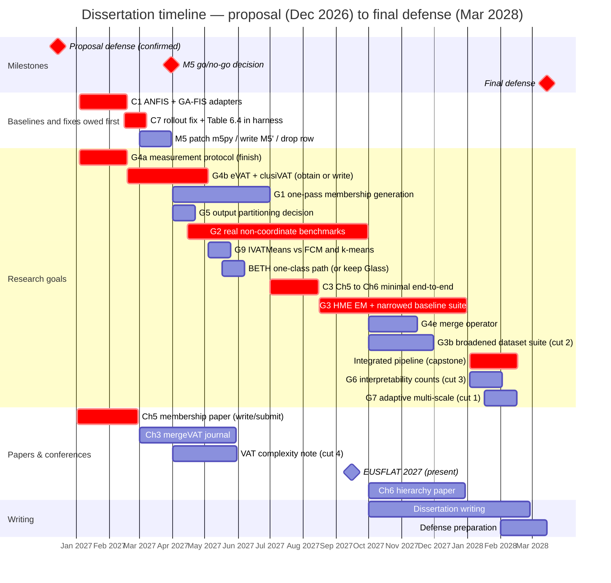

# Chapter 10 — Timeline

The plan runs from the proposal defense at the end of 2026 to the final defense in **March 2028**: fifteen months of research runway. It is deliberately aggressive, and the risk is managed in Chapter 7, where the completed Chapters 3 and 4 are the floor and §7.4 points at the de-scoping order §10.6 carries in full. Quarters are calendar quarters; goal labels match Table 7.1, `CHECKLIST.md` and `ACTION_ITEMS.md`.

Three things changed here, all of them cases of the schedule having assumed the hard parts were done.

- **The baseline adapters come first.** §7.4 calls the ANFIS and GA-tuned-FIS tables the first experiments owed. Eleven cells across Tables 4.5 and 6.2 read `N/A` until they exist, and the speed argument in the title and in Chapters 1, 4 and 8 has no conventional fuzzy method measured beside it. That is the reason they open the schedule (checklist **C1**).
- **Every blocker the evidence names now has a bar or an explicit de-scope.** The M5 dependency fault gets a decision date; the defective rollout behind Table 6.4 gets a bar, because §7.3 promises that result to the committee; BETH's one-class path gets a slot and a stated fallback; eVAT and clusiVAT get their own bar. Fumanal-Idocin et al. (2025) and the deep TSK fuzzy classifier, itemized in Chapter 6's baseline list and nowhere here, are de-scoped in §7.2 instead of silently carried.
- **Goal G8 is absent deliberately.** §7.2 retargets the construction post-defense, since the 2028 Q1 quarter it would need already carries the capstone, G6, G7, the write-up and the defense, and keeps only the disjunct count over G2's datasets, which rides inside G2.

## 10.1 Gantt



The Chapter 5 membership paper targets **EUSFLAT 2027**: written in January and February 2027 against a **February submission deadline**, presented in September. §10.5 sets out what that costs.\* NAFIPS 2025 (Banff, July 2025) and NAFIPS 2026 (El Paso, March 2026) are already published and predate this timeline.

Two bars deliberately have no dates. **G4c**, the datacenter-GPU re-run, is gated on access to a card with full-rate double precision, not on effort, and §7.4's fallback applies if it never opens. **G4d**, the matrix-free reorder, is a cut candidate nothing in Chapter 3 depends on, listed unscheduled in Table 7.1.

\* *Bar arithmetic, in one place.* A 59-day bar from 2027-01-02 ends 2027-03-02, past the confirmed deadline, so the Chapter 5 paper's bar runs 57 days and ends 28 February, the last day the deadline can fall on. An earlier day shortens it (open item below).

## 10.2 Quarter grid (renderer-independent fallback)

```
                                    2026    2027    2027    2027    2027    2028
Goal / activity                       Q4      Q1      Q2      Q3      Q4      Q1
                                   (prop.)                                (defense)
------------------------------------------------------------------------------------
C1  ANFIS + GA-FIS adapters            .    ####       .       .       .       .
C7  rollout fix + Table 6.4            .     ###       .       .       .       .
M5  decide: patch, build, or drop      .     ###       .       .       .       .
G4a measurement protocol (finish)      .    ####       .       .       .       .
G4b eVAT + clusiVAT head-to-head       .     ###     ###       .       .       .
G1  one-pass membership generation     .       .    ####       .       .       .
G5  output partitioning decision       .       .     ###       .       .       .
G2  real non-coordinate benchmarks     .       .    ####    ####       .       .
G9  IVATMeans vs FCM and k-means       .       .     ###       .       .       .
BETH one-class path (or keep Glass)    .       .     ###       .       .       .
C3  Ch5 -> Ch6 minimal end-to-end      .       .       .     ###       .       .
G3  HME EM + narrowed baselines        .       .       .     ###    ####       .
G4e merge operator: composition test   .       .       .       .     ###       .
G3b broadened dataset suite (cut 2)    .       .       .       .     ###       .
    integrated pipeline (capstone)     .       .       .       .       .    ####
G6  interpretability counts (cut 3)    .       .       .       .       .     ###
G7  adaptive multi-scale (cut 1)       .       .       .       .       .     ~~~
------------------------------------------------------------------------------------
    Ch5 paper -> EUSFLAT 2027          .    SUB#       .    PRES       .       .
    Ch3 mergeVAT journal               .     ###     ###       .       .       .
    VAT complexity note (cut 4)        .       .     ###       .       .       .
    Ch6 hierarchy paper                .       .       .       .    ####       .
    dissertation writing               .       .       .       .    ....    ####
------------------------------------------------------------------------------------
    milestones                       PROP.                  EUSFLAT         DEFENSE
```

Legend: `####` a full quarter of scheduled work · `###` a partial quarter, starting or ending mid-quarter or too short to fill one · `SUB#` write and submit (EUSFLAT deadline **Feb 2027**) · `PRES` present at the conference · `~~~` stretch (first to cut) · `....` ramp-up · `.` idle. Every marker is right-aligned to its quarter column; the Chapter 3 journal row was previously indented four characters further, putting its bar under 2027 Q2 while the text scheduled it in Q1.

## 10.3 Milestone table

| Quarter | Focus | Goals | Deliverable |
|---|---|---|---|
| **2026 Q4** | Proposal defense (**Dec**) | — | Defended proposal; committee feedback folded in |
| **2027 Q1** | Baselines and fixes owed first | C1, G4a, C7, M5, G4b (start) | **Adapters filling the eleven `N/A` cells** in Tables 4.5 and 6.2; G4a finished (clocks/thermals, SHA guard, §7.2's three exceptions named); `predict_trajectory` fixed, Table 6.4 at ten seeds in the harness; **M5 go/no-go by 31 March**; eVAT and clusiVAT obtained or written; one consistent Concrete benchmark; **Ch 5 paper submitted (Feb deadline)**; Ch 3 journal begun |
| **2027 Q2** | Memberships and the credibility gap | G1, G5, G2 (start), G4b (finish), G9, BETH | One-pass MF (phase 4 re-attempted against §7.2's threshold, 5 the refactor); output-partitioning **decision** in about three weeks; **G2 starts here, not Q3**; eVAT/clusiVAT reported; `IVATMeans` timed and scored against FCM and k-means, including the non-convex sets where §3.3.5 predicts it loses; BETH one-class path settled or the claim explicitly on Glass |
| **2027 Q3** | Real non-coordinate data | G2, C3, G3 (start) | DTW and graph-kernel benchmarks against §7.2's four criteria; **the minimal Ch 5 → Ch 6 result, pulled forward out of 2028 Q1** (C3); HME EM begun; **EUSFLAT presented (Sept)** |
| **2027 Q4** | Hierarchy, baselines, merge question | G3, G4e, G3b | HME EM judged against the rule §7.2 states *before* it runs; narrowed baseline suite; merge composition test; broadened suite (cut 2); Ch 6 paper; writing begins |
| **2028 Q1** | Capstone, write-up, **defense (Mar)** | capstone, G6\*, G7\* | Shuttle case study end to end **plus the same driver on one DTW matrix**, against §7.1's threshold; interpretability counts and named semantic criteria; **final defense March 2028** |

## 10.4 Dependencies and critical path

- **C1 has no upstream dependency**, which is why Q1 looks crowded: two adapter files, auto-detected by the tables. First, because everything downstream is measured against them.
- **G4a stays front-loaded** (Q1); every later number is reported under its protocol. Its bar lands mid-February.
- **G2 therefore starts 15 April and runs two quarters**, Q2 into Q3, matching its billing as the top credibility item and the riskiest thing to leave late.
- **G9 follows G4b**, starting the week that bar ends, because it is the same shape of work: a competitor comparison on the run-of-record host, reusing G4b's driver and its timing harness. Three weeks, not a quarter, since the estimator and both baselines already exist.
- **G1 precedes C3 and the capstone.** C3 is the new intermediate, the first time Chapter 5's memberships reach Chapter 6's models at all, and putting a small version in Q3 is checklist **C3**'s own recommendation. It leaves the capstone an integration rather than a first attempt.
- **C7 gates §7.3's second showcase**, so it sits in Q1. **The M5 decision gates G3's suite**, hence the dated milestone: one of four baselines may be a *build*, and finding that out in Q4 with the suite half-run is what the date prevents. **G3's EM is the largest single build**, spanning Q3–Q4, with the one-shot mixture as its de-scope path.
- **Papers track the work**: Ch 5 → EUSFLAT (written Q1, presented Q3) → Ch 3 journal (Q1–Q2, a write-up, so it absorbs slip) → the VAT complexity note if the two blocking full-text reads clear (Q2, the fourth cut) → Ch 6 (Q4) → the capstone journal version alongside the write-up (2028 Q1).

## 10.5 A scheduling conflict the confirmed deadline creates

Confirming the EUSFLAT 2027 submission date as **February 2027** breaks the schedule above in a way worth stating rather than quietly re-drawing, because the fix is a choice about what the Chapter 5 paper is.

The grid had the Chapter 5 paper in 2027 Q2 and Goal G1 — one-pass membership generation, the piece §5.5 calls the chapter's differentiator — in 2027 Q2 as well. A February deadline falls in Q1. Two things follow. The submission is scheduled a quarter after the deadline it targets, and more awkwardly, **the paper's headline contribution would not exist when the paper is due.** Q1 is also the quarter already carrying G4a, the baseline adapters, the C7 fix, the M5 decision, the start of the eVAT/clusiVAT work and the Chapter 3 journal.

I do not think the answer is to compress G1 into Q1. G4a is the credibility work every later number depends on, the baselines are what the speed claim rests on, and the chapter that would suffer is the one the committee is most likely to probe. The better answer is to submit the paper Chapter 5 can already support. §5.4 has the multi-scale recovery result — every ground-truth level at adjusted Rand index 1.00 where a flat cover reaches 0.58 to 0.75 — the selection bake-off against beta-plateau and AuToMATo, and the falsification experiment. That is a conference paper as it stands. G1 then becomes the extension, and the natural home for it is the journal version or the following year's conference, where it can be presented with the end-to-end result that §5.5 says the chapter really owes.

The cost of that choice should be named too: the EUSFLAT paper would report clustering scores rather than end-to-end fuzzy-model accuracy, which is exactly the proxy limitation §5.4 concedes. I would rather submit an honest paper about what the selection machinery does than delay for a differentiator and miss the venue. There is a second cost worth stating now that G1's phase-four evidence is in: the extension the journal version would carry is the one whose expectation has already been tested once and did not hold (§7.2, G1), so the follow-up paper should be planned around either outcome — the soft band or the single-versus-multi-level gate — rather than around the version that assumed the fix would work.

## 10.6 The runway is oversubscribed, and here is what I would cut

With everything the evidence requires now scheduled — the baseline adapters, the eVAT and clusiVAT implementations, the M5 branch, the trajectory fix, the BETH decision, the broadened suite, the merge composition test, G2 at its real two-quarter size — the fifteen-month runway has no slack left. **It is oversubscribed, not merely tight, and cutting G7 alone does not fix it.** G7 is roughly thirty days of a stretch goal; the items above are considerably more. So the plan is an ordered list, the same one as §7.4's.

1. **G7, adaptive multi-scale.** Already the designated first cut. Its likeliest outcome, on the phase-four evidence, is a negative result G1 would reach anyway.
2. **G3b, the broadened dataset suite**, narrowed from six datasets (turbine, wave-energy, wine and the IoT sets) to Concrete, PhiUSIIL and one added regression set. Chapter 6 §6.4 promises "characterized across more than two problems," which three satisfy; six against six baselines at ten seeds is a quarter of engineering.
3. **G6's metric half beyond the counts.** The counts are owed and read off a fitted model; the semantic-constraint criteria on top are not load-bearing. The expert-audience study is already dropped in §7.2, having never been scheduled or scoped.
4. **The VAT complexity note (§9.3).** Conditional on two blocking full-text reads, and §3.3.1 concedes it is a modest correction to a problem someone else solved better. The cheapest paper to drop.
5. **G4d, the matrix-free reorder.** Nothing in Chapter 3 depends on it, and it buys the regime past about 155,000 points, which no result here occupies. Listed unscheduled in Table 7.1, so cutting it means not adding it back.
6. **G4e narrows to the composition test alone**, error-growth bound and block-boundary question named as future work. If even that goes, Chapter 3 withdraws the half-million-point distributed target.

**G9 is on neither list, and that is a choice.** It is three weeks on machinery that already exists, and it is the only measurement behind a contribution Chapter 3 §3.3.5 now claims, so putting it on the cut list would mean planning to claim the estimator and never test it. If the quarter overruns anyway, the fallback is stated in §7.4: the claim narrows to what the code proves, and Chapter 3 says so.

What I will not cut, and would rather move the final defense than lose: **C1**, **G2**, **G4a**, **C7**, and the capstone. If G3's EM or G2 overruns, Chapter 7's fallbacks apply (the one-shot mixture, and a synthetic-plus-one-real-domain result), and Chapters 3 and 4 remain a defensible floor. Defense preparation is carved out in Feb 2028 so the final month is not a scramble.

Two caveats. Q1 2027 is the densest quarter, carrying five research items and a conference submission; inside it, the item I would let slip is the Chapter 3 journal, a write-up rather than a build. And throughput is unconfirmed while the teaching and RA load per semester is unsettled, the one open item that could move every bar.

---

### Open items: NEED FROM AUTHOR/ADVISOR

- ~~Confirm the exact proposal-defense month~~ **Confirmed: December 2026.** Final defense is fixed at March 2028, so the runway is fifteen months.
- ~~Confirm the EUSFLAT 2027 submission deadline~~ **Confirmed: February 2027** (conference September 2027), a quarter earlier than the schedule assumed; see §10.5.
- **Confirm the exact EUSFLAT submission day.** The Chapter 5 paper's bar ends 28 February 2027, the latest the deadline can fall; a mid-February date shortens it by two weeks, worth knowing before January.
- **Confirm teaching/RA load per semester**, which sets realistic throughput.
- **Two calls that are yours, not the schedule's.**
  - Whether the M5 branch may be a *build*, writing an M5′ implementation against a current scikit-learn. Dated 31 March 2027, not decided.
  - Whether either Fumanal-Idocin et al. (2025) or the deep TSK fuzzy classifier must be reimplemented: §7.2 de-scopes both, and taking one on displaces G3b.

*Draft — Chapter 10 prose + Gantt, in the author's voice. Goals map to Table 7.1, `../CHECKLIST.md` and `../ACTION_ITEMS.md`.*
