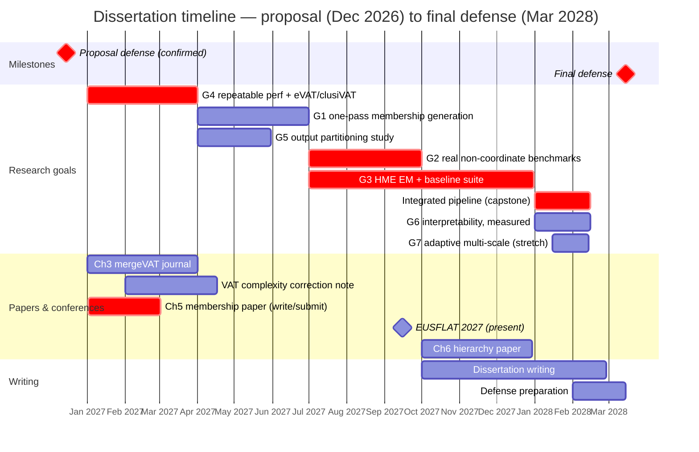

# Chapter 10 — Timeline

The plan runs from the proposal defense at the end of 2026 to the final defense in **March 2028** — a little over a year of research runway. It is deliberately aggressive, per my own intent to defend a substantial body of results rather than a minimal one, and the risk of that is managed in Chapter 7: the completed work (Chapters 3 and 4) is the floor, and the stretch goal (G7) is the designated first cut. The schedule below is organized around the eight goals of Chapter 7 and the papers they feed. Quarters are calendar quarters; the goal labels match Table 7.1 and `ACTION_ITEMS.md`.

## 10.1 Gantt



The Chapter 5 membership paper targets **EUSFLAT 2027**: written in January and February 2027 against a **February submission deadline**, and presented in September. That is tighter than an earlier draft of this timeline assumed, and §10.5 sets out what it costs. NAFIPS 2025 (Banff, July 2025) and NAFIPS 2026 (El Paso, March 2026) are already published and therefore predate this timeline.

## 10.2 Quarter grid (renderer-independent fallback)

```
                                    2026    2027    2027    2027    2027    2028
Goal / activity                       Q4      Q1      Q2      Q3      Q4      Q1
                                   (prop.)                                (defense)
------------------------------------------------------------------------------------
G4  repeatable perf + eVAT/clusiVAT    .     ####      .       .       .       .
G1  one-pass membership generation     .       .     ####      .       .       .
G5  output partitioning study          .       .     ###       .       .       .
G2  real non-coordinate benchmarks     .       .       .     ####      .       .
G3  HME EM + baseline suite            .       .       .     ####    ####      .
    integrated pipeline (capstone)     .       .       .       .       .     ####
G6  interpretability, measured         .       .       .       .       .     ###
G7  adaptive multi-scale (stretch)     .       .       .       .       .     ~~~
------------------------------------------------------------------------------------
    Ch3 mergeVAT journal                   .     ####      .       .       .       .
    VAT complexity note (if pursued)   .     ####      .       .       .       .
    Ch5 paper -> EUSFLAT 2027          .     SUB#      .     PRES      .       .
    Ch6 hierarchy paper                .       .       .       .     ####      .
    dissertation writing               .       .       .       .     ....    ####
------------------------------------------------------------------------------------
    milestones                       PROP.                    EUSFLAT           DEFENSE
```

Legend: `####` scheduled work · `SUB#` write and submit (EUSFLAT deadline **Feb 2027**) · `~~~` stretch (first to cut) · `....` ramp-up · `.` idle.

## 10.3 Milestone table

| Quarter | Focus | Goals | Deliverable |
|---|---|---|---|
| **2026 Q4** | Proposal defense (**Dec**) | — | Defended proposal; committee feedback folded in |
| **2027 Q1** | Close credibility gaps | G4 | Fixed-protocol re-timing (error bars); eVAT/clusiVAT head-to-head; one consistent Concrete benchmark so Ch 4 and Ch 6 numbers are comparable; Ch 3 → mergeVAT journal; VAT complexity correction note (if the blocking reads support it); **Ch 5 paper written and submitted to EUSFLAT (Feb deadline)** |
| **2027 Q2** | Membership generation | G1, G5 | One-pass MF (roadmap phases 1–4); output-partitioning study. *(The Ch 5 paper has already gone out in Q1 — see §10.5.)* |
| **2027 Q3** | Real data + hierarchy | G2, G3 (start) | DTW/edit/graph benchmarks; begin HME EM; **present at EUSFLAT 2027 (Sept)** |
| **2027 Q4** | Hierarchy + baselines | G3 | HME EM done; ANFIS/CART/M5/flat-TSK suite; Ch 6 paper; writing begins |
| **2028 Q1** | Capstone + write-up + **defense (Mar)** | capstone, G6, G7\* | End-to-end flagship case study (Ch 5 → Ch 6 integration); interpretability eval; dissertation complete; **final defense March 2028** |

## 10.4 Dependencies and critical path

- **G4 is front-loaded** (Q1) because every later number is reported under its protocol; the credibility fixes should land before the new results pile up.
- **G1 precedes the capstone** — the one-pass membership generator is what the integrated pipeline consumes, so it must be done (Q2) well before the 2028 Q1 capstone. The capstone is also the first time Chapter 5's membership functions are fed to Chapter 6's models at all, which makes it a genuine experiment rather than an integration chore.
- **G2 has no upstream dependency** — start it as soon as G4's protocol exists; it is the top credibility item and the riskiest to leave late.
- **G3's EM is the largest single build**, spanning Q3–Q4; its de-scope path is to keep the one-shot mixture if it slips.
- **Papers track the work**: Ch 3 journal and, if the prior-art blockers clear, the VAT complexity correction note (Q1 — both draw on work already implemented, so they are write-ups rather than new builds) → Ch 5 → EUSFLAT 2027 (written Q1–Q2, presented Q3) → Ch 6 (Q4) → the capstone/journal version alongside write-up (2028 Q1).

## 10.5 A scheduling conflict the confirmed deadline creates

Confirming the EUSFLAT 2027 submission date as **February 2027** breaks the schedule above in a way worth stating rather than quietly re-drawing, because the fix is a choice about what the Chapter 5 paper is.

The grid puts the Chapter 5 paper in 2027 Q2 and Goal G1 — one-pass membership generation, the piece §5.5 calls the chapter's differentiator — in 2027 Q2 as well. A February deadline falls in Q1. Two things follow. The submission is scheduled a quarter after the deadline it targets, and more awkwardly, **the paper's headline contribution would not exist when the paper is due.** Q1 is also the quarter already carrying G4, the Chapter 3 journal, and the possible complexity note.

I do not think the answer is to compress G1 into Q1. G4 is the credibility work every later number depends on, and the chapter that would suffer is the one the committee is most likely to probe. The better answer is to submit the paper Chapter 5 can already support. §5.4 has the multi-scale recovery result — every ground-truth level at adjusted Rand index 1.00 where a flat cover reaches 0.58 to 0.75 — the selection bake-off against beta-plateau and AuToMATo, and the falsification experiment. That is a conference paper as it stands. G1 then becomes the extension, and the natural home for it is the journal version or the following year's conference, where it can be presented with the end-to-end result that §5.5 says the chapter really owes.

The cost of that choice should be named too: the EUSFLAT paper would report clustering scores rather than end-to-end fuzzy-model accuracy, which is exactly the proxy limitation §5.4 concedes. I would rather submit an honest paper about what the selection machinery does than delay for a differentiator and miss the venue.

## 10.6 Buffer and risk

The 15-month runway has little slack, which is intentional. **G7 (adaptive multi-scale) is the designated first cut.** If G3 (EM) or G2 (real non-metric) overruns, the fallbacks from Chapter 7 apply — the one-shot mixture and a synthetic-plus-one-real-domain result, respectively — and the completed Chapters 3 and 4 remain a defensible floor regardless. Defense preparation is carved out explicitly in Feb 2028 so the final month is not a scramble.

---

### Open items — NEED FROM AUTHOR/ADVISOR
- ~~Confirm the exact proposal-defense month~~ — **confirmed: December 2026.** Final defense is fixed at March 2028.
- ~~Confirm the EUSFLAT 2027 submission deadline~~ — **confirmed: February 2027** (conference September 2027). This is a quarter earlier than the schedule above assumed; see §10.5. NAFIPS 2025 Banff and NAFIPS 2026 El Paso are already published.
- Confirm teaching/RA load per semester (affects realistic throughput).

*Draft — Chapter 10 prose + Gantt, in the author's voice. Goals map to Table 7.1 and `../ACTION_ITEMS.md`.*
