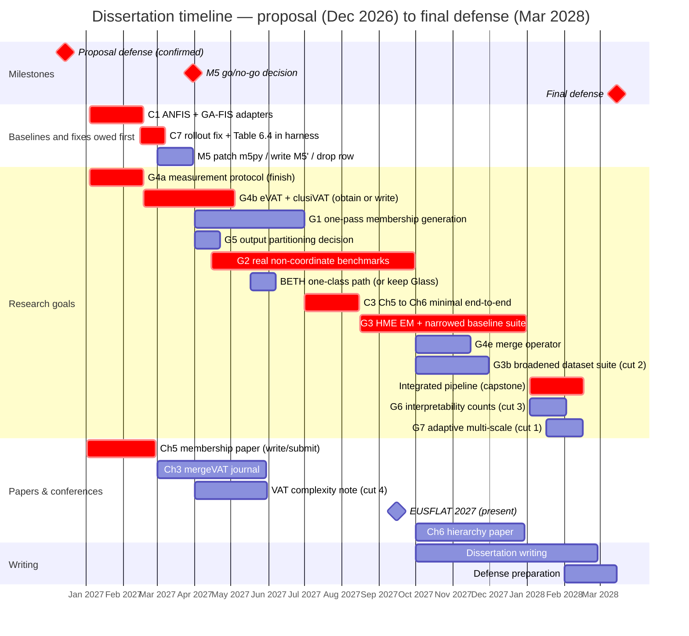

# Chapter 10 — Timeline

The plan runs from the proposal defense at the end of 2026 to the final defense in **March 2028** — fifteen months of research runway. It is deliberately aggressive, per my own intent to defend a substantial body of results rather than a minimal one, and the risk of that is managed in Chapter 7: the completed work (Chapters 3 and 4) is the floor, and §7.4 names the de-scoping order, which §10.6 repeats so the two chapters cannot drift apart. The schedule below is organized around the goals of Chapter 7 §7.2 and the papers they feed. Quarters are calendar quarters; the goal labels match Table 7.1, `CHECKLIST.md` and `ACTION_ITEMS.md`.

Three things changed in this version of the schedule, and they are all cases of the timeline having assumed that the hard parts were done.

**The baseline adapters are now first.** §7.4 calls the ANFIS and GA-tuned-FIS tables "the first experiments I owe," and an earlier version of this chapter scheduled them last — inside Goal G3, in the final two quarters, with no bar of their own. Eleven cells across Tables 4.5 and 6.2 read `N/A` until those two adapters exist, and the speed argument in the title and in Chapters 1, 4 and 8 has no conventional fuzzy method measured beside it. They open the schedule now (checklist **C1**).

**Every blocker the evidence names has a bar or an explicit de-scope.** The M5 dependency fault gets a decision date rather than a slot in a suite; the defective trajectory rollout behind Table 6.4 gets a bar, because §7.3 promises that result to the committee; BETH's one-class evaluation path gets a slot and a stated fallback; eVAT and clusiVAT get their own bar rather than sharing a quarter with the timing protocol, a journal paper, a complexity note and a conference submission; and two published methods that were itemized in Chapter 6's baseline list and nowhere in this chapter — Fumanal-Idocin et al. (2025) and the deep TSK fuzzy classifier — are de-scoped in §7.2 rather than silently carried.

**Goal G8 is not here, and that is now deliberate rather than an omission.** An earlier version of Table 7.1 gave it one quarter and 2028 Q1 while this chapter's Gantt and grid left it out entirely. §7.2 retargets the construction to post-defense work and keeps only its cheap empirical half — the disjunct count over G2's datasets — which rides along inside G2. So the schedule does not contain it because the goal no longer asks for a quarter.

## 10.1 Gantt



The Chapter 5 membership paper targets **EUSFLAT 2027**: written in January and February 2027 against a **February submission deadline**, and presented in September. That is tighter than an earlier draft of this timeline assumed, and §10.5 sets out what it costs. One arithmetic correction to that bar, since the point of rewriting §10.5 was to accommodate the deadline: it previously ran 59 days from 2 January, which ends on 2 March — *after* the deadline it was rewritten for. It now runs 57 days and ends 28 February, the last day the deadline can fall on. If the exact day turns out to be earlier in the month the bar shortens with it, which is an open item below rather than something to guess at here. NAFIPS 2025 (Banff, July 2025) and NAFIPS 2026 (El Paso, March 2026) are already published and therefore predate this timeline.

Two bars deliberately have no dates. **G4c**, the datacenter-GPU re-run, is gated on access to a card with full-rate double precision rather than on effort, and a bar for work that cannot start would be fiction; Chapter 7 §7.4's fallback applies if it never opens. **G4d**, the matrix-free reorder, is a cut candidate that nothing in Chapter 3 depends on, and it is listed in Table 7.1 as unscheduled rather than given a slot it would only take from something load-bearing.

## 10.2 Quarter grid (renderer-independent fallback)

```
                                    2026    2027    2027    2027    2027    2028
Goal / activity                       Q4      Q1      Q2      Q3      Q4      Q1
                                   (prop.)                                (defense)
------------------------------------------------------------------------------------
C1  ANFIS + GA-FIS adapters            .    ####       .       .       .       .
C7  rollout fix + Table 6.4            .     ###       .       .       .       .
M5  decide: patch, build, or drop      .     ###       .       .       .       .
G4a measurement protocol (finish)      .    ####       .       .       .       .
G4b eVAT + clusiVAT head-to-head       .     ###     ###       .       .       .
G1  one-pass membership generation     .       .    ####       .       .       .
G5  output partitioning decision       .       .     ###       .       .       .
G2  real non-coordinate benchmarks     .       .    ####    ####       .       .
BETH one-class path (or keep Glass)    .       .     ###       .       .       .
C3  Ch5 -> Ch6 minimal end-to-end      .       .       .     ###       .       .
G3  HME EM + narrowed baselines        .       .       .     ###    ####       .
G4e merge operator: composition test   .       .       .       .     ###       .
G3b broadened dataset suite (cut 2)    .       .       .       .     ###       .
    integrated pipeline (capstone)     .       .       .       .       .    ####
G6  interpretability counts (cut 3)    .       .       .       .       .     ###
G7  adaptive multi-scale (cut 1)       .       .       .       .       .     ~~~
------------------------------------------------------------------------------------
    Ch5 paper -> EUSFLAT 2027          .    SUB#       .    PRES       .       .
    Ch3 mergeVAT journal               .     ###     ###       .       .       .
    VAT complexity note (cut 4)        .       .     ###       .       .       .
    Ch6 hierarchy paper                .       .       .       .    ####       .
    dissertation writing               .       .       .       .    ....    ####
------------------------------------------------------------------------------------
    milestones                       PROP.                  EUSFLAT         DEFENSE
```

Legend: `####` a full quarter of scheduled work · `###` a partial quarter — work that starts or ends mid-quarter, or is short enough not to fill one · `SUB#` write and submit (EUSFLAT deadline **Feb 2027**) · `PRES` present at the conference · `~~~` stretch (first to cut) · `....` ramp-up · `.` idle. Every marker is right-aligned to its quarter column; an earlier version of this grid had the Chapter 3 journal row indented four characters further than the rest, so its bar sat under 2027 Q2 while the text scheduled it in Q1 — the row now aligns with the others and reads as the Q1–Q2 span it is.

## 10.3 Milestone table

| Quarter | Focus | Goals | Deliverable |
|---|---|---|---|
| **2026 Q4** | Proposal defense (**Dec**) | — | Defended proposal; committee feedback folded in |
| **2027 Q1** | The baselines and the fixes owed first | C1, G4a, C7, M5, G4b (start) | **ANFIS + GA-tuned-FIS adapters, filling the eleven `N/A` cells in Tables 4.5 and 6.2**; G4a finished — clocks and thermals pinned, the submodule-SHA guard in place, the three seed-floor exceptions of §7.2 named in the text; `predict_trajectory` fixed and Table 6.4 re-measured at ten seeds through the harness; **M5 go/no-go decided by 31 March**; eVAT and clusiVAT obtained or written; one consistent Concrete benchmark so Ch 4 and Ch 6 are comparable; **Ch 5 paper written and submitted to EUSFLAT (Feb deadline)**; Ch 3 → mergeVAT journal begun |
| **2027 Q2** | Membership generation and the credibility gap | G1, G5, G2 (start), G4b (finish), BETH | One-pass MF (roadmap phases 1–3 built, 4 re-attempted against §7.2's threshold, 5 the refactor); output-partitioning **decision** — guard or target transform — in about three weeks, not a quarter; **G2 starts here rather than in Q3**, per §10.4's own dependency reading; eVAT/clusiVAT head-to-head reported; BETH one-class path settled or the open-set claim explicitly rests on Glass. *(The Ch 5 paper has already gone out in Q1 — see §10.5.)* |
| **2027 Q3** | Real non-coordinate data, and the first end-to-end result | G2, C3, G3 (start) | DTW / graph-kernel benchmarks against §7.2's four criteria; **the minimal Ch 5 → Ch 6 end-to-end result, pulled forward out of the 2028 Q1 capstone** (checklist C3); HME EM begun; **present at EUSFLAT 2027 (Sept)** |
| **2027 Q4** | Hierarchy, baselines, and the merge question | G3, G4e, G3b | HME EM done and judged against the decision rule stated in §7.2 *before* it ran; the narrowed baseline suite; the merge operator's composition test; broadened dataset suite (cut 2); Ch 6 paper; writing begins |
| **2028 Q1** | Capstone + write-up + **defense (Mar)** | capstone, G6\*, G7\* | End-to-end flagship case study on shuttle **plus the same driver on one DTW matrix**, judged against §7.1's threshold; interpretability counts and the named semantic criteria; dissertation complete; **final defense March 2028** |

## 10.4 Dependencies and critical path

- **The baselines have no upstream dependency at all** and are the reason Q1 looks crowded. C1 needs two adapter files and the table auto-detects them; nothing has to happen first. They are scheduled first because everything downstream is measured against them, and because leaving them to the final quarters — where they were — meant the speed claim would have gone to the committee unmeasured and been fixed afterwards.
- **G4a is still front-loaded** (Q1) because every later number is reported under its protocol. It is a smaller bar than it was, because B1, B2, B3, B5 and B5b are done; what is left is pinning clocks and thermals, the SHA guard, and naming the exceptions.
- **G2 now starts in Q2, which is what §10.4 has been saying it should.** An earlier version of this list said G2 "has no upstream dependency — start it as soon as G4's protocol exists; it is the top credibility item and the riskiest to leave late," and then left it third and late in Q3. That was the plainest self-contradiction in this chapter. G4a's protocol lands mid-February, so G2 starts 15 April and runs two quarters rather than one — it is two dataset families, a graph-kernel path, a triangle-inequality measurement, and the first run of `select_coverage_cover` and `select_multiscale` on matrices that did not come from coordinates.
- **G1 precedes both C3 and the capstone** — the one-pass membership generator is what the integrated pipeline consumes. C3, the minimal Ch 5 → Ch 6 result, is the new intermediate: it is the first time Chapter 5's membership functions are fed to Chapter 6's models at all, which makes it a genuine experiment rather than an integration chore, and putting a small version of it in Q3 rather than the whole thing in 2028 Q1 is checklist **C3**'s own recommendation. It also means the capstone in the final quarter is an integration and a flagship case study rather than a first attempt.
- **C7 gates §7.3's second showcase.** The trajectory fix and the ten-seed re-measure have to land before the memory-augmented result can be presented, and if the re-measure erases the gap the showcase comes out. That is why it is in Q1 and not alongside the write-up.
- **The M5 decision gates G3's suite**, which is the whole reason it is a dated milestone. One of four baselines in that suite may be a *build* — writing an M5′ implementation against a current scikit-learn — and discovering that in Q4 with the suite half-run is the failure mode the date exists to prevent.
- **G3's EM is the largest single build**, spanning Q3–Q4; its de-scope path is to keep the one-shot mixture if it slips. §7.2 states the decision rule in advance, so a null result is a reported prediction rather than a retreat.
- **Papers track the work**: Ch 5 → EUSFLAT (written Q1, presented Q3) → Ch 3 journal (Q1–Q2; a write-up of work already implemented, so it can absorb slip) → the VAT complexity note if the two blocking full-text reads clear (Q2, and the fourth cut) → Ch 6 (Q4) → the capstone/journal version alongside write-up (2028 Q1).

## 10.5 A scheduling conflict the confirmed deadline creates

Confirming the EUSFLAT 2027 submission date as **February 2027** breaks the schedule above in a way worth stating rather than quietly re-drawing, because the fix is a choice about what the Chapter 5 paper is.

The grid had the Chapter 5 paper in 2027 Q2 and Goal G1 — one-pass membership generation, the piece §5.5 calls the chapter's differentiator — in 2027 Q2 as well. A February deadline falls in Q1. Two things follow. The submission is scheduled a quarter after the deadline it targets, and more awkwardly, **the paper's headline contribution would not exist when the paper is due.** Q1 is also the quarter already carrying G4a, the baseline adapters, the C7 fix, the M5 decision, the start of the eVAT/clusiVAT work and the Chapter 3 journal.

I do not think the answer is to compress G1 into Q1. G4a is the credibility work every later number depends on, the baselines are what the speed claim rests on, and the chapter that would suffer is the one the committee is most likely to probe. The better answer is to submit the paper Chapter 5 can already support. §5.4 has the multi-scale recovery result — every ground-truth level at adjusted Rand index 1.00 where a flat cover reaches 0.58 to 0.75 — the selection bake-off against beta-plateau and AuToMATo, and the falsification experiment. That is a conference paper as it stands. G1 then becomes the extension, and the natural home for it is the journal version or the following year's conference, where it can be presented with the end-to-end result that §5.5 says the chapter really owes.

The cost of that choice should be named too: the EUSFLAT paper would report clustering scores rather than end-to-end fuzzy-model accuracy, which is exactly the proxy limitation §5.4 concedes. I would rather submit an honest paper about what the selection machinery does than delay for a differentiator and miss the venue. There is a second cost worth stating now that G1's phase-four evidence is in: the extension the journal version would carry is the one whose expectation has already been tested once and did not hold (§7.2, G1), so the follow-up paper should be planned around either outcome — the soft band or the single-versus-multi-level gate — rather than around the version that assumed the fix would work.

## 10.6 The runway is oversubscribed, and here is what I would cut

An earlier version of this section said the fifteen-month runway "has little slack, which is intentional," and named G7 as the designated first cut. With everything the evidence actually requires now scheduled — the baseline adapters, the eVAT and clusiVAT implementations, the M5 branch, the trajectory fix, the BETH decision, the broadened dataset suite, the merge composition test, and G2 at its real two-quarter size — that is no longer the honest description. **The runway is oversubscribed, not merely tight, and cutting G7 alone does not fix it.** G7 is roughly thirty days of a stretch goal; the items added above are considerably more than that. So the de-scoping plan has to be a list with an order rather than a single designated victim, and it is the same list as §7.4.

In priority order, what goes:

1. **G7 — adaptive multi-scale.** Already the designated first cut. Its most likely outcome, on the phase-four evidence, is a negative result that G1 would reach anyway, so cutting it costs a confirmation rather than a contribution.
2. **G3b — the broadened dataset suite**, narrowed from six datasets (turbine, wave-energy, wine and the IoT sets) to Concrete, PhiUSIIL and one added regression set. "Characterized across more than two problems," which is what Chapter 6 §6.4 promises, is satisfied by three; six datasets against six baselines at ten seeds is a quarter of engineering for a claim that three datasets already support.
3. **G6's metric half beyond the counts.** The rule counts, clause counts and path lengths are owed and are read off a fitted model; the semantic-constraint criteria on top of them are worth having and are not load-bearing. The expert-audience study is already dropped in §7.2 rather than cut here, because it was never scheduled and never scoped.
4. **The VAT complexity note (§9.3).** It is already conditional on two blocking full-text reads, and §3.3.1 concedes it is a modest correction to a problem someone else has solved by a better route. It is the cheapest paper in the plan to drop and the one whose loss costs the dissertation nothing.
5. **G4d — the matrix-free reorder.** Nothing in Chapter 3 depends on it and it buys the regime past about 155,000 points, which no result in this document occupies. It is listed unscheduled in Table 7.1 for that reason, so cutting it is a matter of not adding it back.
6. **G4e narrows to the composition test alone**, with the error-growth bound and the block-boundary question named as future work. If even that is cut, the half-million-point distributed target is withdrawn from Chapter 3 rather than carried as an aspiration on a single-level result.

What I will not cut, and would rather move the final defense than lose: **C1**, **G2**, **G4a**, **C7**, and the capstone. Those five carry the two headline claims and the pipeline argument. If G3's EM or G2 overruns, the fallbacks from Chapter 7 apply — the one-shot mixture and a synthetic-plus-one-real-domain result respectively — and the completed Chapters 3 and 4 remain a defensible floor regardless. Defense preparation is carved out explicitly in Feb 2028 so the final month is not a scramble.

Two honest caveats on the plan as a whole. Q1 2027 is the densest quarter in it, carrying five research items and a conference submission, and the item I would let slip first inside that quarter is the Chapter 3 journal, because it is a write-up of work already implemented rather than a build. And the throughput this schedule assumes is still unconfirmed, because the teaching and RA load per semester is not settled — which is the one open item below that could move every bar in the chart.

---

### Open items — NEED FROM AUTHOR/ADVISOR
- ~~Confirm the exact proposal-defense month~~ — **confirmed: December 2026.** Final defense is fixed at March 2028, so the runway is fifteen months.
- ~~Confirm the EUSFLAT 2027 submission deadline~~ — **confirmed: February 2027** (conference September 2027). This is a quarter earlier than the schedule above assumed; see §10.5. NAFIPS 2025 Banff and NAFIPS 2026 El Paso are already published.
- **Confirm the exact EUSFLAT submission day.** The Chapter 5 paper's bar is sized to end 28 February 2027, the latest the deadline can fall. A mid-February date shortens it by two weeks, which is worth knowing before January.
- **Confirm teaching/RA load per semester** (affects realistic throughput, and §10.6 says why this is the item that could move everything).
- **Two calls that are yours, not the schedule's.** Whether the M5 branch may be a *build* — writing an M5′ implementation against a current scikit-learn — is a decision I have dated but not made (31 March 2027). And whether either Fumanal-Idocin et al. (2025) or the deep TSK fuzzy classifier must be reimplemented for the comparison: §7.2 de-scopes both, and taking one on displaces G3b.

*Draft — Chapter 10 prose + Gantt, in the author's voice. Goals map to Table 7.1, `../CHECKLIST.md` and `../ACTION_ITEMS.md`.*
