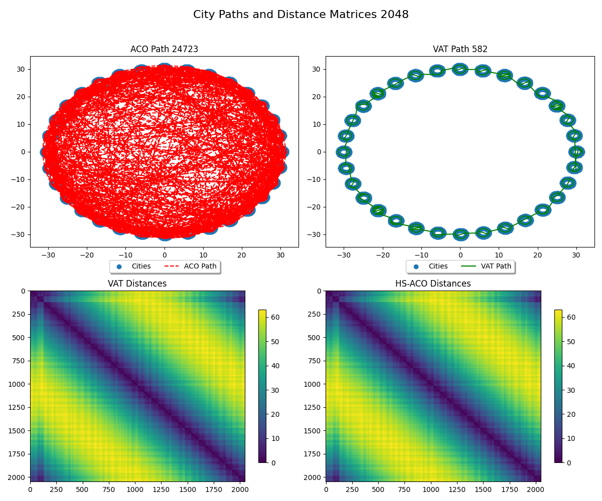
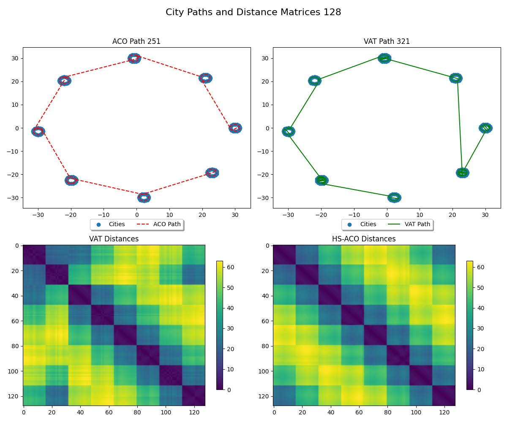
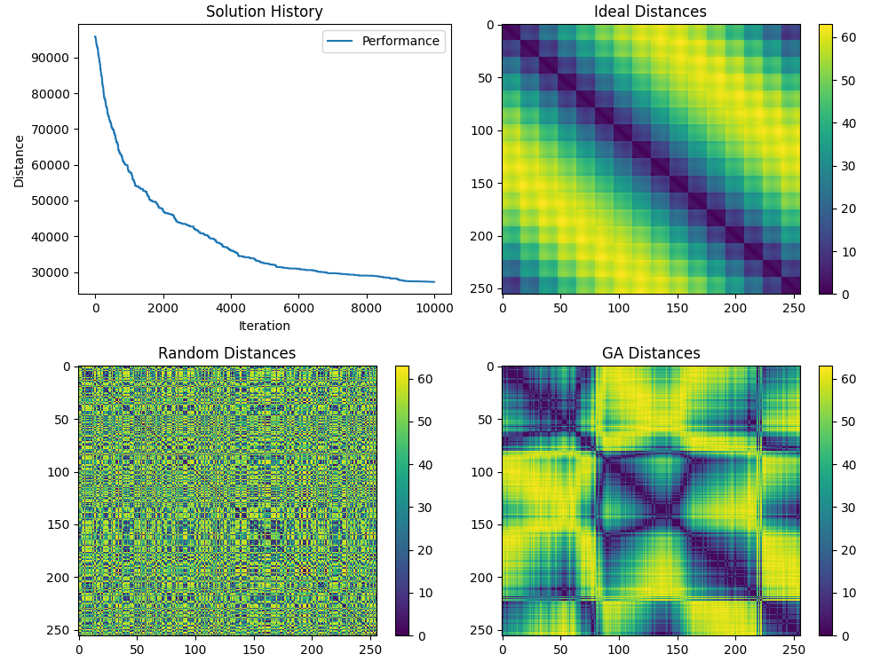
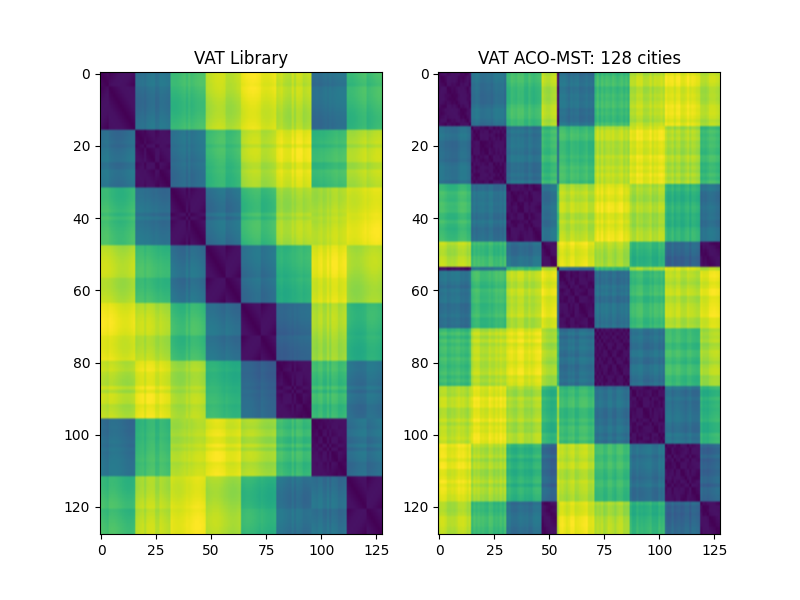
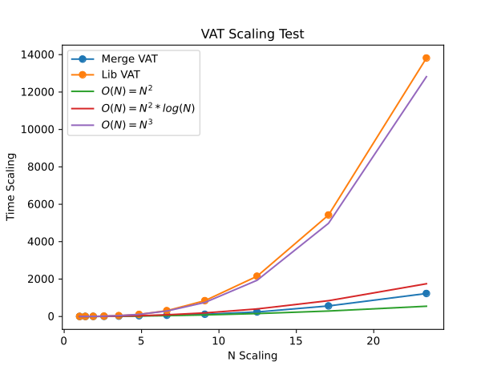
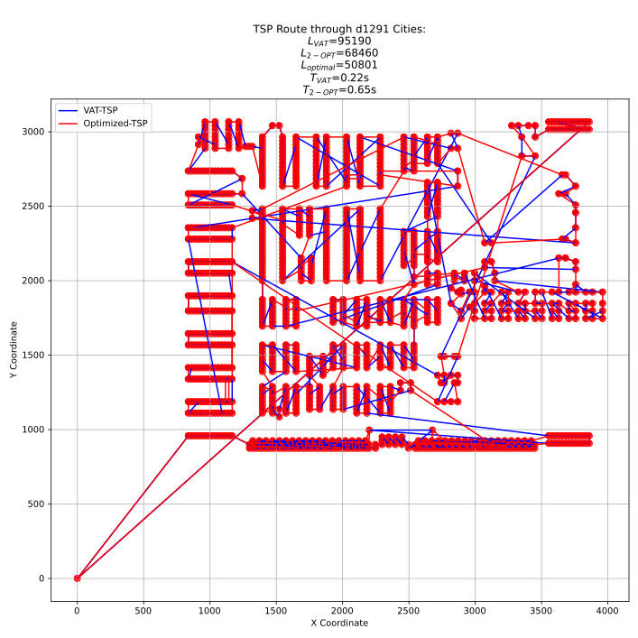
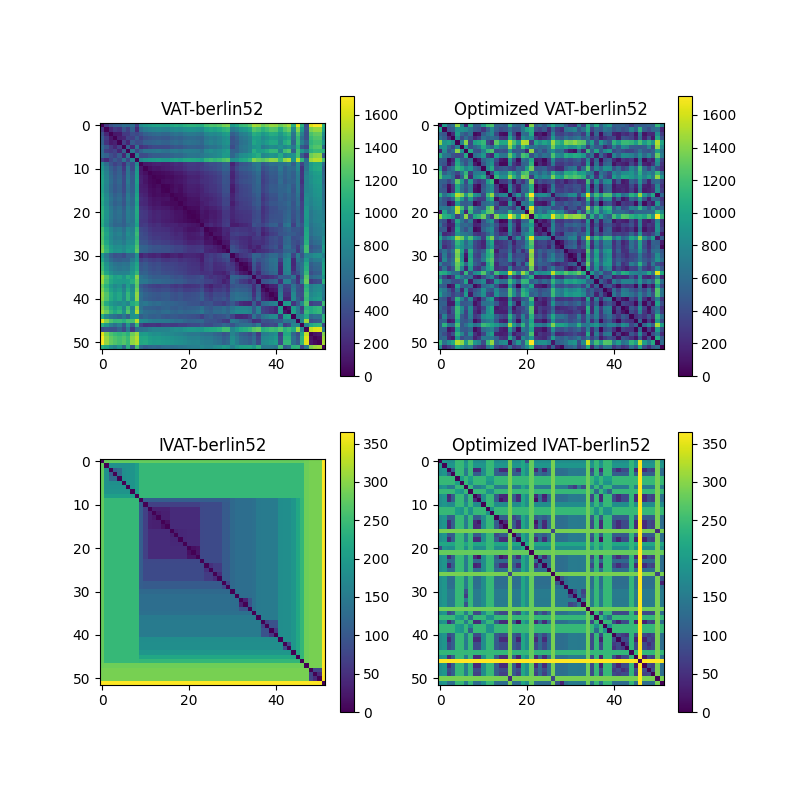
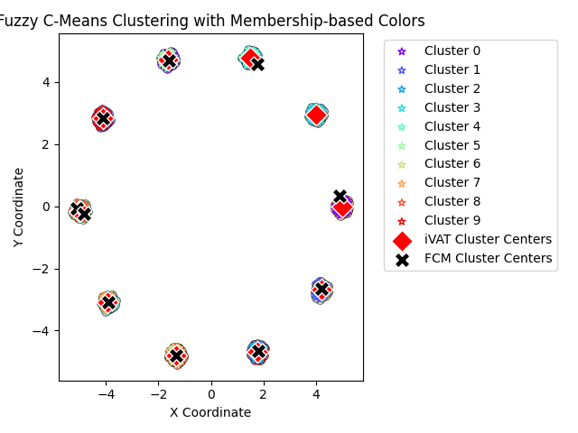

# PhD Quals

_Scott Phillips_

Advisor: Dr Kelly Cohen

---

# About Me

* BSME 2016 University of Cincinnati
* First year PhD student under Dr Cohen
* 10 years of industry experience: P&G, consulting, VC-startup life
* Now the `Vice Nerd` of Nexigen.

---

# NAFIPS Paper 1: Utilization of VAT for Hot-start of TSP Solutions

---

# VAT Background & Limitations

* Visual Assessment for Tendency (VAT) is a method for cluster identification pioneered by Bezdek
* It converts, usually via the _L2-norm_, an $N \times M$ matrix of samples into an $N \times N$ dissimilarity matrix $D$
* It permutes the matrix to minimize the distances off the principal diagonal – Minimum Spanning Tree (MST)
* The core algorithm is a greedy one, similar to Prim's Algorithm for MSTs
* It is computationally expensive, $O(N)=N^3$

---

# ACO Background & Limitations

* Ant Colony Optimization is a stochastic optimization technique used for combinatorics, commonly with the Traveling Salesperson Problem (TSP)
* It doesn’t guarantee finding the “best” solution, but often finds a “good enough” solution
* It is trivially parallelizable – important on multicore processors and GPUs

* It does not require the cost function to continuous, or differentiable, only comparable
* It is susceptible to initialization issues, since it is not guaranteed to find the local optima on a given attempt (unlike gradient descent)
* Having a good initial guess, a “hot-start” can greatly reduce the convergence time.

---

# The Connection

* The dissimilarity matrix $D$, and the optimized VAT matrix $D'$ are symmetric permutations of rows and columns.
* It has been proven that the MST provides an upper bound on the length of the optimal tour:

$T_{best} \le 2T_{MST}$
> An intuitive tour is to visit the permuted cities in $D'$ sequentially, then wrap back from city $N$ to $1$.
---

# Example - Circular Cities

* A constructed dataset with obvious structure, clusters, and an analytic nearly optimal tour length
* A large circle with smaller circular clusters distributed evenly around the perimeter
* Optimal tour length approximation:

$T_{optimal} = P_{polygon} + N_{cities}P_{city} - N_{cities}D_{city}$

$D_{polygon} > D_{city}$

---
layout: image-right
image: ./quals/image.png
backgroundSize: contain

# Initial Performance Observation - 256

|Method |Time [s]|Distance|Change|
|-------|--------|--------|------|
|Optimal|0.00    |289     |100%  |
|Random |0.00    |10,074  |3500% |
|VAT    |0.35    |408     |140%  |
|HS-ACO |4.95    |408     |140%  |
|ACO    |4.10    |1592    |550%  |

> Unfortunately, IVAT mutates the matrix, making it unsuitable for hot-starting

---
layout: image-right
image: ./quals/image-1.png
backgroundSize: contain

# Larger Scale - 2048

|Method |Time [s]|Distance|Change |
|-------|--------|--------|-------|
|Optimal|       0|   394  |   100%|
|Random |       0|78,104  |19,829%|
|VAT    |     196|   582  |   150%|
|HS-ACO |     543|   582  |   150%|
|ACO    |     258|24,723  |  6300%|

---
layout: image-right
image: quals/image-2.png
backgroundSize: contain

# Refinement

* The hot-start ACO ends up a little cleaner in some cases

---
layout: image-right
image: quals/image-3.png
backgroundSize: contain

# Can ACO approximate VAT? - Somewhat

* VAT - based on Prim's (greedy) algorithm
* ACO MST - often Broder's algorithm

> A naive permutation method which minimizes the primary diagonals tends to produce perpendicular lines

---

# ACO MST - Scaling

|Column 1|Column 2|Column 3|Column 4|
|--------|--------|--------|--------|
|      |  |    |    |        |
|        | 50x    2x   |  230x 3x      |        |
|        |  |       |        |        |
|     128 4x   |  512      | 6.25x       |  800      |
|        |        |        |        |

---

# Conclusions and Future Work

* VAT provides a great initial guess to solving TSP problems with ACO
* Permutation methods with ACO are not effective
* ACO MST methods show promise, but need further development

---

# Paper 2: MergeVAT: $58K \times 58K$ in 60 seconds

---
# Motivation: Go, Fuzzy! - faster!
* UC Irvine NASA Dataset
  * Space Shuttle reentry
  * 80% of data in condition-1
  * 58,000 rows
* Can we visualize and confirm that?
    * This image is 1% linear scale, 1/10,000 in area
    * 8-bit grey-scale PNG is >400 MB

---
# Patient Data
* 135K rows
    * 30% clustered
    * 70% sparse
    * Mostly binary values
* Can we visualize and confirm that?
    * 8 minutes for VAT, 15 minutes for distance matrix calculation
    * At 32-bit floating point, this is 73GB

---

# Scaling Time Complexity
* VAT gets the arg-min of the remainder of the current column
* This sorting operation is typically BubbleSort, $O(N)=N^2$
* This is applied on every column, so overall $O(N)=N^3$ 

> At 135K rows, my improved method is 1.6 million times faster

---

# The First Insight - Sort Algorithm
* MergeSort is the asymptotically fastest algorithm which can exist: $O(N)=N \log N$
* Over $N$ columns, we have $O(N)=N^2 \log N$
* N-scaling=24 is a 16K element dataset
* Utilize a priority queue (fibbonacci heap) to extract the remainder index as $O(N)=1$ operation
> Professor Kreinovich pointed out this method is more akin to HeapSort, which is also $O(N)=N \log N$. The original name came from a failed experiment to implement what amounts to a 2D MergeSort.

> For a 4096 element dataset, 124 seconds vs 2.56 seconds

---

# Sorting Algorithm details

---
# TSP Optimization

> Unfortunately, the commonly used 2-OPT local optimization method breaks the MST organization
---
# The Second Insight -- Memory
* VAT often caches the entire dissimilarity matrix $D$
* This doubles the memory consumption to save on compute costs, but since mergeVAT scales so much better, we need to reduce memory consumption
    * Why not compute only the requested distance $D_{i,j}$ as needed?
    * This reduces memory to one copy of $D$ plus working space, approximately $O(N) = {{N^2+N}\over{16}}$ vs $O(N)=2N^2$

---
# The Third Insight - Loop-Walking
* VAT sequence, paired with the original sequence, creates a collection of loops: _directed, cyclic graphs_
* We can start at any point on any loop, and follow the loop until we reach our starting point again.
* If we mask which loop entries have been visited, we can simply increment until we find another loop

---
# Conclusions and Future Work
* mergeVAT:
    * Expands the usable size from 5K to 130K+ elements
    * Provides a good initial guess for TSP applications
    * Loop-walking cuts the memory requirement in half.

* Future Work: Identify VAT-clusters to change 2-Opt check points
* Future Work: Distributed mergeVAT for 500K elements
* Future Work: InsertionSort for building up to 500K elements

---

# (Future) Paper 3: Fuzzy C Means and Cluster Detail Extraction
* Centroid equation:

$$c_k = {{\sum_x w_k(x)^m x}\over{\sum_x w_k(x)^m}}$$

* Objective function:

$$J(W,C) = \sum_{i=1}^{n} \sum_{j=1}^{c} w_{ij}^{m} \|\vec{x}_i - \vec{c}_j\|^{2}$$

* Weights:

$$w_{ij} = \frac{1}{\sum_{k=1}^{c} \left ( {\|\vec{x}_i - \vec{c}_j\|}\over{\|\vec{x}_i - \vec{c}_k\|} \right )^2}$$

> This method handles points with partial membership in multiple clusters, but it is susceptible to initialization issues.

---
# IVAT Initialization
1. Since the VAT provides a permuted list of the rows and columns of $D$, we can use this to identify memberships in clusters
2. Use the difference of off-by-1 diagonal of the IVAT matrix to identify the boundaries of each cluster.
3. Sort the trace of the IVAT matrix, and find the point of the maximum change.
4. This is the initial guess for the count of cluster centroids.
5. Look back to the 

---
# Now: Current Research Direction
1. Accelerating Fuzzy C Means methods with gradient-descent optimization
    1. Still subject to initial point selection
2. Utilizing VAT/IVAT for automatic cluster (and cluster centroid) identification
    1. This guarantees we don't initialize FCM with points which have primary membership in the same cluster.
    2. This also provides the initial steps towards 2-OPT check points identification
    3. Automatic cluster counting
3. Mixture of Gaussians (MoG) FIS membership function and rule identification
    1. This is showing promise for orders-of-magnitude speed up in model training
    2. It trains on a phishing dataset with 235K entries to 97% accuracy in 6 seconds
    3. No post-training GD or GA required
    4. It does this with 2 rules and a handful of clauses
   5. It extends to TSK order-1 and order-2 with linear regression parameter estimation.
4. 2D-rotation AND-rule selection
    1. Uniformly distributes rules across possible space
    2. Provides a good initial solution deck for GA/ACO methods 

---
# Future: Goal

> Make Training of Fuzzy Inference Systems (FIS) models 1000x faster, whether in time, or in usable scale

1. Preliminary Data Review - VAT/IVAT
2. Initial model skeleton - FCM
3. Membership function selection - MoG
4. Rulebase development - MoG
5. Model refinement - Optimization methods
6. Any suggestions?

---
# Thank You!
* Dr Kelly Cohen - my advisor and mentor, allowing me to explore topics like this which interest me.
* Jon Salisbury - for support/employment and opening the door for me to do this
* UC AI / Bio Lab - y'all know what you do. :)
* Dr Phillips, aka _Dad_